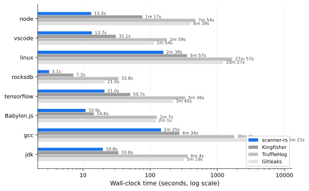
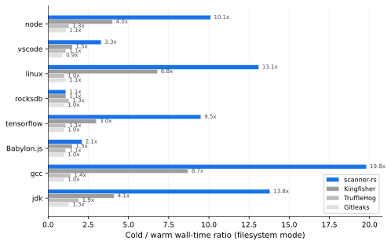
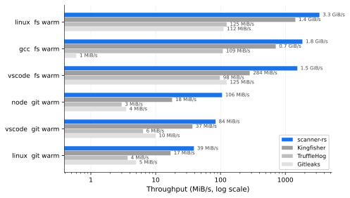
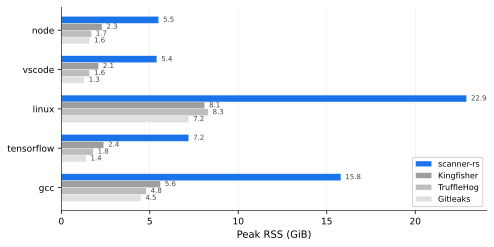

# scanner-rs

A secret scanner for git repositories and filesystems.

This started as a question: how much faster can a secret scanner get if
you design it around the CPU instead of around programmer ergonomics?
What if you take ideas from data-oriented design, mechanical sympathy,
and TigerBeetle-style pre-allocation — and apply them to regex-based
secret detection? This project is the attempt to find out.

The short answer: quite a bit faster, it turns out. But not for free.

## What We Measured

We (Claude Code, Codex, and me) benchmarked scanner-rs against three established secret scanners —
Kingfisher (Rust), TruffleHog (Go), and Gitleaks (Go) — across
8 open-source repositories of varying size and character, in both git
history and filesystem modes, with cold and warm page caches (on
EBS-backed NVMe storage, where kernel readahead behavior matters). 128
total configurations, each on an ARM Graviton3 (16 vCPUs, 61 GiB RAM).

### Speedups vary — a lot



Warm-cache git mode, showing how many times slower each scanner is
vs scanner-rs:

| Repo        |  vs Kingfisher |  vs TruffleHog |  vs Gitleaks |
| ----------- | -------------: | -------------: | -----------: |
| node        |           5.8x |          35.6x |        30.0x |
| vscode      |           2.3x |          13.1x |         8.3x |
| linux       |           2.3x |          10.6x |         7.8x |
| rocksdb     |           2.3x |          10.8x |         6.7x |
| tensorflow  |           2.4x |          16.0x |        10.5x |
| Babylon.js  |           1.3x |          11.6x |        11.1x |
| gcc         |           1.9x |          12.4x |        60.0x |
| jdk         |           1.7x |          18.3x |        16.1x |

The range is wide. Against Kingfisher (the closest Rust scanner), the
advantage is 1.3x on Babylon.js and 5.8x on node. Against the Go
scanners, 6.7x to 60x. The variance matters — it tells us the
advantage depends on workload characteristics, not a single trick.

A few patterns we noticed:

- **Git mode advantages are larger than filesystem mode.** Git scanning
  involves decompressing and traversing commit history, which generates
  more CPU-bound work where our DFA prefilter can skip more input.
  scanner-rs reads pack files directly with custom pure-Rust parsers —
  no libgit2, no git CLI subprocess. Object IDs are resolved through a
  zero-copy MIDX index, and pack objects are decoded in offset order for
  sequential I/O. TruffleHog and Gitleaks shell out to
  `git log --patch` and parse unified diffs; Kingfisher uses the gix
  library. See
  [architecture-comparison.md Section 4.9](tools/bench-compare/results/architecture-comparison.md)
  for the full comparison.
  In filesystem mode, the bottleneck shifts toward I/O on cold caches
  and the gaps narrow (though scanner-rs still shows the largest
  cold-to-warm speedup — see below).
- **Warm-cache filesystem mode isolates compute throughput.**
  When I/O isn't the bottleneck, scanner-rs reaches 1.2–3.3 GiB/s on
  large repos (linux, gcc, Babylon.js).
- **The Gitleaks-on-gcc outlier (60x) is real but context-dependent.**
  Gitleaks runs at 0.5–0.6 MiB/s on gcc across all configurations,
  suggesting a pathological interaction between its sequential rule
  loop and gcc's repository structure.

### Cold vs warm: what the page cache reveals



Filesystem mode shows the starkest cold/warm contrast. The ratio of
cold-cache to warm-cache wall time tells you whether a scanner is
I/O-bound (large ratio: slow when data isn't in memory, fast when it
is) or CPU-bound (ratio near 1.0: I/O was never the bottleneck).

| Repo         |  scanner-rs |  Kingfisher |  TruffleHog |  Gitleaks |
| ------------ | ----------: | ----------: | ----------: | --------: |
| node         |       10.1x |        4.0x |        1.3x |      1.1x |
| vscode       |        3.3x |        1.5x |        1.1x |      0.9x |
| linux        |       13.1x |        6.8x |        1.0x |      1.1x |
| rocksdb      |        1.1x |        1.1x |        1.3x |      1.0x |
| tensorflow   |        9.5x |        3.0x |        1.1x |      1.0x |
| Babylon.js   |        2.1x |        1.5x |        1.1x |      1.0x |
| gcc          |       19.8x |        8.7x |        1.4x |      1.0x |
| jdk          |       13.8x |        4.1x |        1.9x |      1.3x |
| **Average**  |    **9.1x** |    **3.8x** |    **1.3x** |  **1.0x** |

scanner-rs averages a 9.1x cold/warm speedup; Gitleaks averages 1.0x.
A large cold/warm ratio indicates the scanner processes data faster than
I/O can deliver it — so warm cache removes the bottleneck. A ratio near
1.0 indicates the scanner is CPU-bound regardless of cache state. Gitleaks
shows almost no cold/warm delta, consistent with CPU being its bottleneck
even on cold storage.

Several design choices likely contribute to scanner-rs's large
cold/warm delta: `posix_fadvise(POSIX_FADV_SEQUENTIAL)` on every file
open, `madvise(MADV_SEQUENTIAL)` on every mmap, overlap-carry I/O
(no re-reading), and the work-stealing scheduler keeping I/O
pipelined. We haven't isolated each factor's individual contribution
— the ratio captures all of them together.

One context note: the benchmark storage is EBS (Elastic Block Store),
which presents as NVMe but is network-attached. Kernel readahead hints
matter more on EBS than on local NVMe, where device-level prefetching
is already aggressive. These ratios would likely look different on
local SSDs.

### Throughput across repository sizes



A selection of throughput numbers showing how performance scales:

| Repo    | Mode  | Cache  |  scanner-rs |  Kingfisher |  TruffleHog |   Gitleaks |
| ------- | ----- | ------ | ----------: | ----------: | ----------: | ---------: |
| linux   | fs    | warm   |   3.3 GiB/s |   1.4 GiB/s |   125 MiB/s |  112 MiB/s |
| gcc     | fs    | warm   |   1.8 GiB/s |   716 MiB/s |   109 MiB/s |  0.6 MiB/s |
| vscode  | fs    | warm   |   1.5 GiB/s |   284 MiB/s |    98 MiB/s |  125 MiB/s |
| node    | git   | warm   |   106 MiB/s |    18 MiB/s |   3.0 MiB/s |  3.5 MiB/s |
| vscode  | git   | warm   |    84 MiB/s |    37 MiB/s |   6.4 MiB/s |   10 MiB/s |
| linux   | git   | warm   |    39 MiB/s |    17 MiB/s |   3.7 MiB/s |  5.0 MiB/s |

Filesystem warm-cache is the most compute-bound scenario. Git mode
is slower across all scanners because of
the decompression and object-traversal overhead. scanner-rs showed
the highest throughput in every configuration we tested.

### The memory cost



This is the part we can't hand-wave away. scanner-rs uses substantially
more RSS than every other scanner:

| Repo        |  scanner-rs |  Kingfisher |  TruffleHog |  Gitleaks |
| ----------- | ----------: | ----------: | ----------: | --------: |
| node        |     5.5 GiB |     2.3 GiB |     1.7 GiB |   1.6 GiB |
| vscode      |     5.4 GiB |     2.1 GiB |     1.6 GiB |   1.3 GiB |
| linux       |    22.9 GiB |     8.1 GiB |     8.3 GiB |   7.2 GiB |
| tensorflow  |     7.2 GiB |     2.4 GiB |     1.8 GiB |   1.4 GiB |
| gcc         |    15.8 GiB |     5.6 GiB |     4.8 GiB |   4.5 GiB |

Roughly 2–3x more memory across the board. This is the direct cost
of pre-allocated pools, per-worker scratch buffers, and fixed-capacity
arenas. It's a deliberate tradeoff — but it means scanner-rs needs
a bigger instance or won't fit where a lighter scanner would. More
on this in [The Memory Tradeoff](#the-memory-tradeoff) below.

### What the finding counts tell us (and don't)

Finding counts diverge wildly across scanners on the same repo — scanner-rs
reports 98,584 findings on vscode git mode while Gitleaks reports 116.
scanner-rs's counts are inflated because it currently lacks several
false-positive reduction filters that other scanners ship: entropy gates on
rule matches (checking the secret span, not the full match window),
safelists for known-benign patterns, and confidence scoring. These
filters are planned but not yet implemented. Once entropy gating and
safelists land, we expect a significant drop in reported findings.

The throughput numbers above compare scan speed on the same input and
are unaffected by finding counts.

## Why: The CPU-Level Story

The benchmark results told us *that* scanner-rs was faster, but not
*why*. So we ran `perf stat` on the vscode repo (1.12 GiB, git mode,
warm cache) with 24 hardware counters across all four scanners,
capturing cycles, instructions, cache misses, branch mispredictions,
TLB behavior, and pipeline stalls.

This was a deep-dive on one representative workload. The findings
below explain the mechanisms we think drive the broader benchmark
results.

### Scan less: anchor-first prefiltering

The single biggest win had nothing to do with memory layout or cache
lines. It was algorithmic: don't run regex on input that can't
possibly match.

scanner-rs compiles all 223 detection rules into a single Vectorscan
(Hyperscan) multi-pattern DFA. This DFA scans the input buffer in one
SIMD-accelerated pass, identifying narrow anchor windows where a match
*could* exist. Only those windows — typically a small fraction of the
input — get fed to the full regex engine. Everything else is skipped.

The perf counters show the impact: scanner-rs executes 3.5x fewer
instructions than Kingfisher and 26x fewer than Gitleaks on the same
input. Most of the other scanners run regex over the full input for
every matched rule. That instruction reduction alone accounts for
most of the wall-clock difference — and it's likely why the advantage
holds consistently across all 8 benchmark repos, not just vscode.

- `src/engine/buffer_scan.rs:1` — Prefilter → normalize → confirm → validate pipeline
- `src/engine/vectorscan_prefilter.rs:112` — `VsPrefilterDb`: compiled database holding all patterns
- `src/engine/core.rs:30` — Scan algorithm: prefilter seeds windows, regex only runs in hit windows

### Deterministic state transitions: fewer branch misses

The DFA approach has a secondary benefit beyond instruction count: it
replaces per-rule branching with table lookups. Each byte advances the
automaton state via a deterministic table index — the branch predictor
doesn't need to speculate about which rule will match next.

The counters show 4.2x fewer branch mispredictions than TruffleHog
(which dispatches to per-detector regex engines) and 4.4x fewer than
Kingfisher (Vectorscan + per-rule regex). On Graviton3, each
misprediction costs ~10-15 cycles of pipeline flush, so 6 billion
fewer misses adds up.

This is really the same bet as anchor-first scanning — use a single
DFA instead of N separate regex engines — but showing up in a different
counter.

- `src/engine/vectorscan_prefilter.rs:89` — `RawPatternMeta`: 12-byte `#[repr(C)]` per-pattern metadata

### Work-stealing scheduler: keep data warm

The third-largest measured effect was backend stall cycles — 2.2x fewer
than Kingfisher, 3.6x fewer than TruffleHog. Some of this is simply a
consequence of executing fewer instructions (fewer memory operations =
fewer stalls). But the scheduling strategy likely contributes too.

scanner-rs uses a custom work-stealing executor with Chase-Lev deques.
The key property is LIFO-local scheduling: when a worker spawns a
subtask, it pushes to its own deque and pops from the same end. This
means recently-touched data (still warm in L1/L2) gets reused
immediately. Stealing is FIFO from remote workers, randomized to avoid
correlated contention, with a tiered idle strategy (spin → yield → park
with 200us timeout).

Contrast this with Go's goroutine scheduler (used by TruffleHog and
Gitleaks), which may migrate goroutines between OS threads, or Rayon
(used by Kingfisher), which provides work-stealing parallelism but
without the LIFO-local scheduling or tiered idle strategy.

How much of the 77 billion fewer stall cycles is scheduling vs just
doing less work? Hard to say definitively. But the warm-cache
filesystem throughput numbers (1.2–3.3 GiB/s) are consistent with the
scheduler keeping workers fed with work.

- `src/scheduler/executor.rs:3` — Architecture diagram and design rationale
- `src/scheduler/executor.rs:74` — `ExecutorConfig` with tuning knobs
- `src/scheduler/executor.rs:472` — `WorkerCtx`: per-worker deque + scratch + metrics

### Pre-allocate everything: stable address space

Borrowed from TigerBeetle's philosophy: if you know the maximum size at
startup, allocate it once and never touch the allocator again.

- `ScratchVec`: page-aligned, fixed capacity, zero reallocation
  (`src/scratch_memory.rs:43`)
- `NodePoolType`: contiguous arena with bitset free-list, O(1)
  allocate/free (`src/pool/node_pool.rs:44`)
- `BufferPool`: fixed-size 8 MiB chunk buffers, `Rc`-backed
  (`src/runtime.rs:570`)
- `AllocGuard`: runtime enforcement that hot paths perform zero
  allocations (`src/scheduler/alloc.rs:1`)

The measurable effect on vscode: 1.9x fewer dTLB misses than
Kingfisher. The theory is that stable virtual addresses keep TLB entries
warm — no GC relocation, no `realloc` copying to new pages. In absolute
terms this saves an estimated ~11 billion cycles on that workload,
meaningful but modest compared to the algorithmic wins above.

This is also the primary driver of the memory cost discussed earlier.

### I/O hints: helping the kernel help you

The cold/warm ratios above hint that scanner-rs handles I/O
differently. One concrete difference: scanner-rs calls
`posix_fadvise(POSIX_FADV_SEQUENTIAL)` on every file descriptor and
`madvise(MADV_SEQUENTIAL)` on every mmap'd region. No other scanner does
this (verified by searching the Kingfisher, TruffleHog, and Gitleaks
codebases for `posix_fadvise`, `madvise`, `fadvise`, and `MADV_`).

- `src/scheduler/local_fs_owner.rs:1044` — `hint_sequential()`:
  `posix_fadvise(POSIX_FADV_SEQUENTIAL)` on local FS file reads
- `src/git_scan/runner_exec.rs:517` — `advise_sequential()`:
  `posix_fadvise` + `madvise(MADV_SEQUENTIAL)` on pack file mmaps
- `src/git_scan/pack_io.rs:421` — Same pattern on pack cache entries
- `src/git_scan/spill_arena.rs:266` — Same pattern on spill arenas

On Linux, `POSIX_FADV_SEQUENTIAL` doubles the kernel's default
readahead window (from 128 KiB to 256+ KiB). For sequential scans
over large files, this reduces the number of I/O round-trips.
`MADV_SEQUENTIAL` does the same for mmap'd regions and additionally
lets the kernel proactively drop already-read pages, reducing memory
pressure.

On EBS storage (network-attached, presenting as NVMe), each I/O
round-trip carries higher latency than local SSD, so reducing their
count via larger readahead windows has proportionally more impact.

Honest caveat: we haven't isolated the effect of fadvise/madvise from
the other I/O choices (overlap-carry reads, work-stealing I/O
pipelining). The cold/warm ratio captures all of them together. We
can say that scanner-rs is the only scanner making explicit prefetch
hints, and the cold/warm ratios are consistent with this mattering —
but we can't say "fadvise alone explains the difference."

### The smaller optimizations

The remaining design decisions showed measurable but smaller effects in
the vscode perf profile. Whether they're worth their complexity is
debatable — we think they are, mainly because they were cheap to get
right at design time and they compound.

**Cache-line aligned atomics** (`src/engine/core.rs:142`): Shared atomic
counters padded to 64 bytes each, verified by compile-time assertion.
Prevents false sharing. 2.1x fewer L2 writebacks, ~24-40B cycles saved.

**Per-worker scratch** (`src/scheduler/executor.rs:472`): Each worker
owns its scratch buffers via `Rc`, never shared. 1.5x fewer L2 refills,
~5-8B cycles saved. Also simplifies reasoning about thread safety.

**Compact packed metadata** (`src/engine/hit_pool.rs:82`): 4-byte
`PairMeta` (16 per cache line), 12-byte `RawPatternMeta` (5 per cache
line). 2.0x fewer L1D misses, ~12B cycles saved — roughly 3% of the
total cycle delta. The algorithmic decision to scan less input matters
far more than how tightly you pack the metadata for the input you do
scan.

### The memory tradeoff

Every pre-allocation decision above trades memory for speed. Per-worker
scratch, Vectorscan scratch, buffer pools, node arenas, cache-line
padding — they all consume RSS whether fully utilized or not.

The 2-3x memory overhead is consistent across all 8 repos, which makes
sense: it's proportional to worker count and pool configuration, not
input size. On a 61 GiB machine scanning the linux kernel, 22.9 GiB of
RSS is a lot. Whether that's acceptable depends on deployment context.

We think it's the right tradeoff for a batch scanning tool where you
provision the machine for the job. It would be the wrong tradeoff for a
memory-constrained CI environment. There's room to add configurable pool
sizing, but we haven't prioritized it.

### Measure, then measure again

The measurement infrastructure turned out to be important.
Intuition about performance is unreliable — the impact ordering above
surprised us; we expected the memory-layout optimizations to matter more
than they did. The broad benchmark told us *what* was faster; the perf
counters told us *why*; and the gap between our expectations and the
data told us where our mental models were wrong.

- **128-run benchmark matrix**: 8 repos x 2 modes x 2 cache states x
  4 scanners ([findings.md](tools/bench-compare/results/findings.md))
- **24 hardware counters** on vscode: cycles, instructions, L1/L2/LLC
  misses, branches, TLB, stalls
  ([perf_analysis.md](tools/bench-compare/results/perf_analysis.md))
- **Conditional compilation**: `perf_stats` feature gate enables
  per-operation instrumentation without runtime cost in production
- **Side-by-side code analysis**: every design decision mapped to
  other scanners' code excerpts
  ([architecture-comparison.md](tools/bench-compare/results/architecture-comparison.md))

## Design Decisions Summary

Ordered by estimated cycle impact (from the vscode perf deep-dive):

| #    | Decision                                | Observed Impact            | Est. Cycle Share        | Code                                     |
| ---- | --------------------------------------- | -------------------------- | ----------------------- | ---------------------------------------- |
| 1    | Anchor-first scanning + Vectorscan DFA  | 3.5x fewer instructions    | Dominant                | `src/engine/buffer_scan.rs:1`            |
| 2    | Deterministic DFA transitions           | 4.2x fewer branch misses   | Large                   | `src/engine/vectorscan_prefilter.rs:89`  |
| 3    | Work-stealing scheduler                 | 2.2x fewer backend stalls  | Large (partly from #1)  | `src/scheduler/executor.rs:472`          |
| 4    | Cache-line aligned atomics              | 2.1x fewer L2 writebacks   | Moderate                | `src/engine/core.rs:142`                 |
| 5    | Pre-allocated pools                     | 1.9x fewer dTLB misses     | Small                   | `src/scratch_memory.rs:43`               |
| 6    | Compact packed metadata                 | 2.0x fewer L1D misses      | Small                   | `src/engine/hit_pool.rs:82`              |
| 7    | Per-worker scratch memory               | 1.5x fewer L2 refills      | Small                   | `src/scheduler/executor.rs:472`          |
| 8    | I/O hints (fadvise + madvise)           | 9.1x avg cold/warm ratio   | FS-mode                 | `src/scheduler/local_fs_owner.rs:1044`   |

## Quick Start

```bash
# Build (requires Vectorscan/Hyperscan development headers)
cargo build --release

# Scan a git repository
./target/release/scanner-rs scan git /path/to/repo

# Scan a filesystem path
./target/release/scanner-rs scan fs /path/to/directory
```

## Documentation

| Document                                                | Contents                                               |
| ------------------------------------------------------- | ------------------------------------------------------ |
| [Architecture Overview](docs/architecture-overview.md)  | System architecture, component relationships           |
| [Detection Engine](docs/detection-engine.md)            | Vectorscan prefilter, rule compilation, scan pipeline  |
| [Memory Management](docs/memory-management.md)          | Pools, scratch memory, allocation strategy             |
| [Detection Rules](docs/detection-rules.md)              | Rule format, YAML schema, built-in rules               |
| [Window Validation](docs/engine-window-validation.md)   | Anchor-first scanning, gate sequence                   |
| [Transform Chain](docs/transform-chain.md)              | Base64/hex/URL decode pipeline                         |
| [Pipeline Flow](docs/pipeline-flow.md)                  | End-to-end data flow                                   |
| [Git Scanning](docs/git-scanning.md)                    | Git object traversal, commit scanning                  |

## Benchmarks

| Report                                                                                | What it contains                                                          |
| ------------------------------------------------------------------------------------- | ------------------------------------------------------------------------- |
| [findings.md](tools/bench-compare/results/findings.md)                                | 128-run benchmark: wall time, throughput, peak memory across 8 repos      |
| [perf_analysis.md](tools/bench-compare/results/perf_analysis.md)                      | CPU-level profiling: 24 hardware counters on vscode                       |
| [architecture-comparison.md](tools/bench-compare/results/architecture-comparison.md)  | Side-by-side code analysis mapping design decisions to hardware counters  |
