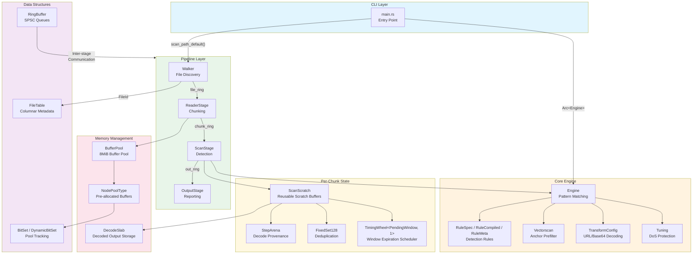

# Architecture Overview

High-level C4-style component diagram showing the scanner-rs secret scanning engine architecture.

## Component Descriptions

| Component | Location | Purpose |
| ------------------- | ------------------------------ | -------------------------------------------------------------------- |
| **CLI Layer**       | `src/main.rs`                  | Entry point that delegates to unified scan routing                   |
| **Unified CLI**     | `src/unified/cli.rs`           | Subcommand parser for `scan fs|git` and source-specific flags        |
| **Unified Orchestrator** | `src/unified/orchestrator.rs` | Dispatches sources and wires structured event sinks               |
| **Unified Events**  | `src/unified/events.rs`        | Structured `ScanEvent` model and JSONL sink                          |
| **FS Owner-Compute Scheduler** | `src/scheduler/local_fs_owner.rs` | Round-robin file dispatch with per-worker owned I/O+scan state |
| **Engine**          | `src/engine/core.rs:154`       | Compiled scanning engine with anchor patterns, rules, and transforms |
| **RuleSpec**        | `src/api.rs:519`               | Rule definitions and specification for rule-based scanning           |
| **RuleCompiled**    | `src/engine/rule_repr.rs:268`  | Compiled rule representation with hot data and validation gates      |
| **Vectorscan**      | `vectorscan-rs-sys` crate      | Multi-pattern anchor prefilter (raw + UTF-16 variants)               |
| **Vectorscan DB Cache** | `src/engine/vectorscan_prefilter.rs` | Best-effort on-disk cache for serialized prefilter/stream DBs |
| **TransformConfig** | `src/api.rs:132`               | Transform stage configuration (URL percent, Base64)                  |
| **Pipeline**        | `src/pipeline.rs`              | 4-stage cooperative pipeline coordinator                             |
| **Archive Core**    | `src/archive/` (`scan.rs`, `budget.rs`, `path.rs`, `formats/*`) | Archive scanning config, budgets, outcomes, path canonicalization, and sink-driven scan core |
| **Walker**          | `src/pipeline.rs`              | Recursive file system traversal (Unix primary with fallback)         |
| **ReaderStage**     | `src/pipeline.rs`              | File chunking with overlap preservation                              |
| **ScanStage**       | `src/pipeline.rs`              | Detection engine invocation                                          |
| **OutputStage**     | `src/pipeline.rs`              | Finding output to stdout                                             |
| **BufferPool**      | `src/runtime.rs:468`           | Fixed-capacity aligned buffer pool                                   |
| **NodePoolType**    | `src/pool/node_pool.rs:49`     | Generic pre-allocated node pool                                      |
| **RingBuffer**      | `src/stdx/ring_buffer.rs:45`   | Fixed-capacity SPSC queue                                            |
| **DynamicBitSet**   | `src/stdx/bitset.rs:51`        | Runtime-sized bitset for pool tracking                               |
| **ScanScratch**     | `src/engine/scratch.rs:83`     | Per-scan reusable scratch state                                      |
| **TimingWheel**     | `src/stdx/timing_wheel.rs:479` | Hashed timing wheel for window expiration scheduling                 |
| **Git Preflight**   | `src/git_scan/preflight.rs`    | Maintenance readiness check for commit-graph, MIDX, and pack count   |
| **ArtifactStatus**  | `src/git_scan/preflight.rs`    | `Ready` vs `NeedsMaintenance` flag produced by Git preflight         |
| **Repo Open**       | `src/git_scan/repo_open.rs`    | Repo discovery, artifact mmaps, start set resolution, watermark load |
| **RepoJobState**    | `src/git_scan/repo_open.rs`    | Bundled repo metadata for downstream Git scan phases                 |
| **StartSetId**      | `src/git_scan/start_set.rs`    | Deterministic identity for start set configuration                   |
| **Watermark Keys**  | `src/git_scan/watermark_keys.rs` | Stable ref watermark key/value encoding                            |
| **Commit Graph View** | `src/git_scan/commit_walk.rs` | Commit-graph adapter with deterministic position lookup              |
| **Commit Graph Index** | `src/git_scan/commit_graph.rs` | Cache-friendly SoA tables for commit OIDs, root trees, and timestamps |
| **Commit Walk**     | `src/git_scan/commit_walk.rs`  | `(watermark, tip]` traversal for introduced-by commit selection      |
| **Commit Walk Limits** | `src/git_scan/commit_walk_limits.rs` | Hard caps for commit traversal and ordering                   |
| **Snapshot Plan**   | `src/git_scan/snapshot_plan.rs` | Snapshot-mode commit selection (tips only)                          |
| **Tree Object Store** | `src/git_scan/object_store.rs` | Pack/loose tree loading for OID-only tree diffs                    |
| **Tree Delta Cache** | `src/git_scan/tree_delta_cache.rs` | Set-associative cache for tree delta bases keyed by pack offset |
| **Tree Spill Arena** | `src/git_scan/spill_arena.rs` | Preallocated mmapped file for large tree payload spill               |
| **Tree Spill Index** | `src/git_scan/object_store.rs` | Fixed-size OID index for reusing spilled tree payloads               |
| **MIDX Mapping**    | `src/git_scan/midx.rs`, `src/git_scan/mapping_bridge.rs` | MIDX parsing and blob-to-pack mapping                     |
| **Tree Diff Walker** | `src/git_scan/tree_diff.rs` | OID-only tree diffs that emit candidate blobs with context          |
| **Blob Introducer** | `src/git_scan/blob_introducer.rs` | First-introduced blob walk for ODB-blob scan mode; supports parallel mode via `introduce_parallel` |
| **BlobIntroWorker** | `src/git_scan/blob_introducer.rs` | Per-thread worker for parallel blob introduction with own `ObjectStore` and `PackCandidateCollector` |
| **AtomicSeenSets** | `src/stdx/atomic_seen_sets.rs` | Lock-free bitmap pair (trees + blobs) sized to MIDX object count for parallel dedup |
| **Pack Candidate Collector** | `src/git_scan/pack_candidates.rs` | Direct blob-to-pack/loose candidate mapping for ODB-blob mode |
| **Tree Stream Parser** | `src/git_scan/tree_stream.rs` | Streaming tree entry parser with bounded buffer                     |
| **Pack Executor**   | `src/git_scan/pack_exec.rs` | Executes pack plans to decode candidate blobs with bounded buffers |
| **Blob Spill**      | `src/git_scan/blob_spill.rs` | Spill-backed mmaps for oversized blob payloads during pack exec     |
| **Engine Adapter**  | `src/git_scan/engine_adapter.rs` | Streams decoded blob bytes into the engine with overlap chunking |
| **Pack I/O**        | `src/git_scan/pack_io.rs` | MIDX-backed pack mmap loader for cross-pack REF delta bases |
| **Path Policy**     | `src/git_scan/path_policy.rs` | Fast path classification for candidate flags                         |
| **Spill Limits**    | `src/git_scan/spill_limits.rs` | Hard caps for spill chunk sizing and on-disk run growth             |
| **CandidateChunk**  | `src/git_scan/spill_chunk.rs` | Bounded candidate buffer + path arena with in-chunk dedupe          |
| **Spill Runs**      | `src/git_scan/run_writer.rs`, `src/git_scan/run_reader.rs` | Stable on-disk encoding for sorted candidate runs     |
| **Run Merger**      | `src/git_scan/spill_merge.rs` | K-way merge of spill runs with canonical dedupe                     |
| **Spiller**         | `src/git_scan/spiller.rs`     | Orchestrates chunking, spilling, and global merge                   |
| **Seen Blob Store** | `src/git_scan/seen_store.rs`  | Batched seen-blob checks for filtering already scanned blobs         |
| **Finalize Builder** | `src/git_scan/finalize.rs` | Builds deterministic blob_ctx/finding/seen_blob + ref_watermark ops |
| **Persistence Store** | `src/git_scan/persist.rs` | Two-phase persistence contract for data ops then watermarks |
| **RocksDB Store** | `src/git_scan/persist_rocksdb.rs` | RocksDB adapter for persistence, seen-blob checks, and watermarks |
| **Git Scan Runner** | `src/git_scan/runner.rs` | End-to-end orchestration across all Git scan stages |
| **WorkItems**       | `src/git_scan/work_items.rs`  | SoA candidate metadata tables for sorting without moving structs    |
| **Policy Hash**     | `src/git_scan/policy_hash.rs`  | Canonical BLAKE3 identity over rules, transforms, and tuning         |

## Archive Scanning Notes

- Nested archive expansion is streaming-only and bounded by `ArchiveConfig::max_archive_depth`.
- Policy enforcement is deterministic: `FailArchive` stops the current container, `FailRun` aborts the scan.
- Archive entries use virtual `FileId` values (high-bit namespace) to isolate per-file engine state.
- Archive parsing and expansion are centralized in `src/archive/scan.rs` and delegated to a sink (`ArchiveEntrySink`) for entry scanning.
- Hardening expectations and review findings are tracked alongside the archive
  scanning implementation in `src/archive/`.

## Git Repo Open

Repo open resolves the repository layout, detects object format, checks for
commit-graph and MIDX presence, and memory-maps those artifacts when ready.
It also resolves the start set refs (via `StartSetResolver`) and loads per-ref
watermarks from `RefWatermarkStore` using the `StartSetId` and policy hash.
The resulting `RepoJobState` is the metadata contract for later Git phases.

## Git Commit Selection

Commit selection uses the commit-graph for deterministic `(watermark, tip]`
traversal in introduced-by mode and emits snapshot tips directly in snapshot
mode. Introduced-by plans are reordered topologically so ancestors appear
before descendants, ensuring first-introduction semantics across merges.

## Git Tree Diff

Tree diffing loads tree objects from the object store and walks them in Git tree
order to emit blob candidates with commit/parent context and path classification.
The walker skips unchanged subtrees, never reads blobs during diffing, and
preserves deterministic candidate ordering for downstream spill/dedupe. Outputs
flow through the `CandidateSink` interface so callers can stream directly into
spill/dedupe; `CandidateBuffer` remains as a buffered fallback for tests and
diagnostics.

The tree object store can spill large tree payloads into a preallocated,
memory-mapped spill arena. Spilled trees are indexed by OID for reuse and do not
count against the in-flight RAM budget.

To reduce repeated base inflations, the object store also maintains a fixed-size
tree delta cache keyed by `(pack_id, offset)`. Delta bases are stored in
fixed-size slots with CLOCK eviction so OFS/REF delta chains can reuse bases
without re-inflating the same pack entry.

For large or spill-backed trees, the walker switches to a streaming parser that
keeps only a bounded buffer of tree bytes in RAM while iterating entries.

## Git Scan Modes

**Diff-history mode (default)** uses tree diffs across the commit plan to emit
candidate blobs with per-commit context. This path feeds the spill/dedupe and
mapping stages before pack planning and execution.

**ODB-blob mode** replaces per-commit diffs with a single pass that
discovers each unique blob once (first-introduced semantics) and then scans blobs
in pack-offset order. Attribution is default in this mode: blobs are tagged with
the first-seen commit position and a representative path, derived from a
commit-graph traversal. It reuses the same pack decode and engine adapter stages
but eliminates redundant tree diff work.

## Git Blob Introducer (ODB-blob mode)

The blob introducer walks commits in topological order and traverses trees
to discover each blob exactly once. It uses `CommitGraphIndex` for cache-friendly
root tree and commit metadata lookups, plus two seen-set bitmaps keyed by
MIDX index (trees + blobs) so repeated subtrees are skipped without parsing.
Loose blobs missing from the MIDX are deduped in fixed-capacity open-addressing
sets. Paths are assembled in a reusable buffer and classified via `PathClass`
to set candidate flags. Excluded paths are tracked separately so a blob can
still be emitted when it later appears under a non-excluded path. The
introducer emits candidates with `ChangeKind::Add` and uses the introducing
commit position for attribution.

## Pack Candidate Collector (ODB-blob mode)

The pack candidate collector receives blob introductions and maps each blob
OID directly to a pack id and offset via the MIDX. Paths are interned into a
local `ByteArena` so downstream pack execution can hold stable `ByteRef`s
without re-interning. Blobs missing from the MIDX are emitted as loose
candidates for `PackIo::load_loose_object`.

## Git Spill + Dedupe

Spill + dedupe buffers candidates in `CandidateChunk` until limits are reached,
then sorts and dedupes within the chunk before writing a spill run (`RunWriter`).
`Spiller` tracks spill run counts and bytes, and `RunMerger` performs a k-way
merge across runs to emit globally sorted, unique candidates. `WorkItems` stores
candidate metadata in SoA form so downstream sorting can shuffle indices without
moving large structs.

Spill chunks now reduce to a single canonical record per OID before writing
runs to disk, shrinking spill bytes without changing canonical context rules.

After global dedupe, sorted OID batches are sent to the seen-blob store so
previously scanned blobs can be filtered before decoding.

Mapping re-interns candidate paths into a shared arena that is kept alive
through pack execution and finalize; scan results retain those path refs to
avoid re-interning in the engine adapter.

## Pack Execution + Cache

Pack execution inflates and applies deltas for packed objects, emitting blob
payloads to the engine adapter. A tiered pack cache keeps decoded bases hot:
Tier A stores <=64 KiB objects, Tier B stores <=512 KiB objects. Both tiers
use fixed-size slots with CLOCK eviction and preallocated storage, so hot-path
lookups and inserts stay allocation-free and deterministic.

Oversized pack objects use a spill-backed mmap path: when the inflated payload
exceeds `PackDecodeLimits.max_object_bytes`, pack exec inflates into a
temporary spill file under the run `spill_dir` and scans from the mmap instead
of holding the bytes in RAM. Delta outputs can spill the same way, keeping the
RAM budget fixed even for very large blobs.

Parallel pack execution shards each pack plan into contiguous offset ranges.
Each worker owns its own pack cache and scratch state; cross-shard delta bases
are resolved via on-demand decode rather than shared caches. Results are merged
in shard order to preserve deterministic output.

## Git Finalize + Persist

Finalize converts scanned blob results into deterministic write ops for
blob_ctx, finding, and seen_blob namespaces plus ref watermark updates.
Persistence writes data ops first, then advances ref watermarks only for
complete runs to avoid skipping unscanned blobs.

## Git Policy Hash

The policy hash is a canonical BLAKE3 identity over:
- Rule specs (canonicalized and order-invariant)
- Transform configs (order-preserving)
- Tuning parameters
- Merge diff mode
- Path policy version

## Testing Harnesses

The optional simulation harnesses provide deterministic simulation primitives and replayable traces
for both scanner and scheduler testing. See `docs/scanner_test_harness_guide.md` and
`docs/scheduler_test_harness_guide.md` for the full design and workflow.

### Scanner Simulation Harness (`sim-harness` feature)

Scanner harness code lives in `src/sim_scanner/` with shared primitives in `src/sim/`.

| Component             | Location                             | Purpose                                                                |
| --------------------- | ------------------------------------ | ---------------------------------------------------------------------- |
| **SimExecutor**       | `src/sim/executor.rs`                | Deterministic single-thread work-stealing model for simulation         |
| **SimFs**             | `src/sim/fs.rs`                      | Deterministic in-memory filesystem used by scenarios                   |
| **ScenarioGenerator** | `src/sim_scanner/generator.rs`       | Synthetic scenario builder with expected-secret ground truth           |
| **SimArchive**        | `src/sim_archive/`                   | Deterministic archive builders + virtual path materialization for sims |
| **Scanner Oracles**   | `src/sim_scanner/runner.rs`          | Ground-truth and differential checks for scanner simulations           |
| **SimRng / SimClock** | `src/sim/rng.rs`, `src/sim/clock.rs` | Stable RNG and simulated time source                                   |
| **TraceRing**         | `src/sim/trace.rs`                   | Bounded trace buffer for replay and debugging                          |
| **Minimizer**         | `src/sim/minimize.rs`                | Deterministic shrink passes for failing scanner artifacts              |

### Git Simulation Harness (`sim-harness` feature)

Git simulation harness code lives in `src/sim_git_scan/` with shared primitives in `src/sim/`.

| Component                  | Location                           | Purpose                                                            |
| -------------------------- | ---------------------------------- | ------------------------------------------------------------------ |
| **Git Scenario Schema**    | `src/sim_git_scan/scenario.rs`     | Repo model + artifact bytes schema for deterministic Git scenarios |
| **Git Scenario Generator** | `src/sim_git_scan/generator.rs`    | Synthetic Git repo generator for bounded random tests              |
| **Git Runner**             | `src/sim_git_scan/runner.rs`       | Deterministic stage runner and failure taxonomy                    |
| **Git Trace Ring**         | `src/sim_git_scan/trace.rs`        | Bounded trace buffer for Git simulation replay                     |
| **Git Artifact Schema**    | `src/sim_git_scan/artifact.rs`     | Reproducible artifact format for Git sim failures                  |
| **Git Fault Plan**         | `src/sim_git_scan/fault.rs`        | Deterministic fault injection plan keyed by logical Git resources  |
| **Git Replay**             | `src/sim_git_scan/replay.rs`       | Load + replay `.case.json` artifacts deterministically             |
| **Git Minimizer**          | `src/sim_git_scan/minimize.rs`     | Deterministic shrink passes for failing Git artifacts              |
| **Git Persist Store**      | `src/sim_git_scan/persist.rs`      | Two-phase persistence simulation with fault injection              |
| **Sim Commit Graph**       | `src/sim_git_scan/commit_graph.rs` | In-memory commit-graph adapter for deterministic commit walks      |
| **Sim Start Set**          | `src/sim_git_scan/start_set.rs`    | Start set + watermark adapters for simulated refs                  |
| **Sim Tree Source**        | `src/sim_git_scan/tree_source.rs`  | Tree-source adapter that encodes semantic trees into raw bytes     |
| **Sim Pack Bytes**         | `src/sim_git_scan/pack_bytes.rs`   | In-memory pack bytes and pack-view adapter                         |
| **Sim Pack I/O**           | `src/sim_git_scan/pack_io.rs`      | External base resolver over in-memory pack bytes                   |
| **SimExecutor**            | `src/sim/executor.rs`              | Shared deterministic executor used for schedule control            |

### Scheduler Simulation Harness (`scheduler-sim` feature)

Scheduler harness code lives in `src/scheduler/sim_executor_harness.rs`.

| Component                   | Location                                | Purpose                                                             |
| --------------------------- | --------------------------------------- | ------------------------------------------------------------------- |
| **Scheduler Sim Harness**   | `src/scheduler/sim_executor_harness.rs` | Deterministic executor model for scheduler interleaving tests       |
| **Scheduler Sim Task VM**   | `src/scheduler/sim_executor_harness.rs` | Bytecode VM driving scheduler-only task effects in simulation       |
| **Scheduler Sim Resources** | `src/scheduler/sim_executor_harness.rs` | Deterministic resource accounting for permits/budgets in simulation |

## Data Flow

1. **Input**: File path from CLI
2. **Walker**: Discovers files, populates FileTable, enqueues FileIds
3. **Reader**: Opens files, reads chunks with overlap, acquires buffers
4. **Scanner**: Runs Engine on each chunk, produces FindingRecs
5. **Output**: Formats and writes findings to stdout
6. **Memory**: Buffers flow through pool acquire/release lifecycle

## Design Principles

- **Anchor-first**: anchors keep regex work bounded to likely windows.
- **Deterministic memory**: fixed-capacity pools and rings make memory usage
  explicit and predictable.
- **Streaming decode**: transforms decode incrementally with budgets, so a
  single file cannot blow up CPU or memory.
- **Correctness over cleverness**: gates may allow false positives, but they
  never skip possible true matches; correctness is preserved by design.
