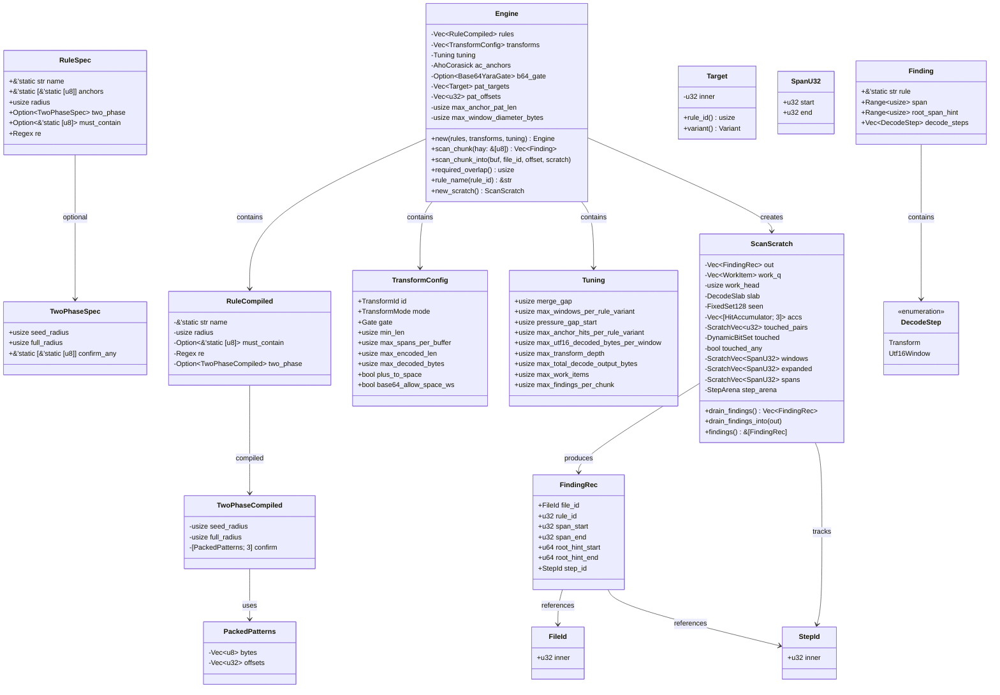
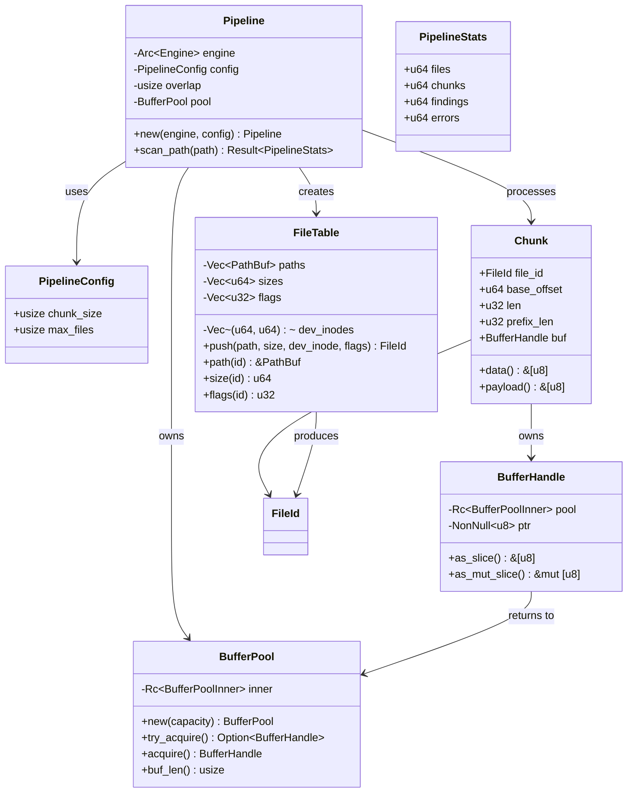
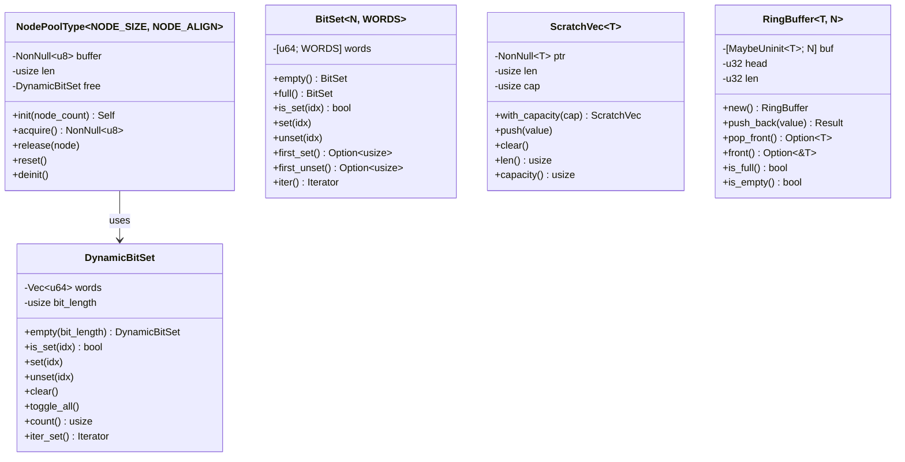
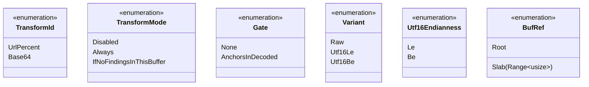

# Data Type Relationships

Class diagram showing the key types in scanner-rs and their relationships.

## Pipeline Types

## Notes

- `Engine.b64_gate` is an optional encoded-space pre-gate for Base64 spans. It
  is built from the same anchor patterns as `ac_anchors` and is only used to
  skip wasteful decodes; the decoded-space gate still enforces correctness.

## Memory Pool Types

## Enumerations

## Key Relationships Summary

| Source | Relationship | Target | Description |
|--------|--------------|--------|-------------|
| `Engine` | contains | `RuleCompiled` | Compiled detection rules |
| `Engine` | contains | `TransformConfig` | Transform configurations |
| `Engine` | creates | `ScanScratch` | Per-scan scratch state |
| `Pipeline` | owns | `BufferPool` | Buffer memory pool |
| `Pipeline` | creates | `FileTable` | File metadata store |
| `Chunk` | owns | `BufferHandle` | Buffer with RAII release |
| `FindingRec` | references | `FileId` | Source file identifier |
| `FindingRec` | references | `StepId` | Decode provenance chain |
| `NodePoolType` | uses | `DynamicBitSet` | Free slot tracking |
