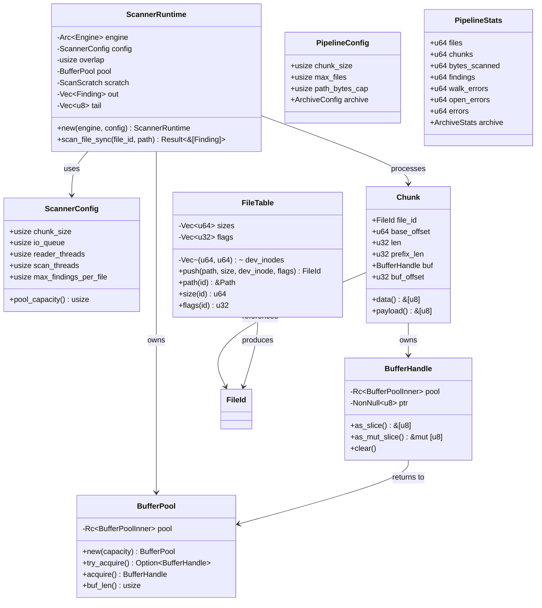
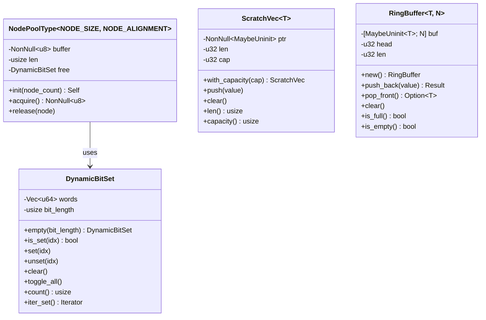
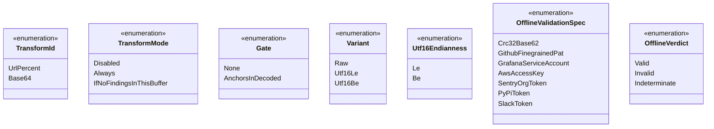
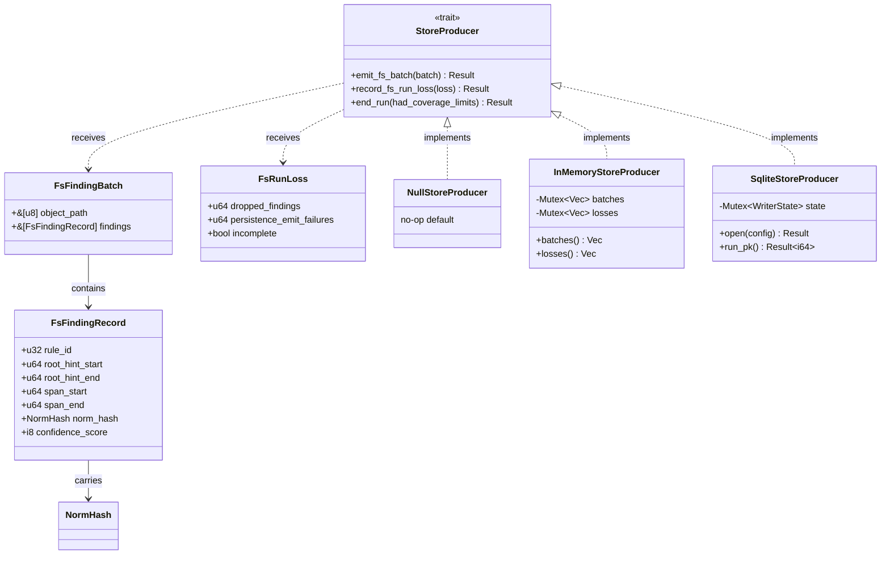
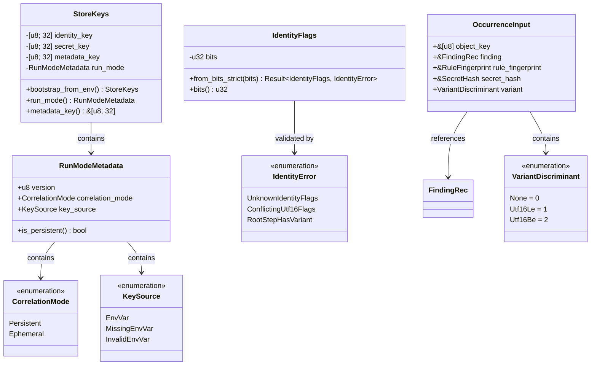

# Data Type Relationships

Class diagram showing the key types in scanner-rs and their relationships.
Verified against:
`src/api.rs`, `src/engine/core.rs`, `src/engine/rule_repr.rs`,
`src/engine/scratch.rs`, `src/engine/hit_pool.rs`, `src/engine/safelist.rs`,
`src/engine/offline_validate.rs`, `src/scratch_memory.rs`,
`src/runtime.rs`, `src/pipeline.rs`,
`src/pool/node_pool.rs`, `src/stdx/{bitset,ring_buffer}.rs`,
`src/store/keys.rs`, `src/store/identity.rs`, and `src/store/fs.rs`.

```mermaid
classDiagram
    direction TB

    class Engine {
        -Vec~RuleCompiled~ rules_hot
        -Vec~RuleCold~ rules_cold
        -Vec~TransformConfig~ transforms
        -Tuning tuning
        -Option~VsPrefilterDb~ vs
        -Option~VsAnchorDb~ vs_utf16
        -Option~Base64YaraGate~ b64_gate
        -SafelistFilter safelist
        -Vec~OfflineValidationSpec~ offline_validation_gates
        -Vec~ConfirmAllCompiled~ confirm_all_gates
        -Vec~KeywordsCompiled~ keyword_gates
        -Vec~PackedPatterns~ value_suppressor_gates
        -Vec~EntropyCompiled~ entropy_gates
        -Vec~CharClassCompiled~ char_class_gates
        -Vec~TwoPhaseCompiled~ two_phase_gates
        -Vec~LocalContextSpec~ local_context_gates
        -usize max_window_diameter_bytes
        -usize max_prefilter_width
        +new(rules, transforms, tuning) Engine
        +scan_chunk_into(root_buf, file_id, base_offset, scratch)
        +scan_chunk_records(buf, file_id, base_offset, scratch) &[FindingRec]
        +required_overlap() usize
        +rule_name(rule_id) &str
        +new_scratch() ScanScratch
    }

    class RuleSpec {
        +&'static str name
        +&'static [&'static [u8]] anchors
        +usize radius
        +ValidatorKind validator
        +Option~TwoPhaseSpec~ two_phase
        +Option~&'static [u8]~ must_contain
        +Option~&'static [&'static [u8]]~ keywords_any
        +Option~&'static [&'static [u8]]~ value_suppressors_any
        +Option~EntropySpec~ entropy
        +Option~CharClassSpec~ char_class
        +Option~LocalContextSpec~ local_context
        +Option~OfflineValidationSpec~ offline_validation
        +bool uuid_format_secret
        +Option~u16~ secret_group
        +Option~i8~ min_confidence
        +Regex re
    }

    class RuleCompiled {
        -Regex re
        -Option~&'static [u8]~ must_contain
        -u32 rule_meta
        -u32 confirm_all
        -u32 keywords
        -u32 value_suppressors
        -u32 entropy
        -u32 char_class
        -u32 local_context
        -u32 two_phase
        -u32 offline_validation
    }

    class RuleCold {
        -&'static str name
    }

    class TwoPhaseCompiled {
        -usize seed_radius
        -usize full_radius
        -[PackedPatterns; 3] confirm
    }

    class PackedPatterns {
        -Box~[u8]~ bytes
        -Box~[u32]~ offsets
    }

    class SafelistFilter {
        +new() SafelistFilter
        +matcher() RegexSet
        +secret_bytes_matcher() RegexSet
    }

    class Target {
        -u32 inner
        +rule_id() usize
        +variant() Variant
    }

    class SpanU32 {
        +u32 start
        +u32 end
        +u32 anchor_hint
    }

    class TwoPhaseSpec {
        +usize seed_radius
        +usize full_radius
        +&'static [&'static [u8]] confirm_any
    }

    class TransformConfig {
        +TransformId id
        +TransformMode mode
        +Gate gate
        +usize min_len
        +usize max_spans_per_buffer
        +usize max_encoded_len
        +usize max_decoded_bytes
        +bool plus_to_space
        +bool base64_allow_space_ws
    }

    class Tuning {
        +usize merge_gap
        +usize max_windows_per_rule_variant
        +usize pressure_gap_start
        +usize max_anchor_hits_per_rule_variant
        +usize max_utf16_decoded_bytes_per_window
        +usize max_transform_depth
        +usize max_total_decode_output_bytes
        +usize max_work_items
        +usize max_findings_per_chunk
        +bool scan_utf16_variants
    }

    class NormHash {
        [u8; 32]
        BLAKE3 normalized secret digest
    }

    class ScanScratch {
        -ScratchVec~FindingRec~ out
        -ScratchVec~NormHash~ norm_hash
        -ScratchVec~u64~ drop_hint_end
        -ScratchVec~WorkItem~ work_q
        -usize work_head
        -DecodeSlab slab
        -usize offline_suppressed
        -usize secret_bytes_safelist_suppressed
        -usize uuid_format_suppressed
        -FixedSet128 seen_findings_scan
        -HitAccPool hit_acc_pool
        -ScratchVec~u32~ touched_pairs
        -ScratchVec~SpanU32~ windows
        -ScratchVec~SpanU32~ expanded
        -ScratchVec~SpanU32~ spans
        -StepArena step_arena
        +drain_findings(out)
        +drain_findings_into(out)
        +drain_findings_with_hashes(findings, hashes)
        +findings() &[FindingRec]
        +norm_hashes() &[NormHash]
        +dropped_findings() usize
    }

    class Finding {
        +&'static str rule
        +Range~usize~ span
        +Range~usize~ root_span_hint
        +DecodeSteps decode_steps
    }

    class FindingRec {
        +FileId file_id
        +u32 rule_id
        +u32 span_start
        +u32 span_end
        +u64 root_hint_start
        +u64 root_hint_end
        +bool dedupe_with_span
        +StepId step_id
        +i8 confidence_score
    }

    class FileId {
        +u32 inner
    }

    class StepId {
        +u32 inner
    }

    class DecodeStep {
        <<enumeration>>
        Transform
        Utf16Window
    }

    Engine --> RuleCompiled : contains
    Engine --> RuleCold : contains
    Engine --> TransformConfig : contains
    Engine --> Tuning : contains
    Engine --> SafelistFilter : contains
    Engine --> ScanScratch : creates
    Engine --> OfflineValidationSpec : offline gate pool

    RuleSpec --> TwoPhaseSpec : optional
    RuleSpec --> CharClassSpec : optional
    RuleSpec --> OfflineValidationSpec : optional
    RuleCompiled --> TwoPhaseCompiled : optional gate index (`u32`; `NO_GATE` sentinel)
    RuleCompiled --> CharClassCompiled : optional gate index (`u32`; `NO_GATE` sentinel)
    TwoPhaseCompiled --> PackedPatterns : uses

    ScanScratch --> FindingRec : produces
    ScanScratch --> NormHash : produces aligned hashes
    ScanScratch --> StepId : tracks

    Finding --> DecodeStep : contains
    FindingRec --> FileId : references
    FindingRec --> StepId : references
```

## Pipeline and Runtime Types

```mermaid
classDiagram
    direction TB

    class ScannerRuntime {
        -Arc~Engine~ engine
        -ScannerConfig config
        -usize overlap
        -BufferPool pool
        -ScanScratch scratch
        -Vec~Finding~ out
        -Vec~u8~ tail
        +new(engine, config) ScannerRuntime
        +scan_file_sync(file_id, path) Result~&[Finding]~
    }

    class ScannerConfig {
        +usize chunk_size
        +usize io_queue
        +usize reader_threads
        +usize scan_threads
        +usize max_findings_per_file
        +pool_capacity() usize
    }

    class PipelineConfig {
        +usize chunk_size
        +usize max_files
        +usize path_bytes_cap
        +ArchiveConfig archive
    }

    class PipelineStats {
        +u64 files
        +u64 chunks
        +u64 bytes_scanned
        +u64 findings
        +u64 walk_errors
        +u64 open_errors
        +u64 errors
        +ArchiveStats archive
    }

    class FileTable {
        -Vec~u64~ sizes
        -Vec~(u64, u64)~ dev_inodes
        -Vec~u32~ flags
        +push(path, size, dev_inode, flags) FileId
        +path(id) &Path
        +size(id) u64
        +flags(id) u32
    }

    class Chunk {
        +FileId file_id
        +u64 base_offset
        +u32 len
        +u32 prefix_len
        +BufferHandle buf
        +u32 buf_offset
        +data() &[u8]
        +payload() &[u8]
    }

    class BufferPool {
        -Rc~BufferPoolInner~ pool
        +new(capacity) BufferPool
        +try_acquire() Option~BufferHandle~
        +acquire() BufferHandle
        +buf_len() usize
    }

    class BufferHandle {
        -Rc~BufferPoolInner~ pool
        -NonNull~u8~ ptr
        +as_slice() &[u8]
        +as_mut_slice() &mut [u8]
        +clear()
    }

    ScannerRuntime --> ScannerConfig : uses
    ScannerRuntime --> BufferPool : owns
    ScannerRuntime --> Chunk : processes

    Chunk --> BufferHandle : owns
    BufferHandle --> BufferPool : returns to
    Chunk --> FileId : references
    FileTable --> FileId : produces
```

## Notes

- `Engine.b64_gate` is an optional encoded-space pre-gate for Base64 spans. It
  is built from the same anchor patterns as `vs` and is only used to
  skip wasteful decodes; the decoded-space gate still enforces correctness.
- `Engine.safelist` is applied at finding emission for root emit paths. A
  suppressed finding is never inserted, so `findings`, `norm_hashes`, and
  `drop_hint_end` stay aligned 1:1 without a post-scan compaction pass.
- Offline validation runs inline at finding emission time in `window_validate`
  as Gate 13. Each root-semantic finding (parent `step_id == STEP_ROOT`) whose
  rule has an `OfflineValidationSpec` gate is checked against the extracted
  secret bytes. `Valid` and `Indeterminate` verdicts keep the finding;
  `Invalid` suppresses it before the finding occupies a cap slot. Non-root
  (transform-derived) findings are always kept. Suppressed findings increment
  `ScanScratch.offline_suppressed`.
- `RuleCompiled.rule_meta` packs four hot fields:
  - bits 0..=15: `secret_group` value (when override-present bit is set)
  - bit 16: `needs_assignment_shape_check`
  - bit 17: `has_secret_group_override`
  - bit 18: `uuid_format_secret`
  This keeps `RuleCompiled` at ≤ 88 bytes on 64-bit targets while preserving
  full `u16` capture-group semantics.
- `Engine.required_overlap()` is computed as:
  `max_window_diameter_bytes + (max_prefilter_width - 1)`.
- `StepId` and `FindingRec.step_id` are only valid while the originating
  `ScanScratch` step arena is alive and not reset.

## Memory Pool Types

```mermaid
classDiagram
    direction TB

    class NodePoolType~NODE_SIZE, NODE_ALIGNMENT~ {
        -NonNull~u8~ buffer
        -usize len
        -DynamicBitSet free
        +init(node_count) Self
        +acquire() NonNull~u8~
        +release(node)
    }

    class DynamicBitSet {
        -Vec~u64~ words
        -usize bit_length
        +empty(bit_length) DynamicBitSet
        +is_set(idx) bool
        +set(idx)
        +unset(idx)
        +clear()
        +toggle_all()
        +count() usize
        +iter_set() Iterator
    }

    class ScratchVec~T~ {
        -NonNull~MaybeUninit<T>~ ptr
        -u32 len
        -u32 cap
        +with_capacity(cap) ScratchVec
        +push(value)
        +clear()
        +len() usize
        +capacity() usize
    }

    class RingBuffer~T, N~ {
        -[MaybeUninit~T~; N] buf
        -u32 head
        -u32 len
        +new() RingBuffer
        +push_back(value) Result
        +pop_front() Option~T~
        +clear()
        +is_full() bool
        +is_empty() bool
    }

    NodePoolType --> DynamicBitSet : uses
```

## Enumerations

```mermaid
classDiagram
    class TransformId {
        <<enumeration>>
        UrlPercent
        Base64
    }

    class TransformMode {
        <<enumeration>>
        Disabled
        Always
        IfNoFindingsInThisBuffer
    }

    class Gate {
        <<enumeration>>
        None
        AnchorsInDecoded
    }

    class Variant {
        <<enumeration>>
        Raw
        Utf16Le
        Utf16Be
    }

    class Utf16Endianness {
        <<enumeration>>
        Le
        Be
    }

    class OfflineValidationSpec {
        <<enumeration>>
        Crc32Base62
        GithubFinegrainedPat
        GrafanaServiceAccount
        AwsAccessKey
        SentryOrgToken
        PyPiToken
        SlackToken
    }

    class OfflineVerdict {
        <<enumeration>>
        Valid
        Invalid
        Indeterminate
    }
```

## FS Persistence Producer Types

```mermaid
classDiagram
    direction TB

    class FsFindingRecord {
        +u32 rule_id
        +u64 root_hint_start
        +u64 root_hint_end
        +u64 span_start
        +u64 span_end
        +NormHash norm_hash
        +i8 confidence_score
    }

    class FsFindingBatch {
        +&[u8] object_path
        +&[FsFindingRecord] findings
    }

    class FsRunLoss {
        +u64 dropped_findings
        +u64 persistence_emit_failures
        +bool incomplete
    }

    class StoreProducer {
        <<trait>>
        +emit_fs_batch(batch) Result
        +record_fs_run_loss(loss) Result
        +end_run(had_coverage_limits) Result
    }

    class NullStoreProducer {
        no-op default
    }

    class InMemoryStoreProducer {
        -Mutex~Vec~ batches
        -Mutex~Vec~ losses
        +batches() Vec
        +losses() Vec
    }

    class SqliteStoreProducer {
        -Mutex~WriterState~ state
        +open(config) Result
        +run_pk() Result~i64~
    }

    FsFindingBatch --> FsFindingRecord : contains
    FsFindingRecord --> NormHash : carries
    StoreProducer <|.. NullStoreProducer : implements
    StoreProducer <|.. InMemoryStoreProducer : implements
    StoreProducer <|.. SqliteStoreProducer : implements
    StoreProducer ..> FsFindingBatch : receives
    StoreProducer ..> FsRunLoss : receives
```

Verified against: `src/store/fs.rs`, `src/store/db/writer.rs`.

**Data flow**: After within-chunk dedup, the scheduler's `build_persistence_batch()`
converts `FindingWithHash<F>` carriers into `FsFindingRecord` values. These are
grouped per scanned object in `FsFindingBatch` and handed to the configured
`StoreProducer`. At run end, `record_fs_run_loss()` captures drop/failure counters
and `end_run()` derives the final run status and persists it to the database.

| Type | Purpose |
|------|---------|
| `FsFindingRecord` | Post-dedupe, backend-agnostic finding with absolute byte offsets, `norm_hash`, and additive `confidence_score` (0–10) |
| `FsFindingBatch` | Borrowed batch of findings for one scanned object (file or archive entry) |
| `FsRunLoss` | Run-level loss accounting (dropped findings, emit failures, incomplete flag) |
| `StoreProducer` | `Send + Sync` trait for FS finding persistence (`Arc<dyn StoreProducer>`) |
| `NullStoreProducer` | Default no-op for CLI / feature-off paths |
| `InMemoryStoreProducer` | Collects batches in memory for tests and diagnostics |
| `SqliteStoreProducer` | Default FS backend: SQLite star-schema with WAL mode, per-batch transactions, and in-memory rule cache |

## Persistence Identity Types

```mermaid
classDiagram
    direction TB

    class StoreKeys {
        -[u8; 32] identity_key
        -[u8; 32] secret_key
        -[u8; 32] metadata_key
        -RunModeMetadata run_mode
        +bootstrap_from_env() StoreKeys
        +run_mode() RunModeMetadata
        +metadata_key() &[u8; 32]
    }

    class RunModeMetadata {
        +u8 version
        +CorrelationMode correlation_mode
        +KeySource key_source
        +is_persistent() bool
    }

    class CorrelationMode {
        <<enumeration>>
        Persistent
        Ephemeral
    }

    class KeySource {
        <<enumeration>>
        EnvVar
        MissingEnvVar
        InvalidEnvVar
    }

    class IdentityFlags {
        -u32 bits
        +from_bits_strict(bits) Result~IdentityFlags, IdentityError~
        +bits() u32
    }

    class VariantDiscriminant {
        <<enumeration>>
        None = 0
        Utf16Le = 1
        Utf16Be = 2
    }

    class OccurrenceInput {
        +&[u8] object_key
        +&FindingRec finding
        +&RuleFingerprint rule_fingerprint
        +&SecretHash secret_hash
        +VariantDiscriminant variant
    }

    class IdentityError {
        <<enumeration>>
        UnknownIdentityFlags
        ConflictingUtf16Flags
        RootStepHasVariant
    }

    StoreKeys --> RunModeMetadata : contains
    RunModeMetadata --> CorrelationMode : contains
    RunModeMetadata --> KeySource : contains
    OccurrenceInput --> FindingRec : references
    OccurrenceInput --> VariantDiscriminant : contains
    IdentityFlags --> IdentityError : validated by
```

Verified against: `src/store/keys.rs`, `src/store/identity.rs`.

**Identity derivation functions** (not shown as classes):

| Function | Input | Output | Key Used |
|---|---|---|---|
| `rule_fingerprint(rule, keys)` | `RuleSpec` | `RuleFingerprint` (`[u8; 32]`) | _(unkeyed)_ |
| `secret_hash(norm_hash, keys)` | `[u8; 32]` | `SecretHash` (`[u8; 32]`) | `secret_key` |
| `occurrence_id(input, keys)` | `OccurrenceInput` | `OccurrenceId` (`[u8; 32]`) | `identity_key` |

See [persistence-identity.md](persistence-identity.md) for contract details and normalization rules.

## Key Relationships Summary

| Source | Relationship | Target | Description |
|--------|--------------|--------|-------------|
| `Engine` | contains | `RuleCompiled` | Compiled detection rules |
| `Engine` | contains | `RuleCold` | Cold rule metadata (`name`) |
| `Engine` | contains | `TransformConfig` | Transform configurations |
| `Engine` | creates | `ScanScratch` | Per-scan scratch state |
| `Engine` | contains | `OfflineValidationSpec` | Offline validation gate pool |
| `RuleSpec` | optional | `OfflineValidationSpec` | Per-rule offline validation spec |
| `ScannerRuntime` | owns | `BufferPool` | Buffer memory pool |
| `FileTable` | produces | `FileId` | File metadata IDs |
| `Chunk` | owns | `BufferHandle` | Buffer with RAII release |
| `FindingRec` | references | `FileId` | Source file identifier |
| `FindingRec` | references | `StepId` | Decode provenance chain |
| `NodePoolType` | uses | `DynamicBitSet` | Free slot tracking |
| `StoreKeys` | contains | `RunModeMetadata` | Run correlation semantics |
| `OccurrenceInput` | references | `FindingRec` | Finding to hash |
| `OccurrenceInput` | contains | `VariantDiscriminant` | UTF-16 variant discrimination |
| `FsFindingBatch` | contains | `FsFindingRecord` | Post-dedupe findings per object |
| `FsFindingRecord` | carries | `NormHash` | BLAKE3 digest for cross-run dedup |
| `StoreProducer` | receives | `FsFindingBatch` | Per-object finding persistence |
| `StoreProducer` | receives | `FsRunLoss` | Run-level loss accounting |
