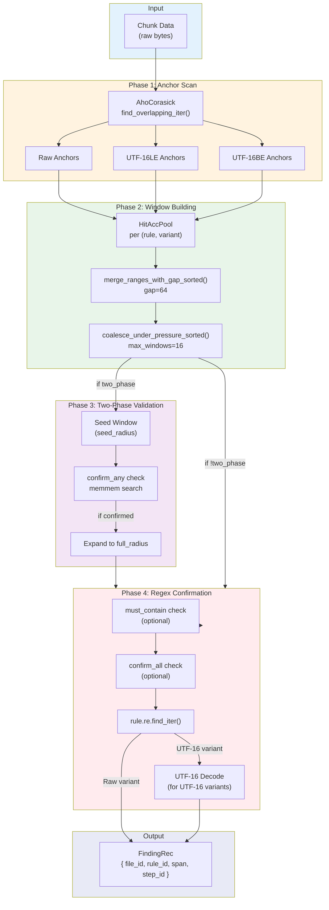
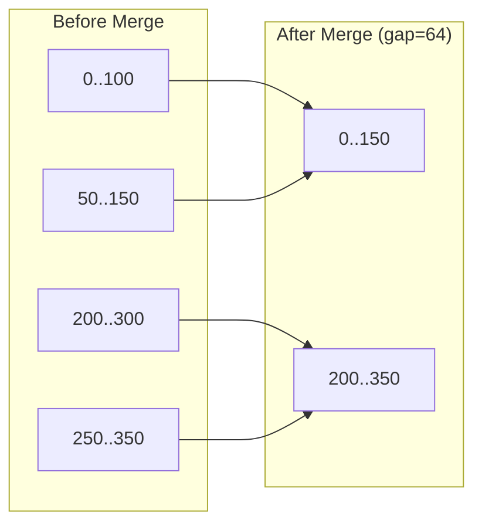
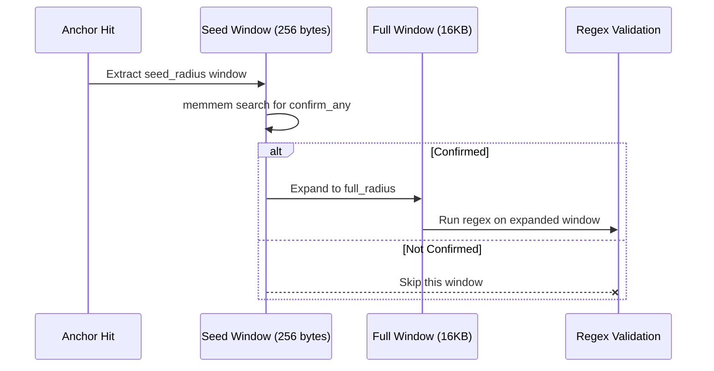
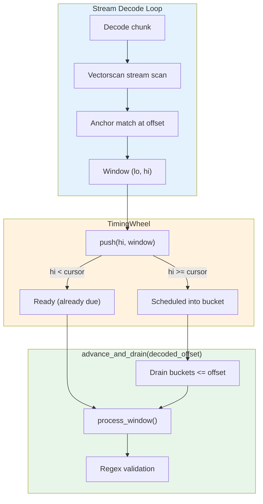

# Detection Engine Flow

Multi-phase pattern matching flow within `Engine::scan_chunk_into()`.



## Phase Details

### Phase 1: Anchor Scan

The engine uses Aho-Corasick for multi-pattern matching of anchor strings:

```rust
// Anchor patterns are deduplicated and mapped to rule targets
for m in self.ac_anchors.find_overlapping_iter(buf) {
    let pid = m.pattern().as_usize();
    let start = self.pat_offsets[pid] as usize;
    let end = self.pat_offsets[pid + 1] as usize;
    let targets = &self.pat_targets[start..end];  // flat Target list

    for &t in targets {
        let rule_id = t.rule_id();
        let variant = t.variant(); // Raw/Utf16Le/Utf16Be
        let rule = &self.rules[rule_id];
        let radius = compute_radius(rule, variant);
        let window = SpanU32::new(m.start() - radius, m.end() + radius);
        let pair = rule_id * 3 + variant.idx();
        hit_acc_pool.push_span(pair, window, &mut touched_pairs);
    }
}
```

Each anchor is stored in three variants:
- **Raw**: Original bytes (e.g., `ghp_`)
- **UTF-16LE**: Little-endian encoding (e.g., `g\0h\0p\0_\0`)
- **UTF-16BE**: Big-endian encoding (e.g., `\0g\0h\0p\0_`)

### Phase 2: Window Building

Windows are accumulated per (rule, variant) pair:



**Pressure Coalescing**: If windows exceed `max_windows_per_rule_variant` (16), the gap doubles until windows fit, or everything merges into one.

### Phase 3: Two-Phase Validation

For noisy rules (like private keys), two-phase confirmation reduces false positives:



Example: Private key detection
- `seed_radius`: 256 bytes (fast check)
- `confirm_any`: ["PRIVATE KEY"]
- `full_radius`: 16KB (for full PEM block)

### Phase 4: Regex Confirmation

For raw variants:
```rust
for rm in rule.re.find_iter(window) {
    scratch.out.push(FindingRec { ... });
}
```

For UTF-16 variants:
```rust
// Decode UTF-16 window to UTF-8
let decoded = decode_utf16le_to_buf(&buf[window], max_out)?;

// Create decode step for provenance
let utf16_step_id = scratch.step_arena.push(
    step_id,
    DecodeStep::Utf16Window { endianness, parent_span: window }
);

// Run regex on decoded bytes
for rm in rule.re.find_iter(&decoded) {
    scratch.out.push(FindingRec { step_id: utf16_step_id, ... });
}
```

## Transform Gating (URL/Base64)

After raw/UTF-16 scanning, the engine may generate derived buffers by decoding
URL-percent or Base64 spans. These transforms are expensive, so they are gated:

- **Decoded-space gate**: stream-decode and check for any anchor in the decoded
  bytes. If no anchor is found, the transform is skipped. This is conservative
  and avoids a full decode when the span is irrelevant.
- **Base64 pre-gate (encoded-space)**: Base64 uses an additional, cheaper prefilter
  that runs on the encoded bytes. It uses YARA-style base64 permutations of the
  anchors to cheaply reject spans that cannot possibly decode to an anchor. The
  decoded-space gate still runs afterward to preserve correctness.

Selection detail:
- The decoded-space gate chooses between a raw-only and a combined (raw + UTF-16)
  anchor automaton based on whether the decoded window contains any NUL bytes.
  This avoids UTF-16 overhead on NUL-free data while keeping a single pass on
  NUL-heavy buffers.

See `docs/transform-chain.md` for diagrams and the gating sequence.

## Keyword + Entropy Gates

Some rules benefit from additional semantic filters beyond anchors + regex:

- **Keyword gate (any-of)**: at least one keyword must appear inside the same
  validation window as the regex. This is a cheap memmem filter that reduces
  false positives without requiring global context.
- **Entropy gate**: after a regex match, compute Shannon entropy (bits/byte)
  of the matched bytes. Low-entropy matches are rejected as likely false
  positives (e.g., repeated characters or structured IDs).

These gates are designed to be **local and bounded**:
- Keywords are checked *before* regex, and for UTF-16 windows the check happens
  **before decoding** to avoid wasting decode budget.
- Entropy runs only on the regex match and is capped by `max_len` to keep cost
  predictable.

## Tuning Parameters

| Parameter | Default | Purpose |
|-----------|---------|---------|
| `merge_gap` | 64 | Window merge gap (bytes) |
| `max_windows_per_rule_variant` | 16 | Max windows before pressure coalescing |
| `pressure_gap_start` | 128 | Starting gap for pressure coalescing |
| `max_anchor_hits_per_rule_variant` | 2048 | Hard cap on anchor hits |
| `max_utf16_decoded_bytes_per_window` | 64KB | UTF-16 decode output limit |
| `pending_window_horizon_bytes` | max_radius + chunk_size | TimingWheel horizon bound |
| `pending_window_cap` | rules × 3 × max_windows | TimingWheel node pool capacity |

## Stream Decode Window Scheduling

During streaming decode (URL/Base64 transforms), the engine uses a **TimingWheel** to
schedule window validation without materializing the full decoded buffer. This enables
efficient incremental scanning where windows are processed exactly when they become
complete.



### How It Works

1. **Window Discovery**: During streaming decode, Vectorscan reports anchor matches
   at decoded-space offsets. Each match generates a window `[lo, hi)` where `hi`
   is the exclusive right edge (when the window becomes complete).

2. **Scheduling**: Windows are pushed to the timing wheel keyed by `hi`:
   ```rust
   match scratch.pending_windows.push(hi, pending_window) {
       Ok(PushOutcome::Scheduled) => { /* queued for later */ }
       Ok(PushOutcome::Ready(w))  => process_window(w, ...),
       Err(_) => { /* pool exhausted, fallback to full decode */ }
   }
   ```

3. **Draining**: As more bytes are decoded, `advance_and_drain(decoded_offset)`
   fires all windows whose `hi <= decoded_offset`:
   ```rust
   scratch.pending_windows.advance_and_drain(decoded_offset, |win| {
       process_window(win, ...);
   });
   ```

4. **Final Flush**: At end-of-stream, `advance_and_drain(u64::MAX)` drains all
   remaining windows.

### TimingWheel Design

The timing wheel uses **exact scheduling** with `G=1` (granularity = 1 byte):

```
┌─────────────────────────────────────────────────────────────────┐
│  TimingWheel<PendingWindow, 1>                                  │
├─────────────────────────────────────────────────────────────────┤
│  wheel_size: power of 2 >= horizon / G                          │
│  cursor_abs: next bucket to process                             │
│  occ: Bitset2 (two-level bitmap for fast next-slot lookup)      │
├─────────────────────────────────────────────────────────────────┤
│  Node Pool (fixed capacity):                                    │
│  ┌─────┬─────┬─────┬─────┐                                      │
│  │ win │ win │free │free │ ...                                  │
│  └──┬──┴──┬──┴─────┴─────┘                                      │
│     │     │                                                     │
│     └──┬──┘                                                     │
│        v                                                        │
│  Slot FIFO lists (intrusive linked list per bucket)             │
└─────────────────────────────────────────────────────────────────┘
```

**Key properties**:

- **Never fires early**: Windows are guaranteed to not fire before `hi`
- **FIFO within bucket**: Windows at the same offset drain in insertion order
- **Fixed allocation**: Node pool is pre-sized; pool exhaustion triggers fallback
- **O(1) push**: Hash-based slot lookup with FIFO append
- **O(buckets + items) drain**: Bitmap skips empty buckets efficiently

### Fallback on Pool Exhaustion

If the timing wheel's node pool is exhausted or horizon is exceeded, the stream
decode falls back to full buffer materialization:

```rust
Err(PushError::PoolExhausted) | Err(PushError::TooFarInFuture { .. }) => {
    scratch.pending_windows.reset();
    // Fall back to non-streaming full decode path
}
```

This ensures correctness is preserved even under adversarial input that
generates many overlapping windows.

## Finding Output

```rust
FindingRec {
    file_id: FileId(0),
    rule_id: 1,              // Index into Engine.rules
    span_start: 100,
    span_end: 140,
    root_hint_start: 100,    // Offset in original file
    root_hint_end: 140,
    step_id: StepId(0),      // Decode provenance chain
}
```
