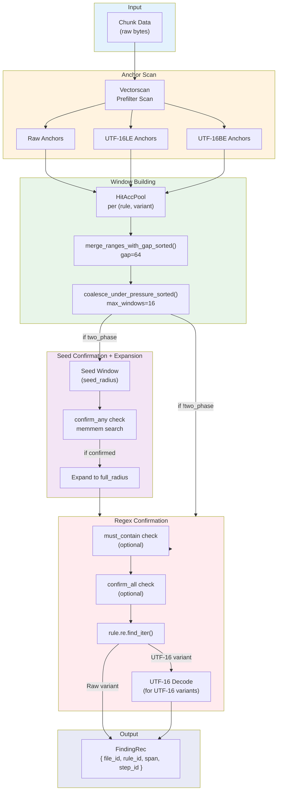

# Detection Engine Flow

Multi-stage pattern matching flow within `Engine::scan_chunk_into()`.



## Stage Details

### Anchor Scan

The engine uses Vectorscan for multi-pattern prefiltering of anchor strings.
Vectorscan scans the buffer and invokes a callback for each anchor match:

```rust
// Vectorscan callback fires for each anchor match in the buffer.
// The callback maps pattern ids to rule targets and accumulates windows.
fn on_match(pid: usize, start: usize, end: usize, ...) {
    let start_idx = pat_offsets[pid] as usize;
    let end_idx = pat_offsets[pid + 1] as usize;
    let targets = &pat_targets[start_idx..end_idx];  // flat Target list

    for &t in targets {
        let rule_id = t.rule_id();
        let variant = t.variant(); // Raw/Utf16Le/Utf16Be
        let rule = &rules[rule_id];
        let radius = compute_radius(rule, variant);
        let window = SpanU32::new(start - radius, end + radius);
        let pair = rule_id * 3 + variant.idx();
        hit_acc_pool.push_span(pair, window, &mut touched_pairs);
    }
}
```

Each anchor is stored in three variants:
- **Raw**: Original bytes (e.g., `ghp_`)
- **UTF-16LE**: Little-endian encoding (e.g., `g\0h\0p\0_\0`)
- **UTF-16BE**: Big-endian encoding (e.g., `\0g\0h\0p\0_`)

### Window Building

Windows are accumulated per (rule, variant) pair:


## Git Chunking Adapter

Git blob scanning feeds decoded bytes through a fixed-size ring buffer and
scans overlapping chunks with the core `Engine`. The overlap length is
`Engine::required_overlap()`; after each chunk scan, the adapter calls
`ScanScratch::drop_prefix_findings(new_bytes_start)` where `new_bytes_start`
is the absolute byte offset of the new (non-overlap) region. This guarantees
chunking invariance without re-materializing full blobs in the scanner.

## Git Tree Diff Streaming

Git tree diffing now uses a streaming entry parser for spill-backed or large
tree payloads. This keeps tree iteration bounded to a fixed-size buffer while
preserving Git tree order before candidates reach the engine adapter.

## Git Path Policy (ODB-Blob)

ODB-blob mode applies path policy during blob introduction, before any blob
bytes are decoded. A blob is emitted with the **first non-excluded path** it
appears under. If the blob appears only under excluded paths (for example,
binary-classified files when `path_policy_version >= 2`), it is skipped. This
ensures deterministic attribution while avoiding false negatives when the same
blob content shows up under both excluded and non-excluded paths.

## FindingKey Hashing

For each match, the engine computes a normalized hash on the **secret span**
in the final representation (decoded UTF-8 / transformed bytes):

```
norm_hash = BLAKE3(secret_bytes)
```

The hash is stored in a scratch sidecar aligned with `FindingRec` indices and
is used by Git persistence as part of the deterministic finding key
`(start, end, rule_id, norm_hash)`. No raw secret bytes are stored.

**Pressure Coalescing**: If windows exceed `max_windows_per_rule_variant` (16), the gap doubles until windows fit, or everything merges into one.

### Seed Confirmation + Expansion

For noisy rules (like private keys), two-phase confirmation reduces false positives:


Example: Private key detection
- `seed_radius`: 256 bytes (fast check)
- `confirm_any`: ["PRIVATE KEY"]
- `full_radius`: 16KB (for full PEM block)

### Regex Confirmation

For raw variants:
```rust
for rm in rule.re.find_iter(window) {
    scratch.out.push(FindingRec { ... });
}
```

For UTF-16 variants:
```rust
// Decode UTF-16 window to UTF-8
let decoded = decode_utf16le_to_buf(&buf[window], max_out)?;

// Create decode step for provenance
let utf16_step_id = scratch.step_arena.push(
    step_id,
    DecodeStep::Utf16Window { endianness, parent_span: window }
);

// Run regex on decoded bytes
for rm in rule.re.find_iter(&decoded) {
    scratch.out.push(FindingRec { step_id: utf16_step_id, ... });
}
```

## Transform Gating (URL/Base64)

After raw/UTF-16 scanning, the engine may generate derived buffers by decoding
URL-percent or Base64 spans. These transforms are expensive, so they are gated:

- **Decoded-space gate**: stream-decode and check for any anchor in the decoded
  bytes. If no anchor is found, the transform is skipped. This is conservative
  and avoids a full decode when the span is irrelevant.
- **Base64 pre-gate (encoded-space)**: Base64 uses an additional, cheaper prefilter
  that runs on the encoded bytes. It uses YARA-style base64 permutations of the
  anchors to cheaply reject spans that cannot possibly decode to an anchor. The
  decoded-space gate still runs afterward to preserve correctness.

Selection detail:
- The decoded-space gate chooses between a raw-only and a combined (raw + UTF-16)
  anchor automaton based on whether the decoded window contains any NUL bytes.
  This avoids UTF-16 overhead on NUL-free data while keeping a single pass on
  NUL-heavy buffers.

See `docs/transform-chain.md` for diagrams and the gating sequence.

## Keyword + Local Context + Entropy Gates

Some rules benefit from additional semantic filters beyond anchors + regex:

- **Keyword gate (any-of)**: at least one keyword must appear inside the same
  validation window as the regex. This is a cheap memmem filter that reduces
  false positives without requiring global context.
- **Local context gate (rule-selective)**: after regex matching and secret
  extraction, inspect a bounded same-line lookaround slice for micro-context
  such as assignment separators, required key names, and/or matching quotes.
  This gate is fail-open when line boundaries are missing in the window to
  avoid false negatives at chunk edges.
- **Lexical context gate (candidate-only)**: after scanning, re-read candidate
  files and classify byte ranges as code/comment/string/config with a streaming
  tokenizer. Rule-level lexical requirements can then score or filter findings.
  The gate fails open on unknown context, run-cap overflow, or I/O errors.
- **Entropy gate**: after a regex match, compute Shannon entropy (bits/byte)
  of the matched bytes. Low-entropy matches are rejected as likely false
  positives (e.g., repeated characters or structured IDs).

These gates are designed to be **local and bounded**:
- Keywords are checked *before* regex, and for UTF-16 windows the check happens
  **before decoding** to avoid wasting decode budget.
- Local context uses bounded lookaround windows and operates on decoded UTF-8
  bytes for UTF-16 variants, preserving fail-open semantics at boundaries.
- Lexical context runs in a **second pass** only when findings exist; it is
  allocation-free after warm-up and fails open when context is unknown.
- Entropy runs only on the regex match and is capped by `max_len` to keep cost
  predictable.

## Lexical Tokenizer Families (Design B)

The candidate-only lexical pass classifies byte ranges with lightweight,
streaming tokenizers. Initial coverage is intentionally coarse but fast:

- **C-like**: `//` and `/* */` comments, `'\"`/`\"`/`` ` `` string delimiters with
  backslash escapes.
- **Python-like**: `#` comments, single/double quotes, and `'''`/`\"\"\"` triple
  quotes (fail-open on ambiguous boundaries).
- **Shell-like**: `#` comments, single/double quotes with backslash escapes.
- **Config**: `#`, `;`, and `//` line comments; quoted strings; unquoted values
  are classified as `Config` (not `Code`).

Tokenizer output is stored as run-length segments and used for rule-specific
lexical context gating and scoring. Lookups treat runs as half-open ranges
`[start, end)` and use a binary search to map findings to a class.

## Tuning Parameters

| Parameter | Default | Purpose |
|-----------|---------|---------|
| `merge_gap` | 64 | Merge adjacent windows within this byte gap |
| `max_windows_per_rule_variant` | 16 | Max windows per (rule, variant) before pressure coalescing |
| `pressure_gap_start` | 128 | Starting gap for pressure coalescing |
| `max_anchor_hits_per_rule_variant` | 2048 | Cap on raw anchor hits before collapsing |
| `max_utf16_decoded_bytes_per_window` | 64 KiB | UTF-16 decode output limit per window |
| `max_transform_depth` | 3 | Max nested decode steps (root + transforms) |
| `max_total_decode_output_bytes` | 512 KiB | Global decoded output budget per scan |
| `max_work_items` | 256 | Cap on queued decode work items per scan |
| `max_findings_per_chunk` | 8192 | Hard cap on findings per chunk |
| `scan_utf16_variants` | true | Enable UTF-16 anchor variants |
| `raw_prefilter_mode` | `RegexAndAnchors` | Raw prefilter policy (regex+anchors vs anchor-only for anchored rules) |

Derived (non-config) limits used by streaming decode:
- `pending_window_horizon_bytes = max_window_radius + STREAM_DECODE_CHUNK_BYTES`
- `pending_window_cap = rules × 3 × max_windows_per_rule_variant`

## Stream Decode Window Scheduling

During streaming decode (URL/Base64 transforms), the engine uses a **TimingWheel** to
schedule window validation without materializing the full decoded buffer. This enables
efficient incremental scanning where windows are processed exactly when they become
complete.


### How It Works

1. **Window Discovery**: During streaming decode, Vectorscan reports anchor matches
   at decoded-space offsets. Each match generates a window `[lo, hi)` where `hi`
   is the exclusive right edge (when the window becomes complete).

2. **Scheduling**: Windows are pushed to the timing wheel keyed by `hi`:
   ```rust
   match scratch.pending_windows.push(hi, pending_window) {
       Ok(PushOutcome::Scheduled) => { /* queued for later */ }
       Ok(PushOutcome::Ready(w))  => process_window(w, ...),
       Err(_) => { /* pool exhausted, fallback to full decode */ }
   }
   ```

3. **Draining**: As more bytes are decoded, `advance_and_drain(decoded_offset)`
   fires all windows whose `hi <= decoded_offset`:
   ```rust
   scratch.pending_windows.advance_and_drain(decoded_offset, |win| {
       process_window(win, ...);
   });
   ```

4. **Final Flush**: At end-of-stream, `advance_and_drain(u64::MAX)` drains all
   remaining windows.

### TimingWheel Design

The timing wheel uses **exact scheduling** with `G=1` (granularity = 1 byte):

```
┌─────────────────────────────────────────────────────────────────┐
│  TimingWheel<PendingWindow, 1>                                  │
├─────────────────────────────────────────────────────────────────┤
│  wheel_size: power of 2 >= horizon / G                          │
│  cursor_abs: next bucket to process                             │
│  occ: Bitset2 (two-level bitmap for fast next-slot lookup)      │
├─────────────────────────────────────────────────────────────────┤
│  Node Pool (fixed capacity):                                    │
│  ┌─────┬─────┬─────┬─────┐                                      │
│  │ win │ win │free │free │ ...                                  │
│  └──┬──┴──┬──┴─────┴─────┘                                      │
│     │     │                                                     │
│     └──┬──┘                                                     │
│        v                                                        │
│  Slot FIFO lists (intrusive linked list per bucket)             │
└─────────────────────────────────────────────────────────────────┘
```

**Key properties**:

- **Never fires early**: Windows are guaranteed to not fire before `hi`
- **FIFO within bucket**: Windows at the same offset drain in insertion order
- **Fixed allocation**: Node pool is pre-sized; pool exhaustion triggers fallback
- **O(1) push**: Hash-based slot lookup with FIFO append
- **O(buckets + items) drain**: Bitmap skips empty buckets efficiently

### Fallback on Pool Exhaustion

If the timing wheel's node pool is exhausted or horizon is exceeded, the stream
decode falls back to full buffer materialization:

```rust
Err(PushError::PoolExhausted) | Err(PushError::TooFarInFuture { .. }) => {
    scratch.pending_windows.reset();
    // Fall back to non-streaming full decode path
}
```

This ensures correctness is preserved even under adversarial input that
generates many overlapping windows.

## Finding Output

```rust
FindingRec {
    file_id: FileId(0),
    rule_id: 1,              // Index into Engine.rules
    span_start: 100,
    span_end: 140,
    root_hint_start: 100,    // Offset in original file
    root_hint_end: 140,
    step_id: StepId(0),      // Decode provenance chain
}
```

## Related Documentation

| Document | Description |
|----------|-------------|
| [Transform Chain](./transform-chain.md) | URL/Base64 transform gating and decode flow |
| [Memory Management](./memory-management.md) | Buffer pools, scratch allocation, and memory budgets |
