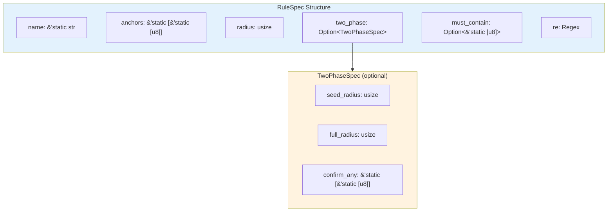
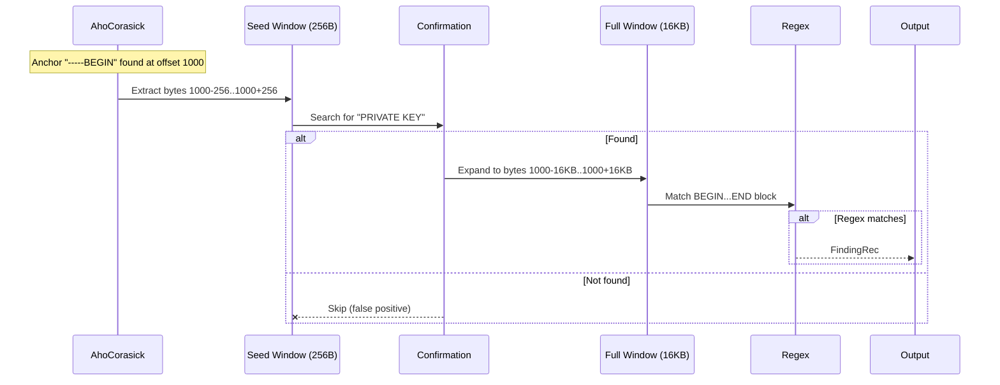
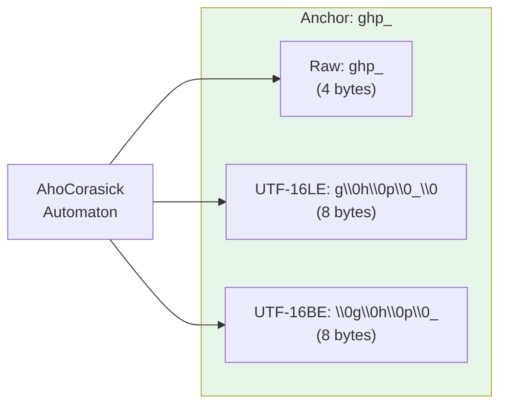
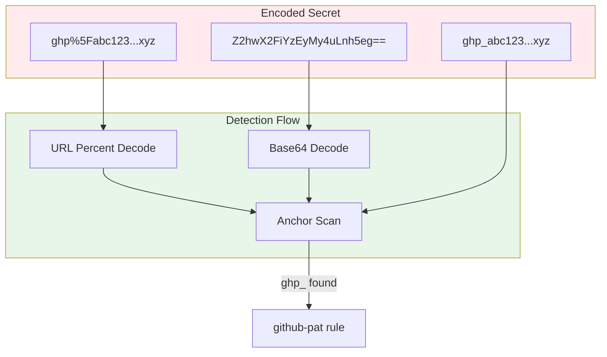

# Detection Rules

Mind map of rule coverage in scanner-rs's `demo_engine()`.

```mermaid
mindmap
    root((Detection Rules))
        Cloud
            AWS
                aws-access-token
                    Anchors: A3T, AKIA, AGPA, AIDA, AROA, AIPA, ANPA, ANVA, ASIA
                    Radius: 64 bytes
                    Pattern: [A3T[A-Z0-9]|AKIA|...])[A-Z0-9]{16}
        Source Control
            GitHub
                github-pat
                    Anchor: ghp_
                    Radius: 96 bytes
                    Pattern: ghp_[0-9a-zA-Z]{36}
                github-oauth
                    Anchor: gho_
                    Radius: 96 bytes
                    Pattern: gho_[0-9a-zA-Z]{36}
                github-app-token
                    Anchors: ghu_, ghs_
                    Radius: 96 bytes
                    Pattern: [ghu|ghs]_[0-9a-zA-Z]{36}
            GitLab
                gitlab-pat
                    Anchor: glpat-
                    Radius: 64 bytes
                    Pattern: glpat-[0-9a-zA-Z\\-\\_]{20}
        Communication
            Slack
                slack-access-token
                    Anchors: xoxb-, xoxa-, xoxp-, xoxr-, xoxs-
                    Radius: 96 bytes
                    Pattern: xox[baprs]-[0-9a-zA-Z]{10,48}
                slack-web-hook
                    Anchor: hooks.slack.com/services/
                    Radius: 160 bytes
                    Pattern: https://hooks.slack.com/services/[A-Za-z0-9+/]{44,46}
        Payment
            Stripe
                stripe-access-token
                    Anchors: sk_test_, sk_live_, pk_test_, pk_live_
                    Radius: 96 bytes
                    Pattern: [sk|pk]_[test|live]_[0-9a-z]{10,32}
        Email
            SendGrid
                sendgrid-api-token
                    Anchors: SG., sg.
                    Radius: 128 bytes
                    Pattern: SG\\.[a-z0-9=_\\-\\.]{66}
        Package Managers
            npm
                npm-access-token
                    Anchor: npm_
                    Radius: 96 bytes
                    Pattern: npm_[a-z0-9]{36}
        Data Platforms
            Databricks
                databricks-api-token
                    Anchors: dapi, DAPI
                    Radius: 96 bytes
                    Pattern: dapi[a-h0-9]{32}
        Cryptographic
            Private Keys
                private-key
                    Anchor: -----BEGIN
                    Two-Phase: Yes
                    Seed: 256 bytes
                    Full: 16KB
                    Confirm: PRIVATE KEY
                    Pattern: -----BEGIN...PRIVATE KEY-----...-----END...PRIVATE KEY-----
```

## Rule Table

| Rule Name | Category | Anchors | Radius | Two-Phase | Notes |
|-----------|----------|---------|--------|-----------|-------|
| `aws-access-token` | Cloud | A3T, AKIA, AGPA, AIDA, AROA, AIPA, ANPA, ANVA, ASIA | 64 | No | Standard AWS access key prefixes |
| `github-pat` | Source Control | ghp_ | 96 | No | GitHub personal access tokens |
| `github-oauth` | Source Control | gho_ | 96 | No | GitHub OAuth tokens |
| `github-app-token` | Source Control | ghu_, ghs_ | 96 | No | GitHub App installation tokens |
| `gitlab-pat` | Source Control | glpat- | 64 | No | GitLab personal access tokens |
| `slack-access-token` | Communication | xoxb-, xoxa-, xoxp-, xoxr-, xoxs- | 96 | No | Slack bot/user tokens |
| `slack-web-hook` | Communication | hooks.slack.com/services/ | 160 | No | Slack incoming webhooks |
| `stripe-access-token` | Payment | sk_test_, sk_live_, pk_test_, pk_live_ | 96 | No | Stripe API keys |
| `sendgrid-api-token` | Email | SG., sg. | 128 | No | SendGrid API tokens |
| `npm-access-token` | Package Managers | npm_ | 96 | No | npm authentication tokens |
| `databricks-api-token` | Data Platforms | dapi, DAPI | 96 | No | Databricks personal access tokens |
| `private-key` | Cryptographic | -----BEGIN | seed=256, full=16KB | Yes | PEM-encoded private keys |

## Rule Anatomy



## Two-Phase Detection (Private Keys)



**Why two-phase?**
- `-----BEGIN` is a common header (certificates, public keys, etc.)
- Only `-----BEGIN ... PRIVATE KEY-----` is sensitive
- Seed window (256B) quickly confirms before expensive 16KB regex

## Anchor Variants

Each anchor is compiled into three variants for detection:



This enables detection in:
- Plain text files (Raw)
- UTF-16LE encoded files (Windows default)
- UTF-16BE encoded files (some network protocols)

## Transform Detection

Secrets may be encoded. The demo engine handles:



## Regex Patterns

| Rule | Pattern | Notes |
|------|---------|-------|
| `aws-access-token` | `(A3T[A-Z0-9]\|AKIA\|AGPA\|AIDA\|AROA\|AIPA\|ANPA\|ANVA\|ASIA)[A-Z0-9]{16}` | 20-char uppercase |
| `github-pat` | `ghp_[0-9a-zA-Z]{36}` | 40-char total |
| `github-oauth` | `gho_[0-9a-zA-Z]{36}` | 40-char total |
| `github-app-token` | `(ghu\|ghs)_[0-9a-zA-Z]{36}` | 40-char total |
| `gitlab-pat` | `glpat-[0-9a-zA-Z\-\_]{20}` | 26-char total |
| `slack-access-token` | `xox[baprs]-([0-9a-zA-Z]{10,48})` | Variable length |
| `slack-web-hook` | `https://hooks.slack.com/services/[A-Za-z0-9+/]{44,46}` | Full URL |
| `stripe-access-token` | `(?i)(sk\|pk)_(test\|live)_[0-9a-z]{10,32}` | Case insensitive |
| `sendgrid-api-token` | `(?i)\b(SG\.(?i)[a-z0-9=_\-\.]{66})` | 69-char total |
| `npm-access-token` | `(?i)\b(npm_[a-z0-9]{36})` | 40-char total |
| `databricks-api-token` | `(?i)\b(dapi[a-h0-9]{32})` | 36-char total |
| `private-key` | `(?is)-----BEGIN...PRIVATE KEY-----.*?-----END...PRIVATE KEY-----` | Multi-line PEM |

## Adding New Rules

To add a new rule to `demo_engine()`:

```rust
RuleSpec {
    name: "my-new-token",
    // Unique byte sequences that appear in the token
    anchors: &[b"mytoken_"],
    // Search radius around anchor hits
    radius: 64,
    // Optional two-phase for noisy anchors
    two_phase: None,
    // Optional fast filter before regex
    must_contain: None,
    // Final validation regex
    re: Regex::new(r"mytoken_[a-z0-9]{32}").unwrap(),
}
```

Guidelines:
1. **Anchors**: Choose distinctive prefixes (4+ bytes)
2. **Radius**: 2x expected token length is usually safe
3. **Two-phase**: Use for anchors that appear in non-sensitive contexts
4. **must_contain**: Fast filter if token has additional required substrings
5. **Regex**: Should be anchored (no `.*` prefix) for performance
