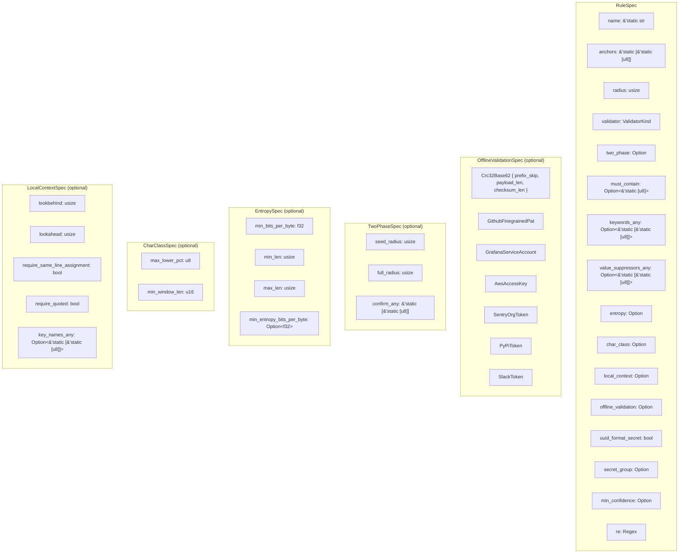
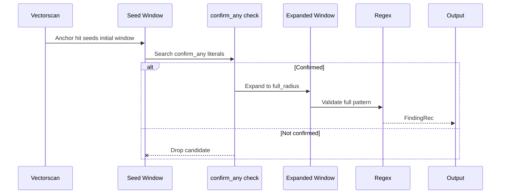
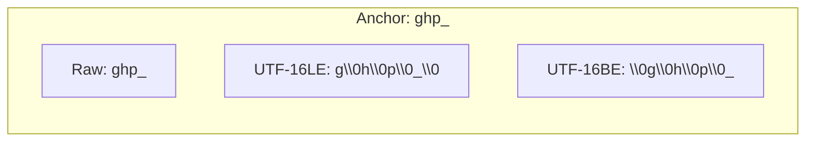

# Detection Rules

Representative view of the current built-in detection rules used by scanner-rs.

## Source of Truth

- [default_rules.yaml](../default_rules.yaml)
- [src/rules/yaml.rs](../src/rules/yaml.rs)
- [src/rules/mod.rs](../src/rules/mod.rs)
- [src/demo.rs](../src/demo.rs)
- [src/unified/orchestrator.rs](../src/unified/orchestrator.rs)

## Current Snapshot

The values below are from the current repository snapshot:

- Built-in rules: `223`
- `two_phase` enabled: `2` rules (`private-key`, `vault-service-token-legacy`)
- `entropy` enabled: `218` rules
- `min_entropy_bits_per_byte` enabled: `97` rules (Tier 0: 43 hex, Tier 1: 48 keyword+alphanum, Tier 2: 6 prefix-structured)
- `local_context` enabled: `1` rule (`generic-api-key`)
- `value_suppressors_any` enabled: `15` rules (`adafruit-api-key`, `adobe-client-id`, `algolia-api-key`, `atlassian-api-token`, `confluent-access-token`, `confluent-secret-key`, `curl-auth-header`, `curl-auth-user`, `discord-api-token`, `discord-client-secret`, `generic-api-key`, `hashicorp-tf-password`, `heroku-api-key`, `linear-client-secret`, `zendesk-secret-key`)
- `secret_group` enabled: `2` rules (`microsoft-teams-webhook`, `sonar-api-token`)
- `char_class` enabled: `212` rules (auto-enabled for all rules with `entropy.min_bits_per_byte >= 3.0`)
- `offline_validation` enabled: `18` rules (`aws-access-token`, `github-app-token`, `github-fine-grained-pat`, `github-oauth`, `github-pat`, `github-refresh-token`, `grafana-service-account-token`, `npm-access-token`, `pypi-upload-token`, `sentry-org-token`, `slack-app-token`, `slack-bot-token`, `slack-config-access-token`, `slack-config-refresh-token`, `slack-legacy-bot-token`, `slack-legacy-token`, `slack-legacy-workspace-token`, `slack-user-token`)
- `uuid_format_secret` enabled: `7` rules (`heroku-api-key`, `hubspot-api-key`, `kucoin-secret-key`, `messagebird-client-id`, `sendbird-access-id`, `snyk-api-token`, `squarespace-access-token`)
- `must_contain` enabled: `0` rules
- `keywords_any` enabled: `223` rules

Rule loading order:

1. Explicit `--rules=<path>`
2. `default_rules.yaml` next to the scanner binary
3. Compiled-in fallback (`include_str!("../../default_rules.yaml")`)

Startup logs include the resolved rule source and a stable fast non-cryptographic
`rule_hash` fingerprint of the loaded rule bytes to make cache and rule-source
behavior auditable.

## Suppression Controls

Suppression is split between rule-level secret filtering and engine-level safelist policy.

| Control | Config Surface | Match Input | Stage |
|-----------|---------------------|---------|--------|
| `value_suppressors_any` | Per-rule YAML (`RuleSpec.value_suppressors_any`) | Extracted secret bytes | Window validation post-match gate |
| `offline_validation` | Per-rule YAML (`RuleSpec.offline_validation`) | Extracted secret bytes (root findings) | Inline emission-time gate (root-semantic findings) |
| Global safelist | Engine policy (`SafelistFilter`) | Root-match context slice | Emit-time suppression on root emit paths |
| UUID-format quick-reject | Per-rule YAML (`RuleSpec.uuid_format_secret`) | Extracted secret bytes | Emit-time suppression (structural UUID check, bypassed when flag is `true`) |

Examples:

1. **Value suppressor**: `API_KEY=YOUR_EXAMPLE_1` matches `generic-api-key` shape but is filtered because the extracted secret contains a configured suppressor substring.
2. **Safelist**: a real-looking bearer token in documentation-style context (for example hosts/placeholders) can be filtered by emit-time safelist even when the secret bytes do not match `value_suppressors_any`.
3. **Non-safelisted context**: the same token in production-like context (for example `api.internal`) remains reportable if other gates pass.

`value_suppressors_any` is the only suppression control encoded directly in rule YAML today; safelist suppression is deliberately outside rule-gate sequencing and runs at finding emission.

## Rule Families (Representative Only)

Categories in this document are organizational only. The YAML schema does not
contain a category field.

```mermaid
mindmap
    root((Detection Rules))
        Cloud
            aws-access-token
                Anchors: A3T, AKIA, ASIA, ABIA, ACCA
                Radius: 256 bytes
                Pattern: (?:A3T[A-Z0-9]|AKIA|ASIA|ABIA|ACCA)[A-Z2-7]{16}
        Source Control
            github-pat
                Anchor: ghp_
                Radius: 256 bytes
            github-oauth
                Anchor: gho_
                Radius: 256 bytes
            github-app-token
                Anchors: ghu_, ghs_
                Radius: 256 bytes
            gitlab-pat
                Anchor: glpat-
                Radius: 256 bytes
        Communication
            slack-bot-token
                Anchor: xoxb
                Radius: 2048 bytes
            slack-webhook-url
                Anchor: hooks.slack.com
                Radius: 256 bytes
        Payment
            stripe-access-token
                Anchors: sk_test, sk_live, sk_prod, rk_test, rk_live, rk_prod
                Radius: 256 bytes
        Data Platforms
            databricks-api-token
                Anchor: dapi
                Radius: 256 bytes
        Package Managers
            npm-access-token
                Anchors: npm_, NPM_
                Radius: 256 bytes
        Cryptographic
            private-key
                Anchors: -----begin, -----BEGIN
                Two-Phase: Yes
                Seed: 256 bytes
                Full: 16KB
            vault-service-token-legacy
                Anchors: vault, VAULT, Vault
                Two-Phase: Yes
                Seed: 128 bytes
                Full: 512 bytes
```

## Rule Table (Representative)

| Rule Name | Category (doc-only) | Anchors | Radius | Two-Phase | Notes |
|-----------|---------------------|---------|--------|-----------|-------|
| `aws-access-token` | Cloud | A3T, AKIA, ASIA, ABIA, ACCA | 256 | No | AWS access key id variants |
| `github-pat` | Source Control | ghp_ | 256 | No | GitHub personal access token |
| `github-oauth` | Source Control | gho_ | 256 | No | GitHub OAuth token |
| `github-app-token` | Source Control | ghu_, ghs_ | 256 | No | GitHub app token |
| `gitlab-pat` | Source Control | glpat- | 256 | No | GitLab personal access token |
| `slack-bot-token` | Communication | xoxb | 2048 | No | Slack bot token |
| `slack-webhook-url` | Communication | hooks.slack.com | 256 | No | Slack incoming webhook URL |
| `stripe-access-token` | Payment | sk_test, sk_live, sk_prod, rk_test, rk_live, rk_prod | 256 | No | Stripe API token |
| `sendgrid-api-token` | Email | SG. | 256 | No | SendGrid API token |
| `npm-access-token` | Package Managers | npm_, NPM_ | 256 | No | npm token |
| `databricks-api-token` | Data Platforms | dapi | 256 | No | Databricks PAT |
| `private-key` | Cryptographic | -----begin, -----BEGIN | 0 | Yes (`256`/`16384`) | PEM private key |
| `vault-service-token-legacy` | Secrets Management | vault, VAULT, Vault | 512 | Yes (`128`/`512`) | Legacy Vault service token |

## Rule Anatomy


```mermaid
graph TB
    subgraph RuleSpec["RuleSpec"]
        Name["name: &'static str"]
        Anchors["anchors: &'static [&'static [u8]]"]
        Radius["radius: usize"]
        Validator["validator: ValidatorKind"]
        TwoPhase["two_phase: Option<TwoPhaseSpec>"]
        MustContain["must_contain: Option<&'static [u8]>"]
        KeywordsAny["keywords_any: Option<&'static [&'static [u8]]>"]
        ValueSuppressorsAny["value_suppressors_any: Option<&'static [&'static [u8]]>"]
        Entropy["entropy: Option<EntropySpec>"]
        CharClass["char_class: Option<CharClassSpec>"]
        LocalContext["local_context: Option<LocalContextSpec>"]
        OfflineValidation["offline_validation: Option<OfflineValidationSpec>"]
        UuidFormatSecret["uuid_format_secret: bool"]
        SecretGroup["secret_group: Option<u16>"]
        MinConfidence["min_confidence: Option<i8>"]
        Regex["re: Regex"]
    end

    subgraph OfflineValidationSpec["OfflineValidationSpec (optional)"]
        OvCrc32["Crc32Base62 { prefix_skip, payload_len, checksum_len }"]
        OvGhPat["GithubFinegrainedPat"]
        OvGrafana["GrafanaServiceAccount"]
        OvAws["AwsAccessKey"]
        OvSentry["SentryOrgToken"]
        OvPyPi["PyPiToken"]
        OvSlack["SlackToken"]
    end

    subgraph TwoPhaseSpec["TwoPhaseSpec (optional)"]
        SeedRadius["seed_radius: usize"]
        FullRadius["full_radius: usize"]
        ConfirmAny["confirm_any: &'static [&'static [u8]]"]
    end

    subgraph EntropySpec["EntropySpec (optional)"]
        MinBpb["min_bits_per_byte: f32"]
        MinLen["min_len: usize"]
        MaxLen["max_len: usize"]
        MinEntropyBpb["min_entropy_bits_per_byte: Option&lt;f32&gt;"]
    end

    subgraph CharClassSpec["CharClassSpec (optional)"]
        MaxLowerPct["max_lower_pct: u8"]
        MinWindowLen["min_window_len: u16"]
    end

    subgraph LocalContextSpec["LocalContextSpec (optional)"]
        Lookbehind["lookbehind: usize"]
        Lookahead["lookahead: usize"]
        SameLine["require_same_line_assignment: bool"]
        Quoted["require_quoted: bool"]
        KeyNames["key_names_any: Option<&'static [&'static [u8]]>"]
    end
```

`ValidatorKind` is intentionally not part of the YAML schema today. YAML-loaded
rules default to `ValidatorKind::None`.

## Two-Phase Detection

Current two-phase rules:

| Rule | Seed Radius | Full Radius | Confirm Literals |
|------|-------------|-------------|------------------|
| `private-key` | 256 | 16384 | `PRIVATE KEY` |
| `vault-service-token-legacy` | 128 | 512 | `s.` |


```mermaid
sequenceDiagram
    participant VS as Vectorscan
    participant Seed as Seed Window
    participant Confirm as confirm_any check
    participant Full as Expanded Window
    participant Regex as Regex

    VS->>Seed: Anchor hit seeds initial window
    Seed->>Confirm: Search confirm_any literals
    alt Confirmed
        Confirm->>Full: Expand to full_radius
        Full->>Regex: Validate full pattern
        Regex-->>Output: FindingRec
    else Not confirmed
        Confirm--xSeed: Drop candidate
    end
```

## Anchor Variants

Each anchor is compiled into three byte variants for matching:


```mermaid
graph LR
    subgraph Variants["Anchor: ghp_"]
        Raw["Raw: ghp_"]
        LE["UTF-16LE: g\\0h\\0p\\0_\\0"]
        BE["UTF-16BE: \\0g\\0h\\0p\\0_"]
    end
```

This allows the same rule to detect plain ASCII and UTF-16 encoded content.

## Why Anchors and Radii Matter

Anchors are the primary cost-control mechanism. Regex validation only runs in
windows around anchor hits.

- Too small radius: can miss valid matches
- Too large radius: increases regex cost on noisy inputs

Current radius distribution is heavily centered at `256` bytes (`202` of `223`
rules), with targeted outliers for long/noisy formats.

## Transform Detection

Demo transforms (from `src/demo.rs`) decode:

- URL percent-encoding
- Base64

Both use decoded-anchor gating (`Gate::AnchorsInDecoded`) to limit unnecessary
secondary scans.

## Regex Patterns (Representative, Exact)

| Rule | Pattern |
|------|---------|
| `aws-access-token` | `\b((?:A3T[A-Z0-9]|AKIA|ASIA|ABIA|ACCA)[A-Z2-7]{16})\b` |
| `github-pat` | `ghp_[0-9a-zA-Z]{36}` |
| `gitlab-pat` | `glpat-[\w-]{20}` |
| `slack-webhook-url` | `(?:https?://)?hooks.slack.com/(?:services|workflows|triggers)/[A-Za-z0-9+/]{43,56}` |
| `stripe-access-token` | `\b((?:sk|rk)_(?:test|live|prod)_[a-zA-Z0-9]{10,99})(?:[\x60'"\s;]|\\[nr]|$)` |
| `sendgrid-api-token` | `\b(SG\.(?i)[a-z0-9=_\-\.]{66})(?:[\x60'"\s;]|\\[nr]|$)` |
| `npm-access-token` | `(?i)\b(npm_[a-z0-9]{36})(?:[\x60'"\s;]|\\[nr]|$)` |
| `databricks-api-token` | `\b(dapi[a-f0-9]{32}(?:-\d)?)(?:[\x60'"\s;]|\\[nr]|$)` |
| `private-key` | `(?i)-----BEGIN[ A-Z0-9_-]{0,100}PRIVATE KEY(?: BLOCK)?-----[\s\S-]{64,}?KEY(?: BLOCK)?-----` |

## Adding New Rules

Built-in rule changes are made in `default_rules.yaml` (not in `demo_engine()`,
which now just returns `builtin_rules()`).

YAML template:

```yaml
rules:
- name: my-new-token
  regex: \b(mytok_[A-Za-z0-9]{32})\b
  anchors:
  - mytok_
  radius: 256
  must_contain: null
  keywords_any:
  - mytok_
  value_suppressors_any: null
  entropy:                          # Shannon + min-entropy gate (optional)
    min_bits_per_byte: 3.0          # Shannon entropy floor
    min_len: 16                     # skip gate if secret < min_len bytes
    max_len: 256                    # cap measurement at max_len bytes
    min_entropy_bits_per_byte: null  # min-entropy floor (null = disabled)
  char_class: null                  # auto-enabled when entropy.min_bits_per_byte >= 3.0
  #   max_lower_pct: 95            # override: max % lowercase ASCII before rejection
  #   min_window_len: 32           # override: skip gate for short windows
  two_phase: null
  local_context: null
  offline_validation: null
  uuid_format_secret: false  # set true when the capture group is exactly UUID (8-4-4-4-12 hex)
  secret_group: null
  min_confidence: null       # optional per-rule threshold (0..=10); auto-derived from gates when null
```

Guidelines:

1. Use distinctive anchors to reduce noisy windows.
2. Set radius to cover expected anchor-to-secret distance.
3. Use `two_phase` only when anchors are noisy.
4. Keep `keywords_any` aligned with reliable context tokens.
5. Use `value_suppressors_any` to suppress known placeholder or example values
   (e.g., `EXAMPLE`, `DUMMY_TOKEN`) that regex and entropy cannot distinguish
   from real secrets. Patterns are case-sensitive and matched on extracted secret bytes.
6. Set `secret_group` when the secret is not the full match.
7. Set `min_confidence` to override the per-rule confidence threshold. When
   omitted (`null`), the engine auto-derives defaults by gate strength:
   offline validation => 5, keywords+entropy => 3, assignment-shape => 2, else 0.
8. Derived anchors are enabled by default (`AnchorPolicy::PreferDerived`) and
   may produce a compiled `confirm_all` gate from regex literal islands.
