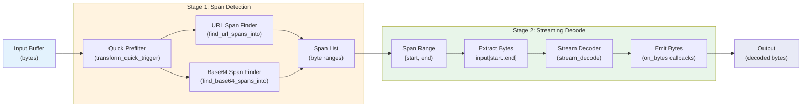

# Engine Transforms Module

Transform execution and streaming decode for URL percent-encoding and Base64 payloads.

Located in: `src/engine/transform.rs`

## Module Overview

The transform module implements the **transform stage** of the scanner pipeline, responsible for:

1. **Span Detection** - Finding candidate URL-encoded and Base64-encoded spans in input buffers
2. **Streaming Decode** - Efficiently decoding spans with bounded memory and single-pass processing
3. **Output Emission** - Emitting decoded bytes via callbacks with internal buffering

The module trades precision for throughput: span finders use **permissive scanning** (favoring recall over strict validation), while **decode operators enforce correctness** through bounded-memory streaming decoders.

## Transform Pipeline

Transform execution follows a two-stage model:



### Stage 1: Span Detection

Span finders execute **single-pass scans** to identify candidate encoding spans:

- **URL Percent**: Scans URL-ish runs (RFC3986 unreserved/reserved + '%' and '+'), keeps runs containing at least one escape
- **Base64**: Scans base64 alphabet runs (including allowed whitespace), trims trailing whitespace

Both finders:
- Are capped by `max_len` boundaries (splits long runs)
- Stop after `max_spans` spans are found
- Use fast byte-class lookup tables for O(1) per-byte classification

### Stage 2: Streaming Decode

Streaming decoders process each span:

- **Single-pass, O(1) memory**: No intermediate buffers; output emitted in chunks
- **Bounded chunks**: 16 KiB output buffer (`STREAM_DECODE_CHUNK_BYTES`)
- **Callback-based**: Emit decoded bytes via `on_bytes` callbacks; caller can abort early via `ControlFlow::Break()`
- **Error handling**: Errors stop the stream; some bytes may have been emitted before error

## Span Detection Details

### URL Percent-Encoding Spans

**Span Finder: `find_url_spans_into()` and `UrlSpanStream`**

The URL span finder identifies runs of "URL-ish" characters that contain at least one encoding trigger:

```rust
// A span qualifies if:
// 1. Run is entirely URL-ish (RFC3986 unreserved/reserved + '%' + '+')
// 2. Contains at least one '%' (required always)
// 3. Contains at least one '+' (required if plus_to_space enabled)
// 4. Run length >= min_len and <= max_len
```

**Byte Classification**

URL-ish bytes include:
- Alphanumerics: `[A-Za-z0-9]`
- RFC3986 unreserved: `-._~`
- RFC3986 reserved: `:/?#[]@!$&'()*,;=`
- Encoding markers: `%` and `+`

**Chunked Processing: `UrlSpanStream`**

For streaming input, `UrlSpanStream` maintains state across chunk boundaries:

```rust
pub struct UrlSpanStream {
    min_len: usize,              // Minimum span size
    max_len: usize,              // Maximum span size (splits long runs)
    plus_to_space: bool,         // '+' counts as trigger
    in_run: bool,                // Currently in a URL-ish run
    start: u64,                  // Absolute start offset
    run_len: usize,              // Current run length
    triggers: usize,             // Count of '%' (and '+' if enabled)
    done: bool,                  // Stream stopped early
}
```

**Example: Span Finding**

```
Input: "query=%48%65%6C%6C%6F+not_encoded"
       ^^^^^^ URL-ish run with 3 '%' triggers

Output spans:
  [6, 22)  → "%48%65%6C%6C%6F" (triggers > 0, len >= min_len)

Note: "+not_encoded" skipped (no '%' trigger, '+' alone insufficient)
```

### Base64-Encoding Spans

**Span Finder: `find_base64_spans_into()` and `Base64SpanStream`**

The Base64 span finder identifies runs of base64 alphabet with optional allowed whitespace:

```rust
// A span qualifies if:
// 1. Run is base64 alphabet (A-Za-z0-9+/-_=) + allowed whitespace
// 2. Contains at least min_chars base64 alphabet bytes
// 3. Span trimmed to last base64 byte (trailing whitespace removed)
// 4. Total run length <= max_len
```

**Byte Classification**

- **Base64 alphabet**: `[A-Za-z0-9+/=-_]` (standard + URL-safe variants)
- **Allowed whitespace**: `\t`, `\r`, `\n`, optionally space (if `base64_allow_space_ws`)
- **Whitespace not counted** toward `min_chars` or `max_len`

**Chunked Processing: `Base64SpanStream`**

```rust
pub struct Base64SpanStream {
    min_chars: usize,            // Min base64 alphabet bytes (excludes whitespace)
    max_len: usize,              // Max run length including whitespace
    allow_space_ws: bool,        // Include space in allowed whitespace
    in_run: bool,                // Currently in base64 run
    start: u64,                  // Absolute start offset
    run_len: usize,              // Total run length
    b64_chars: usize,            // Count of base64 alphabet bytes
    last_b64: u64,               // Offset of last base64 byte (for trimming)
    done: bool,                  // Stream stopped early
}
```

**Example: Span Finding**

```
Input: "data:SGVsbG8gV29y bGQ=extra"
        ^^^^^^^^^^^^^^^^^^^^^ base64 run (includes space)

Alphabet count: 16 (spaces not counted)
Output span: [5, 24)  → "SGVsbG8gV29y bGQ=" (trimmed to last base64 byte)
```

## Decoding Logic

### URL Percent-Decoding

**Decoder: `stream_decode_url_percent()`**

Decodes `%HH` escape sequences and optionally converts `+` to space:

```rust
// Rules:
// 1. "%HH" (where H is hex) → single byte (HH)
// 2. "%" not followed by 2 hex digits → passed through unchanged
// 3. "+" → space (if plus_to_space enabled)
// 4. All other bytes → passed through unchanged
```

**Decode Process**

```
Input:    "hello%20world%2B%XX+"
Process:
  "h"     → "h"          (literal)
  "e"     → "e"          (literal)
  "l"     → "l"          (literal)
  "l"     → "l"          (literal)
  "o"     → "o"          (literal)
  "%20"   → " "          (space, hex 20)
  "w"     → "w"          (literal)
  ...
  "%2B"   → "+"          (plus, hex 2B)
  "%XX"   → "%XX"        (invalid hex, passed through)
  "+"     → " "          (if plus_to_space enabled)

Output: "hello world+%XX " (assuming plus_to_space=true)
```

**Hex Parsing**

```rust
fn is_hex(b: u8) -> bool {
    b.is_ascii_hexdigit()  // [0-9a-fA-F]
}

fn hex_val(b: u8) -> u8 {
    // '0'..'9' → 0..9, 'a'..'f' → 10..15, 'A'..'F' → 10..15
}
```

**Memory Bounds**

- Input: N bytes
- Output: ≤ N bytes (escape sequences expand to 1 byte)
- Streaming buffer: 16 KiB chunks

### Base64 Decoding

**Decoder: `stream_decode_base64()`**

Decodes standard (`+/`) and URL-safe (`-_`) base64 alphabets:

```rust
// Processing:
// 1. Skip whitespace (space, tab, CR, LF)
// 2. Collect 4-byte quantum
// 3. Validate padding rules
// 4. Emit 1-3 decoded bytes per quantum
// 5. Accept unpadded tail (2-3 bytes)
```

**Alphabet Mapping**

- **A-Z** → 0-25
- **a-z** → 26-51
- **0-9** → 52-61
- **`+` or `-`** → 62
- **`/` or `_`** → 63
- **`=`** → padding marker
- Other bytes → invalid

**Decoding State Machine**

```
Input bytes: a b c d (one quantum)

Padding patterns:
  [a b c d]        → 3 output bytes: byte0 | (byte1 >> 4)
                                     ((byte1 & 0x0F) << 4) | (byte2 >> 2)
                                     ((byte2 & 0x03) << 6) | byte3

  [a b c =]        → 2 output bytes: (a << 2) | (b >> 4)
                                     ((b & 0x0F) << 4) | (c >> 2)

  [a b = =]        → 1 output byte:  (a << 2) | (b >> 4)

  [a = = =]        → ERROR (insufficient data)
  [a b = c]        → ERROR (padding in middle)
  [a = c d]        → ERROR (non-padding after padding)
```

**Unpadded Tail Handling**

- **2 characters** → 1 decoded byte (sufficient data)
- **3 characters** → 2 decoded bytes (sufficient data)
- **1 character** → ERROR (`TruncatedQuantum`)

**Example Decode**

```
Input:  "SGVs bG8="  (includes space, standard padding)
        ^12 chars, 1 space

Process:
  S   → 18  (A-Z → 0-25)
  G   → 6
  V   → 21
  s   → 44  (a-z → 26-51)
  (space ignored)
  b   → 27
  G   → 6
  8   → 60  (0-9 → 52-61)
  =   → PAD

Quantum [18, 6, 21, 44]:
  (18 << 2) | (6 >> 4)           = 72 | 0 = 72   ('H')
  ((6 & 0xF) << 4) | (21 >> 2)   = 96 | 5 = 101  ('e')
  ((21 & 0x3) << 6) | 44         = 64 | 44 = 108 ('l')
Quantum [27, 6, 60, PAD]:
  (27 << 2) | (6 >> 4)           = 108 | 0 = 108 ('l')
  ((6 & 0xF) << 4) | (60 >> 2)   = 96 | 15 = 111 ('o')

Output: "Hello"
```

## Budget Enforcement

The module enforces runtime limits to prevent pathological input from causing unbounded work:

### Span Finder Budgets

**Per-scan limits** (configured via `TransformConfig`):

| Budget | Field | Default | Purpose |
|--------|-------|---------|---------|
| Minimum span size | `min_len` | Configurable | Skip trivial spans |
| Maximum span size | `max_encoded_len` | Configurable | Cap scan depth; splits long runs |
| Maximum spans per buffer | `max_spans_per_buffer` | Configurable | Stop after N spans found |

**Run Splitting**

Long runs are split at `max_len` boundaries to bound worst-case O(N) scans:

```rust
// Splitting does NOT align to encoding quanta
// - URL: %HH may be split into "%" and "HH"
// - Base64: 4-char quantum may be split

// Decoder treats each span independently:
// - URL decoder: split "%" parts become literals
// - Base64 decoder: fragment may fail strict validation
```

### Decoder Budgets

**Streaming decoders use O(1) memory:**

- Output buffer: 16 KiB (`STREAM_DECODE_CHUNK_BYTES`)
- No intermediate allocations
- Chunks emitted via callback

**Caller responsibility:**

```rust
// Caller can enforce output-size limits by:
let mut total_out = 0;
on_bytes = |chunk| {
    total_out += chunk.len();
    if total_out > MAX_OUTPUT {
        return ControlFlow::Break(());  // Stop early
    }
    ControlFlow::Continue(())
};
```

## Work Queue Processing

### Quick Prefilter

Before expensive span scanning, a quick prefilter checks for trigger bytes:

```rust
pub fn transform_quick_trigger(tc: &TransformConfig, buf: &[u8]) -> bool {
    match tc.id {
        TransformId::UrlPercent => {
            // URL spans require at least one '%'
            if memchr(b'%', buf).is_some() {
                return true;
            }
            // Or '+' if plus_to_space enabled
            if tc.plus_to_space && memchr(b'+', buf).is_some() {
                return true;
            }
            false
        }
        TransformId::Base64 => true,  // Span finder is the real filter
    }
}
```

**Benefit:** Avoids expensive full-buffer scan for non-matching buffers (e.g., binary data with no '%').

### Span Sink Abstraction

Spans are collected into a flexible `SpanSink` trait:

```rust
pub trait SpanSink {
    fn clear(&mut self);
    fn len(&self) -> usize;
    fn push(&mut self, span: Range<usize>);
}
```

**Implementations:**

- `Vec<Range<usize>>` - Simple vector of ranges
- `ScratchVec<Range<usize>>` - Reusable scratch memory
- `ScratchVec<SpanU32>` - Compact u32-based spans (for large buffers)

**Benefit:** Allows callers to reuse allocations across multiple scans.

### Dispatch Layer

The dispatch functions route to appropriate implementations based on `TransformConfig::id`:

```rust
pub fn find_spans_into(tc: &TransformConfig, buf: &[u8], out: &mut impl SpanSink) {
    match tc.id {
        TransformId::UrlPercent => find_url_spans_into(...),
        TransformId::Base64 => find_base64_spans_into(...),
    }
}

pub fn stream_decode(
    tc: &TransformConfig,
    input: &[u8],
    on_bytes: impl FnMut(&[u8]) -> ControlFlow<()>,
) -> Result<(), ()> {
    match tc.id {
        TransformId::UrlPercent => {
            stream_decode_url_percent(input, tc.plus_to_space, on_bytes);
            Ok(())
        }
        TransformId::Base64 => stream_decode_base64(input, on_bytes).map_err(|_| ()),
    }
}
```

## Gate Policy: AnchorsInDecoded

The module integrates with the engine's **gate policy** through callback-based control flow.

When the engine applies the `AnchorsInDecoded` gate (anchor pattern validation after decoding):

```rust
// Engine pseudocode:
spans = find_spans_into(tc, buf);
for span in spans {
    stream_decode(tc, &buf[span.start..span.end], |decoded_chunk| {
        // Gate check: do anchors appear in this decoded chunk?
        if !anchors.find_overlapping_iter(decoded_chunk).next() {
            // Anchors not found in decoded chunk
            return ControlFlow::Break(());  // Early exit
        }
        ControlFlow::Continue(())
    });
}
```

**Effect:** Decoded data is validated chunk-by-chunk; processing stops early if gate rejects a chunk.

**Note:** The transform module does not implement gate logic; it provides streaming infrastructure for gates to be applied downstream.

## Key Functions and Data Structures

### Byte Classification

```rust
const URLISH: u8 = 1 << 0;        // URL-ish run character
const B64_CHAR: u8 = 1 << 1;      // Base64 alphabet byte
const B64_WS: u8 = 1 << 2;        // Base64 whitespace (\t, \r, \n)
const B64_WS_SPACE: u8 = 1 << 3;  // Space character (if allowed)

static BYTE_CLASS: [u8; 256] = build_byte_class();  // Lookup table

// Lookups are O(1) per byte
let flags = BYTE_CLASS[b as usize];
let is_urlish = (flags & URLISH) != 0;
let is_b64 = (flags & B64_CHAR) != 0;
```

### Base64 Decode Table

```rust
const B64_INVALID: u8 = 0xFF;        // Invalid byte marker
const B64_PAD: u8 = 64;              // Padding ('=') marker

static B64_DECODE: [u8; 256] = build_b64_decode_table();

// Per-byte decode: 0-63 for valid chars, B64_PAD for '=', B64_INVALID for invalid
let v = B64_DECODE[b as usize];
if v == B64_INVALID {
    return Err(Base64DecodeError::InvalidByte);
}
```

### Core Struct: `UrlSpanStream`

Stateful scanner for URL spans over chunked input:

```rust
pub struct UrlSpanStream {
    min_len: usize,
    max_len: usize,
    plus_to_space: bool,
    in_run: bool,
    start: u64,          // Absolute offset
    run_len: usize,
    triggers: usize,     // Count of '%' (and '+' if enabled)
    done: bool,
}

impl UrlSpanStream {
    pub fn new(tc: &TransformConfig) -> Self { ... }
    pub fn feed<F>(&mut self, chunk: &[u8], base_offset: u64, on_span: F)
    where F: FnMut(u64, u64) -> bool { ... }
    pub fn finish<F>(&mut self, end_offset: u64, on_span: F)
    where F: FnMut(u64, u64) -> bool { ... }
}
```

### Core Struct: `Base64SpanStream`

Stateful scanner for Base64 spans over chunked input:

```rust
pub struct Base64SpanStream {
    min_chars: usize,
    max_len: usize,
    allow_space_ws: bool,
    in_run: bool,
    start: u64,          // Absolute offset
    run_len: usize,
    b64_chars: usize,    // Alphabet bytes only (excludes whitespace)
    last_b64: u64,       // Offset of last base64 byte
    done: bool,
}

impl Base64SpanStream {
    pub fn new(tc: &TransformConfig) -> Self { ... }
    pub fn feed<F>(&mut self, chunk: &[u8], base_offset: u64, on_span: F)
    where F: FnMut(u64, u64) -> bool { ... }
    pub fn finish<F>(&mut self, _end_offset: u64, on_span: F)
    where F: FnMut(u64, u64) -> bool { ... }
}
```

### Streaming Decoders

```rust
fn stream_decode_url_percent(
    input: &[u8],
    plus_to_space: bool,
    on_bytes: impl FnMut(&[u8]) -> ControlFlow<()>,
);

fn stream_decode_base64(
    input: &[u8],
    on_bytes: impl FnMut(&[u8]) -> ControlFlow<()>,
) -> Result<(), Base64DecodeError>;
```

### Public Dispatch Functions

```rust
pub fn transform_quick_trigger(tc: &TransformConfig, buf: &[u8]) -> bool;

pub fn find_spans_into(tc: &TransformConfig, buf: &[u8], out: &mut impl SpanSink);

pub fn stream_decode(
    tc: &TransformConfig,
    input: &[u8],
    on_bytes: impl FnMut(&[u8]) -> ControlFlow<()>,
) -> Result<(), ()>;
```

## Edge Cases and Trade-offs

### Span Splitting

**Issue:** Long runs are split at `max_len` boundaries, which may cut through encoding quanta.

```
Input (max_len=8):
  "%48%656C"  (12 bytes: 4 + 8 + more)
   12345678901...

Splits at boundary 8:
  Span 1: "%48%656"    (6 bytes, but ends with "%65")
  Span 2: "6C..."      (remainder)

Decoder sees "%65" in Span 1 → passes through as literal (incomplete)
Decoder sees "6C" in Span 2 → invalid quantum
```

**Rationale:** Single-pass scanning must stay bounded; downstream decode inherits imprecision trade-off.

**Mitigation:** Decoder validates and handles fragments gracefully.

### Whitespace Handling in Base64

**Issue:** Whitespace is allowed but not counted toward `min_chars` or `max_len`.

```
Input:  "SGVs\nbG8="  (8 alphabet bytes + 1 newline + padding)
Config: min_chars=4, max_len=8

Result:
  b64_chars=8 (alphabet only)
  run_len=10  (includes newline and padding)

  Counted: 8 >= 4 ✓
  Length:  10 >= 8 ✓

Output span: valid (despite run_len exceeding max_len in total bytes)
```

**Rationale:** Whitespace is transparent to Base64 semantics; not counting it allows longer logical content per span.

### Callback Early Exit

**Design:** Decoders respect `ControlFlow::Break(())` to allow callers to abort decoding early.

```rust
// Example: limit output to 1 MB
stream_decode_url_percent(&input, true, |chunk| {
    total_out += chunk.len();
    if total_out > 1024 * 1024 {
        return ControlFlow::Break(());  // Stop, return Ok(())
    }
    process_chunk(chunk);
    ControlFlow::Continue(())
});
```

**Effect:** Output may be partial; caller must track bytes seen before break.

## Configuration

Transform behavior is controlled via `TransformConfig`:

```rust
pub struct TransformConfig {
    pub id: TransformId,                    // UrlPercent or Base64
    pub min_len: usize,                     // Minimum span size
    pub max_encoded_len: usize,             // Maximum span size (splits long runs)
    pub max_spans_per_buffer: usize,        // Stop after N spans
    pub plus_to_space: bool,                // URL: '+' → space
    pub base64_allow_space_ws: bool,        // Base64: allow space in whitespace
}
```

## Performance Characteristics

| Operation | Complexity | Notes |
|-----------|-----------|-------|
| Span finding | O(N) single-pass | N = input buffer size |
| Byte classification | O(1) | Lookup table |
| URL decoding | O(N) | Single pass, O(1) memory |
| Base64 decoding | O(N) | Single pass, O(1) memory |
| Output buffering | O(K) | K = output buffer size (16 KiB) |

**Memory Usage:**

- Span finder state: ~50-60 bytes (per stream instance)
- Decode buffer: 16 KiB (stack-allocated, shared across calls)
- No heap allocations during decode
- Allocations via `SpanSink` (caller responsibility)

## Testing Helpers

Test-only functions provide convenient interfaces with bounds checking:

```rust
#[cfg(test)]
fn decode_url_percent_to_vec(
    input: &[u8],
    plus_to_space: bool,
    max_out: usize,
) -> Result<Vec<u8>, UrlTestError>;

#[cfg(test)]
fn decode_base64_to_vec(
    input: &[u8],
    max_out: usize,
) -> Result<Vec<u8>, Base64TestError>;
```

**Purpose:** Simplified testing without streaming callback infrastructure.

## Benchmark Helpers

Feature-gated benchmark functions for performance measurement:

```rust
#[cfg(feature = "bench")]
pub fn bench_stream_decode_url(input: &[u8], plus_to_space: bool) -> usize;

#[cfg(feature = "bench")]
pub fn bench_stream_decode_base64(input: &[u8]) -> usize;
```

Returns bytes successfully decoded (to verify computation wasn't optimized away).

## Related Modules

- **`engine::hit_pool`** - Span data structures (`SpanU32`)
- **`api::TransformConfig`** - Configuration schema
- **`scratch_memory::ScratchVec`** - Reusable buffer allocations
- **`memchr`** - Fast byte searching (prefilter)

## Summary

The transform module provides:

1. **Permissive span finding** with configurable budgets and early termination
2. **Streaming decoders** with O(1) memory and chunk-based emission
3. **Graceful handling** of malformed input (invalid escapes, padding errors)
4. **Callback integration** for gate policies and output bounds
5. **High throughput** via single-pass algorithms and lookup tables

The design emphasizes **scanning throughput** (permissive span finding) with **correctness enforcement** (strict decoding and optional gates).
