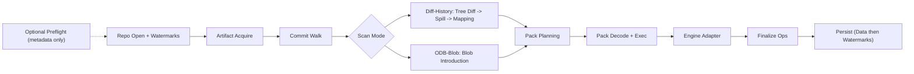

# Git Scanning Pipeline

This document describes the end-to-end Git scanning pipeline, its persistence
contract, and ODB-blob attribution semantics.

## Flow Diagram



## Pipeline Components

| Component | Location | Purpose |
| --- | --- | --- |
| Preflight | `src/git_scan/preflight.rs` | Standalone metadata-only readiness check for commit-graph, MIDX, locks, and pack-count recommendations |
| Repo Open | `src/git_scan/repo_open.rs` | Resolve repo layout, start set + watermarks, and artifact lock paths |
| Artifact Acquire | `src/git_scan/artifact_acquire.rs` | Build MIDX + commit-graph in memory and capture artifact fingerprint |
| Commit Walk | `src/git_scan/commit_walk.rs` | `(watermark, tip]` traversal and topo ordering |
| Tree Diff | `src/git_scan/tree_diff.rs` | OID-only tree diffs that emit blob candidates |
| Spill + Dedupe | `src/git_scan/spiller.rs` | Global dedupe + seen-blob filtering |
| MIDX Mapping | `src/git_scan/mapping_bridge.rs` | Map unique blobs to pack offsets or loose fallback |
| Pack Planning | `src/git_scan/pack_plan.rs` | Build per-pack decode plans with delta closure |
| Pack Exec | `src/git_scan/runner_exec.rs`, `src/git_scan/pack_exec.rs` | Scheduler-driven pack execution and decode with bounded buffers |
| Engine Adapter | `src/git_scan/engine_adapter.rs` | Overlap-safe chunked scanning with deterministic finding keys |
| Finalize | `src/git_scan/finalize.rs` | Build write ops for blob_ctx, finding, seen_blob, and watermarks |
| Persist | `src/git_scan/persist.rs` | Two-phase persistence (data ops then watermarks) |
| ODB-Blob Pipeline | `src/git_scan/runner_odb_blob.rs` | Blob introduction + pack pipeline for ODB-blob mode |
| Diff-History Pipeline | `src/git_scan/runner_diff_history.rs` | Tree-diff/spill/mapping + pack pipeline for diff-history mode |
| Runner | `src/git_scan/runner.rs` | End-to-end orchestration of all stages |

## Determinism and Safety Invariants

- `run_git_scan` starts at repo open; preflight is an optional standalone readiness check.
- Repo open reads metadata only; no blob payloads are read before pack decoding.
- MIDX and commit-graph artifacts are built in memory by `artifact_acquire` and stored as byte views.
- Artifact fingerprints are captured after MIDX acquisition; runner revalidates artifact stability after build, before pack execution, and after mode execution.
- Preflight reports pack-count maintenance recommendations separately; pack count does not block scans.
- Pack execution mmaps are bounded by explicit pack count and total byte limits.
- Candidate ordering is deterministic through mode-specific ordering
  (spill/merge where used) and pack-exec result reassembly.
- In ODB-blob mode with `blob_intro_workers > 1`, unique blob discovery is
  stable, but blob attribution context (`commit_id`, path, flags) is
  race-winner based and can vary across worker counts.
- Findings are deduped per blob and stored as `(start, end, rule_id, norm_hash)`.
- No raw secret bytes are persisted; only hashes and metadata are stored.
- Persistence is atomic: data ops and (when complete) watermark ops are committed together.
- Incremental correctness depends on `seen_blob` markers and ref watermarks;
  `blob_ctx` is metadata and is not a deterministic contract in parallel
  ODB-blob mode.
- Loose candidates are scanned via bounded loose-object decode; non-blob or
  missing loose objects are recorded as explicit skips.
- Any decode skips or missing/corrupt loose objects result in `FinalizeOutcome::Partial`.
- Skipped candidates are reported with explicit reasons; pack exec reports contain detailed decode errors.
- Pack decoding can be driven via a read-at reader for deterministic fault injection.

## Concurrency and Backpressure

Most stages before pack execution (preflight, repo open, commit walk, tree diff,
spill/dedupe, mapping) run **single-threaded**. Blob introduction (ODB-blob
mode) and pack execution introduce parallelism:

- **Blob introduction** (ODB-blob mode only) can run in parallel when
  `blob_intro_workers > 1`. The commit plan is pre-partitioned into
  `~4 × worker_count` chunks. Workers claim chunks via an atomic counter
  (work-stealing pattern), each with its own `ObjectStore` and
  `PackCandidateCollector`. A shared `AtomicSeenSets` (lock-free bitmap)
  ensures each tree/blob is claimed by exactly one worker. Cache budgets
  (tree cache, delta cache, spill arena, packed cap, loose cap, path arena)
  are divided per worker with floor/cap clamping. After all workers finish,
  results are merged and global caps are re-validated. The worker that first
  claims a blob determines that blob's emitted context (`commit_id`, path,
  flags), so attribution is not deterministic across worker counts.

- **Pack planning** is built on the runner thread before execution
  (`build_pack_plans` in diff-history, per-pack planning in ODB-blob mode).
- **Pack execution** runs through scheduler tasks selected by
  `PackExecStrategy` (`Serial`, `PackParallel`, `IntraPackSharded`). In
  sharded mode, plans use `shard_ranges()` over execution indices. Each
  worker owns its own `PackCache` and `EngineAdapter`, and outputs are
  reassembled in deterministic plan/shard order.

There are no in-flight queues between the serial stages; instead, each stage
enforces explicit bounds:

- Spill/dedupe caps (`SpillLimits`) limit candidate count and spill bytes.
- Mapping caps (`MappingBridgeConfig`) bound packed/loose candidate buffers.
- Pack planning limits (`PackPlanConfig`) bound delta expansion worklists.
- Pack execution limits (`PackMmapLimits`, `PackDecodeLimits`) bound mmaps and
  inflate sizes.

## Persistence Contract

Finalize produces two batches:

- `data_ops`: `bc\0` (blob_ctx), `fn\0` (finding), `sb\0` (seen_blob)
- `watermark_ops`: `rw` (ref_watermark)

Persist commits `data_ops` and (when complete) `watermark_ops` in a single
atomic batch. If the run is partial, watermark ops are skipped to avoid
advancing ref tips past unscanned blobs.

`blob_ctx` (`bc\0`) values are persisted metadata. They are not used for seen
filtering or watermark advancement and are not a cross-worker determinism
contract in parallel ODB-blob mode.

## Simulation Harness

The Git simulation harness exercises this pipeline deterministically using a
semantic repo model and optional pack artifacts. It replays `.case.json`
artifacts and supports bounded random runs.

```bash
# Replay Git simulation corpus
cargo test --features sim-harness --test simulation git_scan_corpus

# Run bounded random Git simulations
cargo test --features sim-harness --test simulation git_scan_random
```

Corpus cases live in `tests/corpus/git_scan/*.case.json`. Replay failures emit
artifacts to `tests/failures/` for triage and minimization.

## Related Docs

- `docs/architecture-overview.md`
- `docs/detection-engine.md`
- `docs/git_simulation_harness_guide.md`
