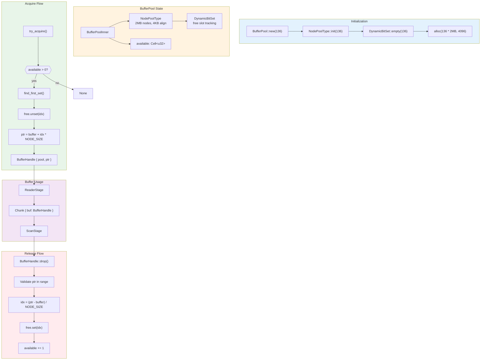
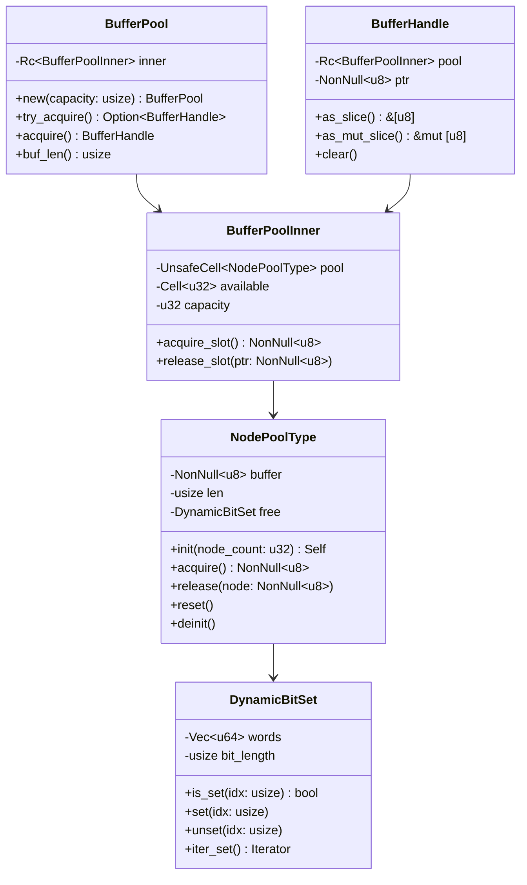
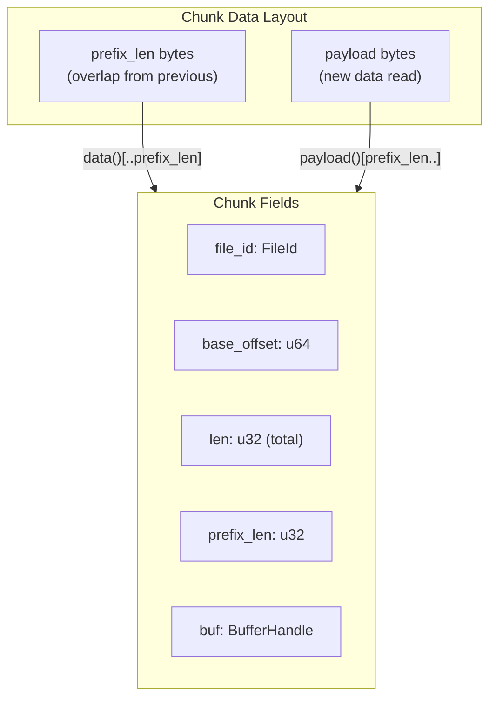
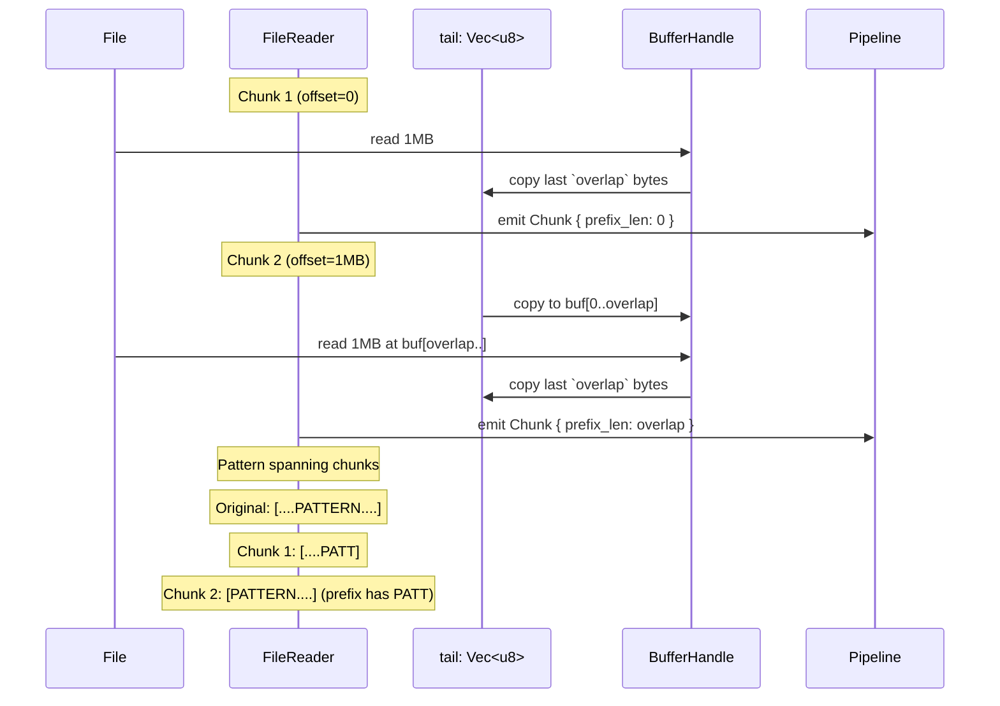

# Memory Management

Buffer lifecycle and pool management in scanner-rs.

## Multi-Core Production Memory Model

The production multi-core scanner (`scan_local`) allocates memory at startup
and maintains zero allocations during the hot path. Memory scales with worker count.

### Memory Breakdown by Worker Count

| Workers | Per-Worker | Buffer Pool | **Total** |
| ------- | ---------- | ----------- | --------- |
| 4       | 75.3 MiB   | 5.0 MiB     | ~80 MiB   |
| 8       | 150.5 MiB  | 10.0 MiB    | ~161 MiB  |
| 12      | 225.8 MiB  | 15.0 MiB    | ~241 MiB  |
| 16      | 301.1 MiB  | 20.0 MiB    | ~321 MiB  |

### Per-Worker Allocation (~18.8 MiB each)

| Component                           | Size      | % of Total |
| ----------------------------------- | --------- | ---------- |
| **HitAccPool.windows**              | 15.68 MiB | 83.3%      |
| FixedSet128 (seen_findings)         | 768 KiB   | 4.0%       |
| FindingRec buffers (out + tmp)      | 640 KiB   | 3.3%       |
| DecodeSlab                          | 512 KiB   | 2.6%       |
| Other (ByteRing, TimingWheel, etc.) | ~1.2 MiB  | 6.8%       |

**Key insight**: HitAccPool dominates at 83.3% of per-worker memory. This is
sized for worst-case: 669 (rule,variant) pairs × 2048 max hits × 12 bytes/SpanU32.

> **Future optimization**: HitAccPool may be over-provisioned. Reducing
> `max_anchor_hits_per_rule_variant` from 2048 to 512 could save ~60% memory.

### Buffer Pool (System-Wide)

- **Buffers**: `workers × 4` (e.g., 32 buffers for 8 workers)
- **Buffer size**: `chunk_size + overlap` = 256 KiB + 64 KiB = 320 KiB
- **Total**: ~10 MiB for 8 workers

### Production Configuration (ParallelScanConfig)

```rust
ParallelScanConfig {
    workers: num_cpus::get(),     // Auto-detect CPU count
    chunk_size: 256 * 1024,       // 256 KiB chunks
    pool_buffers: workers * 4,    // 4 buffers per worker
    max_in_flight_objects: 1024,
    local_queue_cap: 4,
}
```

### Zero-Allocation Hot Path

After startup allocation, the scan phase is allocation-free:
- All per-worker scratch is pre-allocated (ScanScratch, LocalScratch)
- Buffer pool provides fixed I/O buffers (TsBufferPool)
- Findings use pre-sized vectors that are reused across chunks
- Archive scanning reuses `archive::scan::ArchiveScratch` buffers (path builders, tar/zip cursors, gzip header/name buffers) and per-sink scratch for entry scanning

Path storage is also bounded: `FileTable` maintains a fixed-capacity byte arena
for Unix paths. Archive expansion uses fallible `try_*` insertion APIs plus
per-archive path budgets so hostile inputs cannot panic the scanner.
See `src/archive/` for the release-mode capacity guards and archive-specific
allocation constraints.

Run diagnostic tests to verify: `cargo test --test diagnostic -- --ignored --nocapture --test-threads=1`

---

## Git Tree Loading Budgets

Git tree diffing has its own bounded memory envelope:

- **Tree bytes in-flight budget**: `TreeDiffLimits.max_tree_bytes_in_flight` caps
  the total decompressed tree payloads retained at any one time. This is a
  peak-memory guard, not a cumulative counter.
- **Pack access**: pack files are memory-mapped on demand only for packs
  referenced by mapping results; no pack data is copied unless inflated.
- **Inflate buffers**: tree payloads and delta instructions are inflated into
  bounded buffers capped by the tree bytes budget (plus a small header slack
  for loose objects).
- **Candidate storage**: candidate buffer and path arena sizes are explicitly
  bounded by `TreeDiffLimits.max_candidates` and `max_path_arena_bytes`. The
  runner streams candidates directly into the spill/dedupe sink to avoid
  buffering the entire plan in memory; `CandidateBuffer` uses a capped
  initial capacity and can be cleared between diffs when used.
- **Tree cache sizing**: tree payload cache uses fixed-size slots (4 KiB)
  with 4-way sets; total cache bytes are rounded down to a power-of-two
  set count. Entries larger than a slot are not cached. Cache hits return
  pinned handles so tree bytes can be borrowed without copying; pinned slots
  are skipped by eviction until the handle is dropped.
- **Tree delta cache**: delta base cache stores decompressed tree bases
  keyed by pack offset in fixed-size slots. It is sized by
  `TreeDiffLimits.max_tree_delta_cache_bytes` and avoids repeated base
  inflations in deep delta chains. Entries larger than a slot are not cached.
- **Tree spill arena**: large tree payloads can be written into a preallocated,
  memory-mapped spill file sized by `TreeDiffLimits.max_tree_spill_bytes`.
  Spilled bytes are referenced by `(offset, len)` handles and do not count
  against the in-flight RAM budget.
- **Spill index**: a fixed-size, open-addressed OID index (sized from the
  spill capacity and spill threshold) reuses spilled tree payloads without
  heap allocations after startup. When the index is full, spilling continues
  but reuse is disabled.
- **Streaming parser**: tree diffs switch to a streaming entry parser for
  spill-backed or large tree payloads. The parser retains a fixed-size
  buffer (`TREE_STREAM_BUF_BYTES`, currently 16 KiB) so tree iteration stays
  bounded in RAM while still preserving Git tree order.
- **Spill I/O hints**: on Unix, the spill arena applies `posix_fadvise` and
  `madvise(MADV_SEQUENTIAL)` hints to favor sequential access. On non-Unix
  platforms these calls are no-ops.

These limits make Git tree traversal deterministic and DoS-resistant while
keeping blob data out of memory during diffing.

## Git Spill + Dedupe Budgets

Spill/dedupe keeps candidate metadata in SoA tables sized to the spill chunk
limit. `WorkItems` allocates once up to `SpillLimits.max_chunk_candidates` and
stores:

- `oid_table`: one OID per candidate (20 or 32 bytes each)
- `ctx_table`: one `CandidateContext` per candidate (commit/parent/kind/flags + path ref)
- Index/attribute arrays: `oid_idx`, `ctx_idx`, `path_ref`, `flags`, `pack_id`, `offset`
- Sorting scratch: `order` + `scratch` (`u32` each)

Path bytes are stored separately in the chunk `ByteArena` and bounded by
`SpillLimits.max_chunk_path_bytes`, so total spill working set remains linear
in candidate count plus bounded path arena growth.

`ByteArena::clear_keep_capacity()` resets spill path arenas between flushes
without releasing capacity, keeping spill loops allocation-stable.

Run IO is allocation-aware: `RunWriter::write_resolved` writes borrowed paths
directly, `RunReader::read_next_into` reuses a scratch record buffer, and the
spill merger reuses record storage across runs to avoid per-record clones.

Seen filtering uses a per-batch arena capped by `SpillLimits.seen_batch_max_path_bytes`
and batches up to `SpillLimits.seen_batch_max_oids` OIDs before issuing a
seen-store query. Batches are flushed on either limit to keep memory bounded.

## Git Mapping Budgets

The mapping bridge re-interns candidate paths into a long-lived arena and
collects pack/loose candidates for downstream planning:

- **Path arena**: bounded by `MappingBridgeConfig.path_arena_capacity`.
- **Candidate caps**: `MappingBridgeConfig.max_packed_candidates` and
  `MappingBridgeConfig.max_loose_candidates` bound the in-memory vectors.
- **Failure mode**: exceeding either cap returns
  `SpillError::MappingCandidateLimitExceeded` and aborts the run before
  watermark advancement.

## ODB-Blob Scan Budgets

ODB-blob mode allocates fixed-capacity data structures once at startup:

- **OID index**: open-addressed table mapping OID → MIDX index sized from
  `midx.object_count` with a ≤0.7 load factor. This is the primary O(1)
  lookup structure used by the blob introducer.
- **Commit graph index**: SoA arrays (commit OID, root tree OID, committer
  timestamp) sized to `commit_graph.num_commits` for cache-friendly lookups
  during first-seen attribution.
- **Seen sets**: two `DynamicBitSet`s (trees + blobs) sized to
  `midx.object_count` to guarantee each tree or blob is processed once.
- **Loose OID sets**: open-addressed tables for loose blob OIDs (seen +
  excluded) capped by `MappingBridgeConfig.max_loose_candidates` to match the
  loose candidate budget.
- **Path builder**: reusable path buffer + segment stack with a hard
  `MAX_PATH_LEN` guard (4096 bytes) to avoid per-entry allocation.
- **Symbol table (planned)**: interns filename segments to reduce repeated
  allocations and improve cache locality during deep tree traversal.
- **Pack candidate collector**: bounded `Vec<PackCandidate>`/`Vec<LooseCandidate>`
  sized by `MappingBridgeConfig.max_*_candidates`. In ODB-blob mode the runner
  raises `max_packed_candidates` to at least `midx.object_count()` and scales
  the path arena with a fixed bytes-per-candidate heuristic to avoid cap
  failures on large repos.
- **Spill fallback**: if in-memory candidate caps or the path arena overflow,
  ODB-blob replays the introducer and streams candidates into the existing
  spill + dedupe pipeline, reusing `SpillLimits` for disk-backed buffering.

## Git Pack Planning Budgets

Pack planning builds per-pack `PackPlan` buffers sized to the candidate set
and the delta-base closure:

- Candidate list: one `PackCandidate` per packed blob.
- Candidate offsets: one `CandidateAtOffset` per candidate (sorted by offset).
- Need offsets: unique `u64` offsets for candidates plus pack-local bases,
  expanded up to `PackPlanConfig.max_delta_depth` and capped by
  `PackPlanConfig.max_worklist_entries`.
- Delta deps: one `DeltaDep` per delta entry in `need_offsets` (records
  internal base offsets or external base OIDs).
- Entry header cache: one cached `ParsedEntry` per offset in `need_offsets`
  during planning, bounded by the same worklist cap.
- Base lookups: `PackPlanConfig.max_base_lookups` bounds REF delta
  resolver calls to prevent unbounded MIDX lookups.
- Exec order: optional `Vec<u32>` of indices into `need_offsets` when forward
  dependencies exist.

Memory is linear in `candidates.len()` + `need_offsets.len()` with explicit
caps on closure expansion and header parsing.

In ODB-blob mode, the runner scales `max_worklist_entries` and
`max_base_lookups` to at least 2× the packed candidate count so large repos
do not trip the default 1M limits.

## Git Pack Decode Budgets

Pack decode uses bounded buffers and a fixed-size cache:

- **Inflate buffers**: in-memory output is capped by `PackDecodeLimits.max_object_bytes`
  for full objects and `PackDecodeLimits.max_delta_bytes` for delta payloads.
  When a full object or delta output exceeds `max_object_bytes`, pack exec
  inflates into a spill-backed mmap under the run `spill_dir` and scans from
  disk instead of growing RAM.
- **Scratch reuse**: pack exec reuses per-pack scratch buffers for delta maps,
  candidate ranges, and base/delta buffers (`inflate_buf`, `result_buf`,
  `base_buf`) to avoid per-plan allocations after warmup. Delta base cache
  misses re-decode base chains into `base_buf` to preserve correctness
  without requiring larger caches.
- **Header parsing**: entry headers are bounded by
  `PackDecodeLimits.max_header_bytes`.
- **Pack cache (tiered)**: `PackCacheTiered` stores decoded objects in
  size-segregated fixed-size slots using two internal `PackCache` instances.
  Tier A uses 64 KiB slots; Tier B uses 512 KiB slots. Entries larger than
  Tier B are not cached. Each tier is 4-way set associative with CLOCK
  eviction, and all storage is preallocated.
- **Sequential hints**: pack mmaps use `posix_fadvise`/`madvise` (when
  available) to hint sequential access and improve readahead without
  changing memory caps.
- **ODB-blob cache sizing**: pack cache bytes are raised to approximately
  `total_pack_bytes / 64` (capped at 2 GiB) to keep delta bases hot when
  scanning full history. The default split is 75% Tier A / 25% Tier B,
  with a minimum of 32 MiB reserved for Tier B.
- **Parallel pack exec memory**: each worker owns its own pack cache and
  scratch buffers. A global scheduler caps total workers and enforces
  per-repo memory ceilings: `workers * (pack_cache_bytes + scratch_bytes)`.

These limits keep pack decoding deterministic and bound memory to the
configured cache capacity plus temporary inflate buffers.

## Git Scan Hot-Loop Allocation Guard

Hot-loop allocations are prohibited after warmup in pack execution and
engine scanning:

- **Debug guard**: `git_scan::set_alloc_guard_enabled(true)` enables a
  debug-only `AllocGuard` around pack exec and engine adapter scan paths.
- **Findings arena**: per-blob findings are stored in a shared arena and
  referenced by spans (`FindingSpan`), avoiding per-blob `Vec` allocations.
- **Chunker reuse**: the engine adapter reuses a fixed-size ring chunker and
  findings buffer across blobs to keep scan hot loops allocation-free.

Use the allocation guard in debug tests with the counting allocator to
verify no heap activity after warmup.

## Single-Threaded Pipeline Memory Model

> **Note**: The diagrams below describe the single-threaded `Pipeline` API, which uses
> different buffer sizes (2 MiB vs 256 KiB). For production multi-core scanning, see
> the section above.



## Pool Structure



## Memory Layout

```
┌─────────────────────────────────────────────────────────────────┐
│                    NodePoolType Buffer                           │
│                    (136 * 2MB = 272MB)                          │
├─────────────┬─────────────┬─────────────┬───────┬─────────────┤
│   Node 0    │   Node 1    │   Node 2    │  ...  │   Node 135  │
│   2MB       │   2MB       │   2MB       │       │   2MB       │
│   align=4K  │   align=4K  │   align=4K  │       │   align=4K  │
└─────────────┴─────────────┴─────────────┴───────┴─────────────┘

DynamicBitSet (136 bits = 3 u64 words):
┌─────────────────────────────────────────────────────────────────┐
│ word[0]: bits 0-63    │ word[1]: bits 64-127 │ word[2]: 128-135│
│ 1=free, 0=acquired    │                      │ (8 valid bits)  │
└─────────────────────────────────────────────────────────────────┘
```

## Rationale

The pool is deliberately large and aligned:

- **Fixed allocation**: all buffers are allocated up front so scanning never
  allocates on the hot path. This avoids allocator jitter and makes worst-case
  memory consumption explicit.
- **Alignment**: 4KB alignment keeps buffers page-aligned, which improves cache
  behavior and keeps the door open for direct I/O or SIMD-friendly access.
- **Predictable reclamation**: `BufferHandle` is RAII; dropping the chunk is the
  only way to return a buffer. This makes lifecycle bugs easy to spot.

If you need a smaller footprint, see `docs/perf.md` for sizing trade-offs.

## Constants

```rust
pub const BUFFER_LEN_MAX: usize = 2 * 1024 * 1024;  // 2MB per buffer
pub const BUFFER_ALIGN: usize = 4096;               // 4KB alignment

pub const PIPE_CHUNK_RING_CAP: usize = 128;         // Max chunks in flight
pub const PIPE_POOL_CAP: usize = PIPE_CHUNK_RING_CAP + 8;  // 136 buffers
```

## Chunk Structure



```rust
pub struct Chunk {
    pub file_id: FileId,
    pub base_offset: u64,    // File offset where chunk starts
    pub len: u32,            // Total bytes (prefix + payload)
    pub prefix_len: u32,     // Overlap bytes from previous chunk
    pub buf: BufferHandle,   // Owned buffer handle
}

impl Chunk {
    // Full data including overlap prefix
    pub fn data(&self) -> &[u8] {
        &self.buf.as_slice()[..self.len as usize]
    }

    // Payload only (excludes overlap)
    pub fn payload(&self) -> &[u8] {
        &self.buf.as_slice()[self.prefix_len as usize..self.len as usize]
    }
}
```

## DecodeSlab and Scratch Buffers

Scanning derived buffers (URL/Base64 decode) uses a fixed-capacity slab:

- **DecodeSlab** is append-only and sized to the global decode budget. It never
  reallocates, so ranges returned to work items stay valid for the scan.
- **ScanScratch** owns the slab and all other hot-path buffers; it is reused
  across chunks to avoid per-chunk allocations.

This is the core "no allocations during scan" mechanism: the scanner either
fits within the configured limits or it skips work.

## Overlap Preservation



The overlap ensures patterns that span chunk boundaries are detected:
- `overlap = engine.required_overlap()`
- `required_overlap = max_window_diameter_bytes + max_anchor_pat_len - 1`

## ScanScratch Per-Chunk State

```rust
pub struct ScanScratch {
    out: Vec<FindingRec>,           // Output findings
    work_q: Vec<WorkItem>,          // Transform work queue
    work_head: usize,               // Current work item index
    slab: DecodeSlab,               // Decoded buffer storage
    seen: FixedSet128,              // Deduplication set
    total_decode_output_bytes: usize,
    work_items_enqueued: usize,
    hit_acc_pool: HitAccPool,       // Per-(rule, variant) accumulator pool
    touched_pairs: ScratchVec<u32>, // Scratch list of touched (rule, variant)
    windows: ScratchVec<SpanU32>,   // Temp window storage
    expanded: ScratchVec<SpanU32>,  // Expanded two-phase windows
    spans: ScratchVec<SpanU32>,     // Transform span candidates
    gate: GateScratch,              // Gate streaming scratch
    step_arena: StepArena,          // Decode provenance
    pending_windows: TimingWheel<PendingWindow, 1>,  // Window expiration scheduler
    utf16_buf: Vec<u8>,             // UTF-16 decode output
    steps_buf: Vec<DecodeStep>,     // Finding materialization temp
}
```

All vectors are reused across chunks via `reset_for_scan()`:
- Vectors are cleared but retain capacity
- `seen` uses generation-based O(1) reset
- Avoids per-chunk allocation overhead
