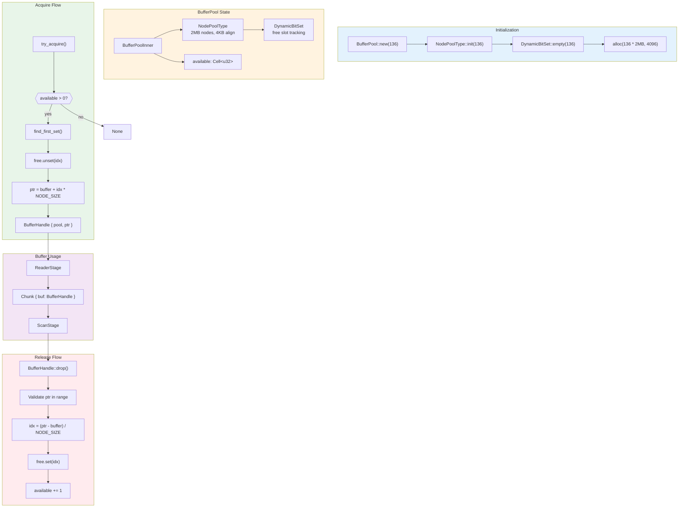
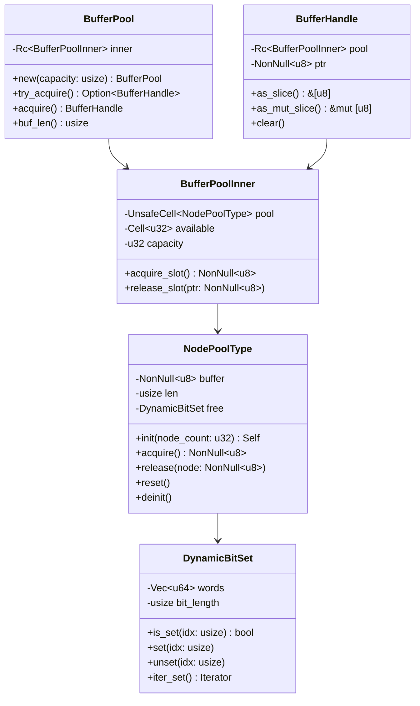
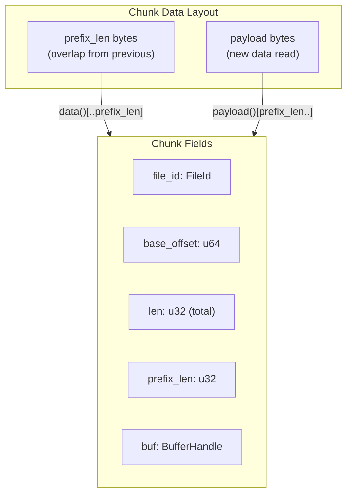
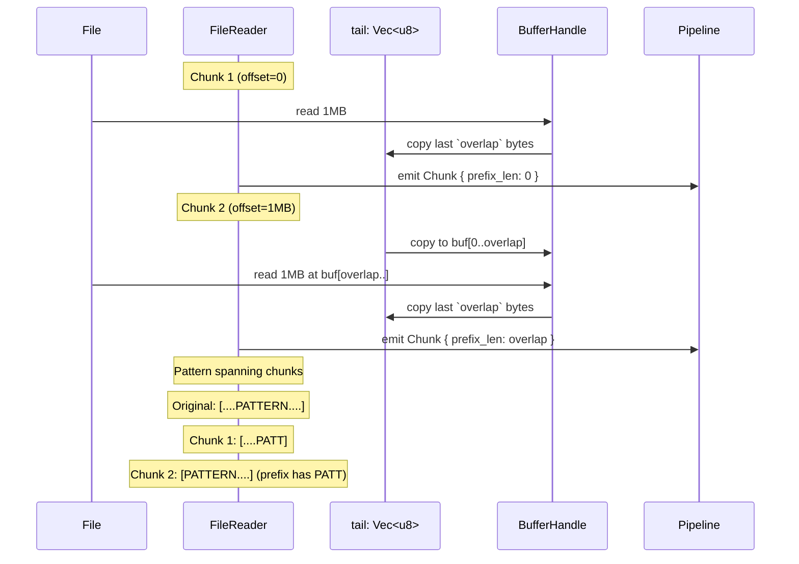

# Memory Management

Buffer lifecycle and pool management in scanner-rs.



## Pool Structure



## Memory Layout

```
┌─────────────────────────────────────────────────────────────────┐
│                    NodePoolType Buffer                           │
│                    (136 * 2MB = 272MB)                          │
├─────────────┬─────────────┬─────────────┬───────┬─────────────┤
│   Node 0    │   Node 1    │   Node 2    │  ...  │   Node 135  │
│   2MB       │   2MB       │   2MB       │       │   2MB       │
│   align=4K  │   align=4K  │   align=4K  │       │   align=4K  │
└─────────────┴─────────────┴─────────────┴───────┴─────────────┘

DynamicBitSet (136 bits = 3 u64 words):
┌─────────────────────────────────────────────────────────────────┐
│ word[0]: bits 0-63    │ word[1]: bits 64-127 │ word[2]: 128-135│
│ 1=free, 0=acquired    │                      │ (8 valid bits)  │
└─────────────────────────────────────────────────────────────────┘
```

## Constants

```rust
pub const BUFFER_LEN_MAX: usize = 2 * 1024 * 1024;  // 2MB per buffer
pub const BUFFER_ALIGN: usize = 4096;               // 4KB alignment

pub const PIPE_CHUNK_RING_CAP: usize = 128;         // Max chunks in flight
pub const PIPE_POOL_CAP: usize = PIPE_CHUNK_RING_CAP + 8;  // 136 buffers
```

## Chunk Structure



```rust
pub struct Chunk {
    pub file_id: FileId,
    pub base_offset: u64,    // File offset where chunk starts
    pub len: u32,            // Total bytes (prefix + payload)
    pub prefix_len: u32,     // Overlap bytes from previous chunk
    pub buf: BufferHandle,   // Owned buffer handle
}

impl Chunk {
    // Full data including overlap prefix
    pub fn data(&self) -> &[u8] {
        &self.buf.as_slice()[..self.len as usize]
    }

    // Payload only (excludes overlap)
    pub fn payload(&self) -> &[u8] {
        &self.buf.as_slice()[self.prefix_len as usize..self.len as usize]
    }
}
```

## Overlap Preservation



The overlap ensures patterns that span chunk boundaries are detected:
- `overlap = engine.required_overlap()`
- `required_overlap = max_window_diameter_bytes + max_anchor_pat_len - 1`

## ScanScratch Per-Chunk State

```rust
pub struct ScanScratch {
    out: Vec<FindingRec>,           // Output findings
    work_q: Vec<WorkItem>,          // Transform work queue
    work_head: usize,               // Current work item index
    slab: DecodeSlab,               // Decoded buffer storage
    seen: FixedSet128,              // Deduplication set
    total_decode_output_bytes: usize,
    work_items_enqueued: usize,
    accs: Vec<[HitAccumulator; 3]>, // Per-rule, per-variant accumulators
    touched_pairs: ScratchVec<u32>, // Scratch list of touched (rule, variant)
    touched: DynamicBitSet,         // Bitset of touched (rule, variant)
    windows: ScratchVec<SpanU32>,   // Temp window storage
    expanded: ScratchVec<SpanU32>,  // Expanded two-phase windows
    spans: ScratchVec<SpanU32>,     // Transform span candidates
    gate: GateScratch,              // Gate streaming scratch
    step_arena: StepArena,          // Decode provenance
    utf16_buf: Vec<u8>,             // UTF-16 decode output
    steps_buf: Vec<DecodeStep>,     // Finding materialization temp
}
```

All vectors are reused across chunks via `reset_for_scan()`:
- Vectors are cleared but retain capacity
- `seen` uses generation-based O(1) reset
- Avoids per-chunk allocation overhead
