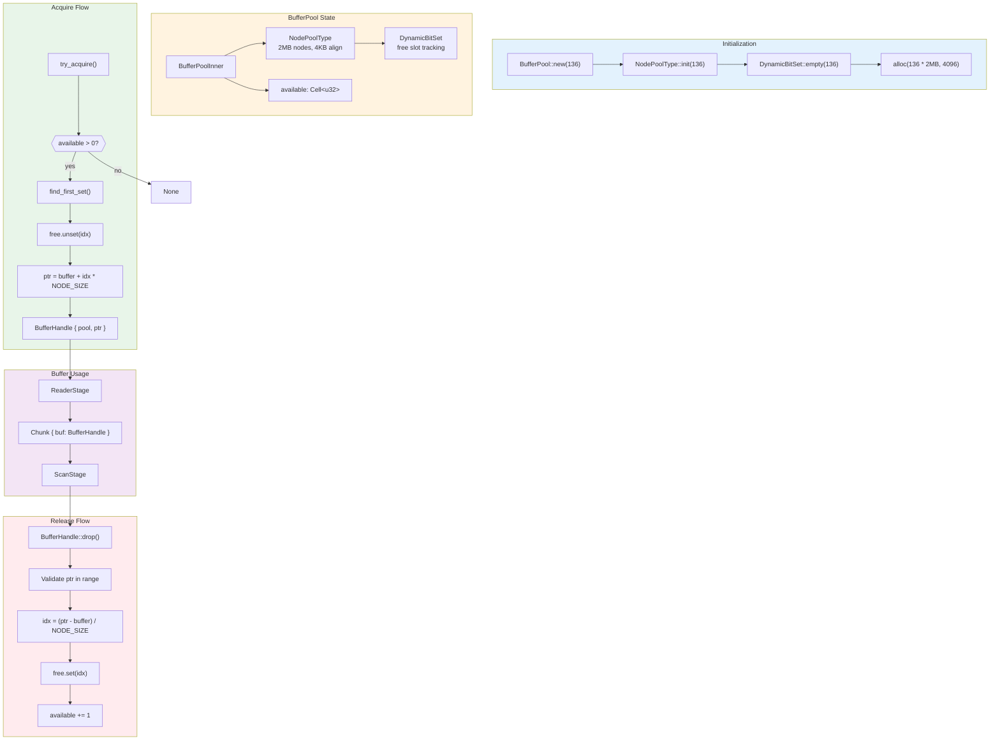
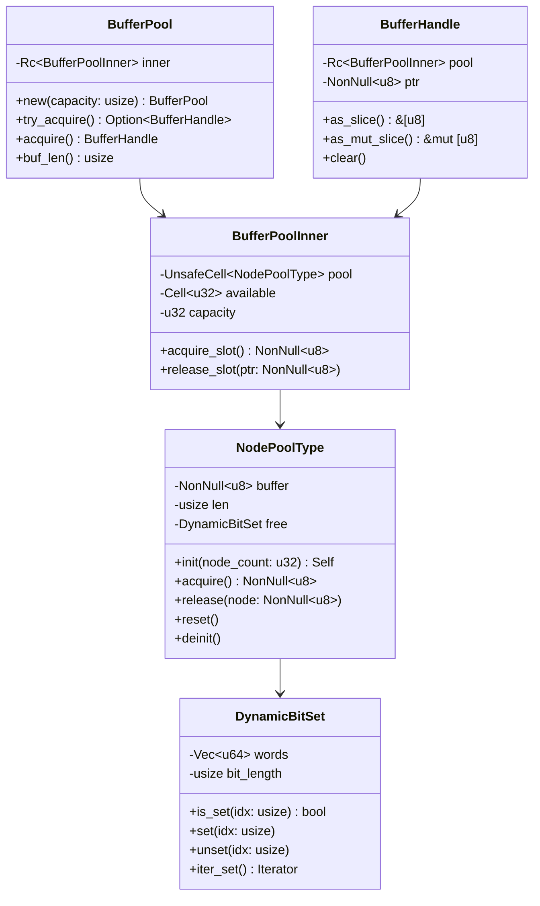
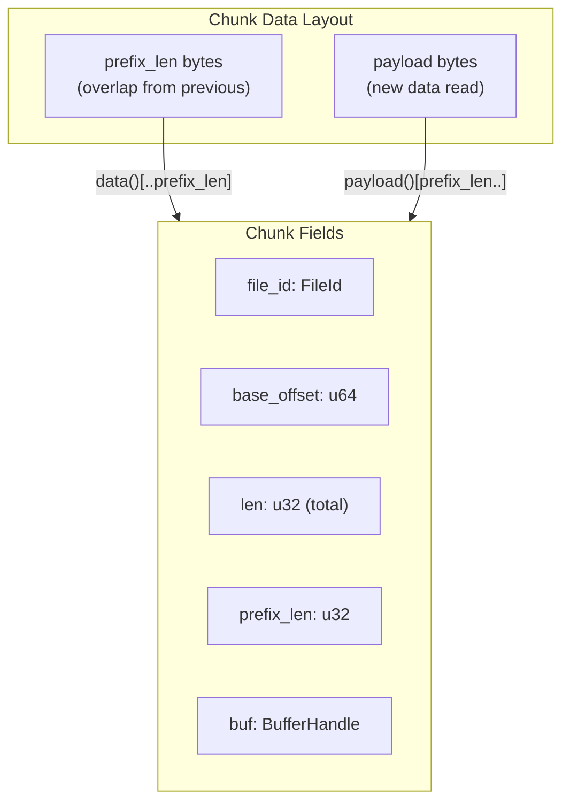
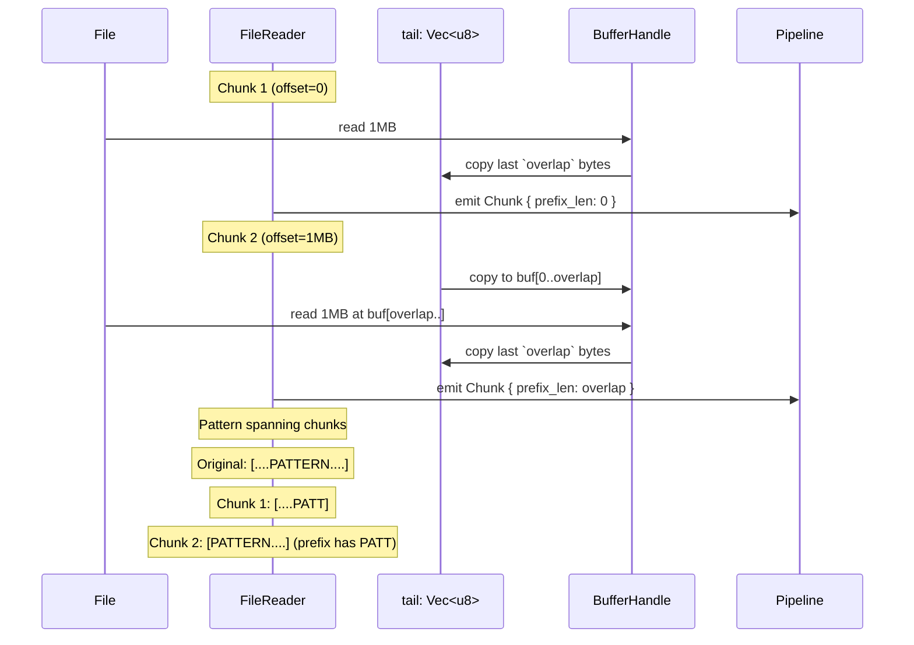

# Memory Management

Buffer lifecycle and pool management in scanner-rs.

## Multi-Core Production Memory Model

The production multi-core scanner (`scan_local`) allocates memory at startup
and maintains zero allocations during the hot path. Memory scales with worker count.

### Memory Breakdown by Worker Count

| Workers | Per-Worker | Buffer Pool | **Total** |
|---------|------------|-------------|-----------|
| 4       | 75.3 MiB   | 5.0 MiB     | ~80 MiB   |
| 8       | 150.5 MiB  | 10.0 MiB    | ~161 MiB  |
| 12      | 225.8 MiB  | 15.0 MiB    | ~241 MiB  |
| 16      | 301.1 MiB  | 20.0 MiB    | ~321 MiB  |

### Per-Worker Allocation (~18.8 MiB each)

| Component | Size | % of Total |
|-----------|------|------------|
| **HitAccPool.windows** | 15.68 MiB | 83.3% |
| FixedSet128 (seen_findings) | 768 KiB | 4.0% |
| FindingRec buffers (out + tmp) | 640 KiB | 3.3% |
| DecodeSlab | 512 KiB | 2.6% |
| Other (ByteRing, TimingWheel, etc.) | ~1.2 MiB | 6.8% |

**Key insight**: HitAccPool dominates at 83.3% of per-worker memory. This is
sized for worst-case: 669 (rule,variant) pairs × 2048 max hits × 12 bytes/SpanU32.

### Buffer Pool (System-Wide)

- **Buffers**: `workers × 4` (e.g., 32 buffers for 8 workers)
- **Buffer size**: `chunk_size + overlap` = 256 KiB + 64 KiB = 320 KiB
- **Total**: ~10 MiB for 8 workers

### Production Configuration (ParallelScanConfig)

```rust
ParallelScanConfig {
    workers: num_cpus::get(),     // Auto-detect CPU count
    chunk_size: 256 * 1024,       // 256 KiB chunks
    pool_buffers: workers * 4,    // 4 buffers per worker
    max_in_flight_objects: 1024,
    local_queue_cap: 4,
}
```

### Zero-Allocation Hot Path

After startup allocation, the scan phase is allocation-free:
- All per-worker scratch is pre-allocated (ScanScratch, LocalScratch)
- Buffer pool provides fixed I/O buffers (TsBufferPool)
- Findings use pre-sized vectors that are reused across chunks

Run diagnostic tests to verify: `cargo test --test diagnostic -- --ignored --nocapture --test-threads=1`

---

## Single-Threaded Pipeline Memory Model

> **Note**: The diagrams below describe the single-threaded `Pipeline` API, which uses
> different buffer sizes (2 MiB vs 256 KiB). For production multi-core scanning, see
> the section above.



## Pool Structure



## Memory Layout

```
┌─────────────────────────────────────────────────────────────────┐
│                    NodePoolType Buffer                           │
│                    (136 * 2MB = 272MB)                          │
├─────────────┬─────────────┬─────────────┬───────┬─────────────┤
│   Node 0    │   Node 1    │   Node 2    │  ...  │   Node 135  │
│   2MB       │   2MB       │   2MB       │       │   2MB       │
│   align=4K  │   align=4K  │   align=4K  │       │   align=4K  │
└─────────────┴─────────────┴─────────────┴───────┴─────────────┘

DynamicBitSet (136 bits = 3 u64 words):
┌─────────────────────────────────────────────────────────────────┐
│ word[0]: bits 0-63    │ word[1]: bits 64-127 │ word[2]: 128-135│
│ 1=free, 0=acquired    │                      │ (8 valid bits)  │
└─────────────────────────────────────────────────────────────────┘
```

## Rationale

The pool is deliberately large and aligned:

- **Fixed allocation**: all buffers are allocated up front so scanning never
  allocates on the hot path. This avoids allocator jitter and makes worst-case
  memory consumption explicit.
- **Alignment**: 4KB alignment keeps buffers page-aligned, which improves cache
  behavior and keeps the door open for direct I/O or SIMD-friendly access.
- **Predictable reclamation**: `BufferHandle` is RAII; dropping the chunk is the
  only way to return a buffer. This makes lifecycle bugs easy to spot.

If you need a smaller footprint, see `docs/perf.md` for sizing trade-offs.

## Constants

```rust
pub const BUFFER_LEN_MAX: usize = 2 * 1024 * 1024;  // 2MB per buffer
pub const BUFFER_ALIGN: usize = 4096;               // 4KB alignment

pub const PIPE_CHUNK_RING_CAP: usize = 128;         // Max chunks in flight
pub const PIPE_POOL_CAP: usize = PIPE_CHUNK_RING_CAP + 8;  // 136 buffers
```

## Chunk Structure



```rust
pub struct Chunk {
    pub file_id: FileId,
    pub base_offset: u64,    // File offset where chunk starts
    pub len: u32,            // Total bytes (prefix + payload)
    pub prefix_len: u32,     // Overlap bytes from previous chunk
    pub buf: BufferHandle,   // Owned buffer handle
}

impl Chunk {
    // Full data including overlap prefix
    pub fn data(&self) -> &[u8] {
        &self.buf.as_slice()[..self.len as usize]
    }

    // Payload only (excludes overlap)
    pub fn payload(&self) -> &[u8] {
        &self.buf.as_slice()[self.prefix_len as usize..self.len as usize]
    }
}
```

## DecodeSlab and Scratch Buffers

Scanning derived buffers (URL/Base64 decode) uses a fixed-capacity slab:

- **DecodeSlab** is append-only and sized to the global decode budget. It never
  reallocates, so ranges returned to work items stay valid for the scan.
- **ScanScratch** owns the slab and all other hot-path buffers; it is reused
  across chunks to avoid per-chunk allocations.

This is the core "no allocations during scan" mechanism: the scanner either
fits within the configured limits or it skips work.

## Overlap Preservation



The overlap ensures patterns that span chunk boundaries are detected:
- `overlap = engine.required_overlap()`
- `required_overlap = max_window_diameter_bytes + max_anchor_pat_len - 1`

## ScanScratch Per-Chunk State

```rust
pub struct ScanScratch {
    out: Vec<FindingRec>,           // Output findings
    work_q: Vec<WorkItem>,          // Transform work queue
    work_head: usize,               // Current work item index
    slab: DecodeSlab,               // Decoded buffer storage
    seen: FixedSet128,              // Deduplication set
    total_decode_output_bytes: usize,
    work_items_enqueued: usize,
    hit_acc_pool: HitAccPool,       // Per-(rule, variant) accumulator pool
    touched_pairs: ScratchVec<u32>, // Scratch list of touched (rule, variant)
    windows: ScratchVec<SpanU32>,   // Temp window storage
    expanded: ScratchVec<SpanU32>,  // Expanded two-phase windows
    spans: ScratchVec<SpanU32>,     // Transform span candidates
    gate: GateScratch,              // Gate streaming scratch
    step_arena: StepArena,          // Decode provenance
    pending_windows: TimingWheel<PendingWindow, 1>,  // Window expiration scheduler
    utf16_buf: Vec<u8>,             // UTF-16 decode output
    steps_buf: Vec<DecodeStep>,     // Finding materialization temp
}
```

All vectors are reused across chunks via `reset_for_scan()`:
- Vectors are cleared but retain capacity
- `seen` uses generation-based O(1) reset
- Avoids per-chunk allocation overhead
