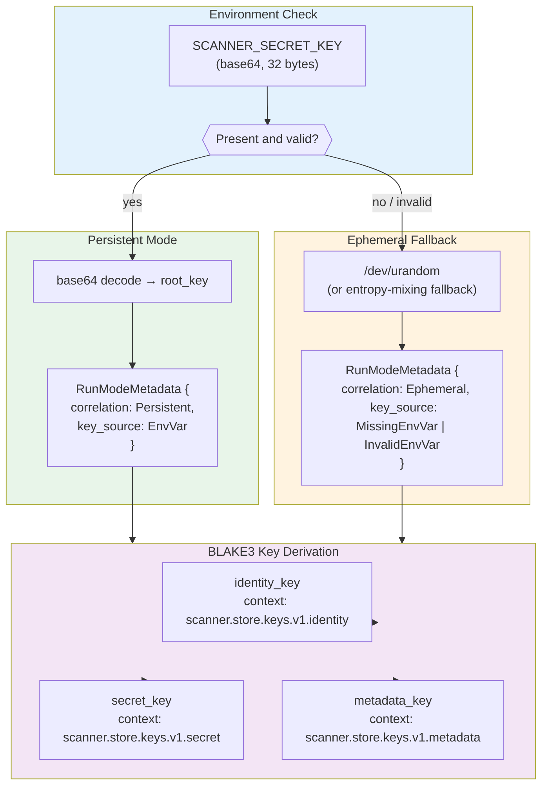
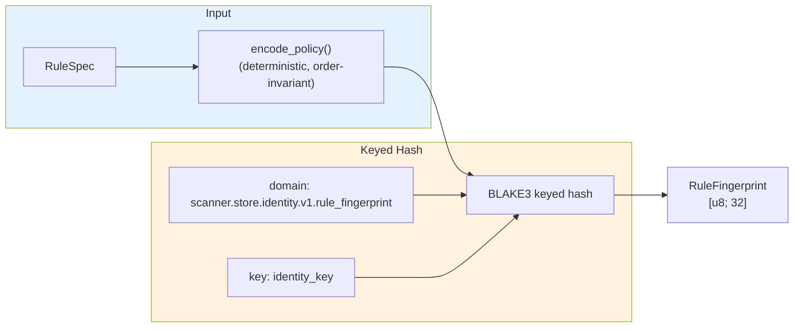
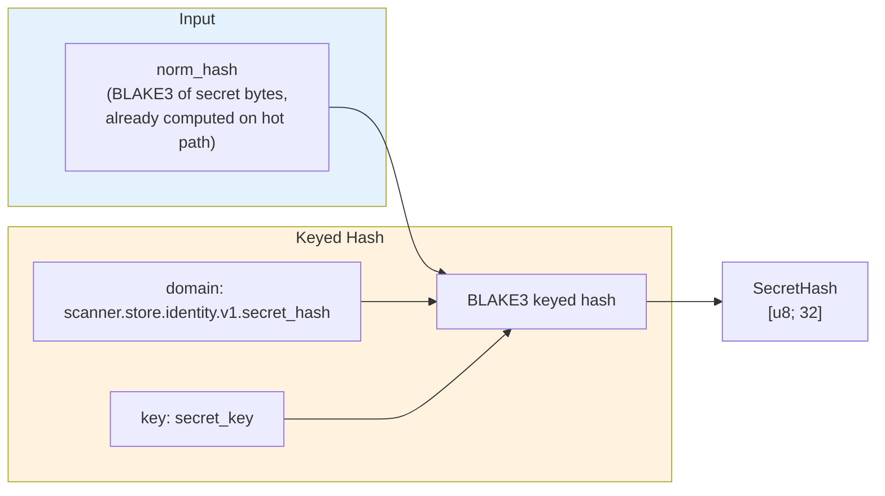
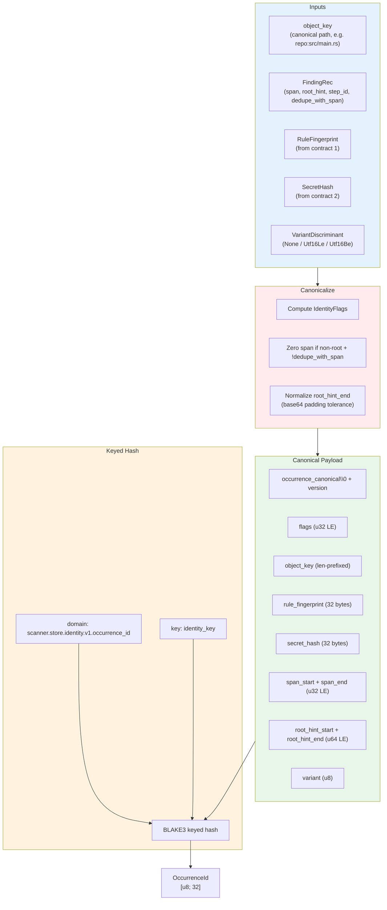

# Persistence Identity Contracts

Deterministic, versioned identity contracts for filesystem persistence.
These contracts let the scanner answer "have I seen this exact finding before?"
across runs without storing raw secret bytes.

**Source**: `src/store/keys.rs`, `src/store/identity.rs`

## Purpose

The detection engine emits `FindingRec` records during scanning. To support
cross-run deduplication, suppression, and incremental scanning on the
filesystem path, each finding needs a **stable identity** that:

- Is deterministic: same inputs always produce the same ID.
- Is keyed: IDs are meaningless without the operator's secret key.
- Matches engine dedupe semantics: two findings the engine considers
  duplicates must hash to the same occurrence ID.
- Never stores raw secret bytes: only keyed hashes are persisted.

Phase A provides the identity derivation contracts. Future phases will use
these IDs to read/write a persistence store on disk.

## Relationship to Git Persistence

Git scanning (`src/git_scan/persist.rs`) has its own persistence pipeline
that uses `(start, end, rule_id, norm_hash)` as finding keys and writes
through a two-phase contract (data ops then watermarks).

The `src/store/` module is a **separate, parallel identity system** for
filesystem scanning. The two systems share the same `norm_hash` concept
(BLAKE3 of secret bytes) but differ in scope:

| Aspect | Git persistence | FS persistence (Phase A) |
|---|---|---|
| Location | `src/git_scan/persist.rs` | `src/store/` |
| Finding key | `(start, end, rule_id, norm_hash)` | `occurrence_id` (32-byte keyed hash) |
| Key material | None (hashes are unkeyed) | `SCANNER_SECRET_KEY` with KDF |
| Cross-run correlation | Via ref watermarks + seen-blob store | Via persistent key identity |
| Secret protection | `norm_hash` is unkeyed BLAKE3 | `secret_hash` is keyed BLAKE3 |

## Key Bootstrap



### Why BLAKE3 KDF?

`blake3::derive_key` is purpose-built for deriving independent subkeys from
a single root. Unlike `new_keyed` (which is a PRF/MAC), `derive_key` accepts
an arbitrary-length context string as domain separator. Each subkey's context
string ensures cryptographic independence even though all three share the
same root material. This avoids the need for HKDF or a separate KDF library.

### Persistent vs. Ephemeral Mode

| Mode | When | Cross-run correlation | Use case |
|---|---|---|---|
| **Persistent** | `SCANNER_SECRET_KEY` set and valid | Yes | Production: suppression, dedup, tracking |
| **Ephemeral** | Env var missing or invalid | No (process-local only) | CI/one-shot scans, development |

`RunModeMetadata` is attached to `StoreKeys` so downstream consumers can
check `is_persistent()` and avoid assuming cross-run correlation when
the key is ephemeral.

### Generating a Key

```bash
# Generate a 32-byte random key, base64-encoded
head -c 32 /dev/urandom | base64
# Export for the scanner
export SCANNER_SECRET_KEY="<output from above>"
```

## Identity Contracts

All three contracts follow the same pattern:

1. Build a canonical byte payload from the input fields.
2. Feed the payload through a domain-separated BLAKE3 keyed hash.

```
H_key(domain ‖ NUL ‖ payload) → [u8; 32]
```

The NUL byte between domain and payload prevents ambiguity when one domain
string is a prefix of another (e.g. `"foo"` vs `"foobar"`).

### Contract 1: Rule Fingerprint

Stable per-rule identity derived from `RuleSpec::encode_policy()`.



`encode_policy()` sorts and deduplicates anchors and keywords before
encoding, so the fingerprint is order-invariant. Two `RuleSpec` values
with identical detection semantics always produce the same fingerprint.

### Contract 2: Secret Hash

Keyed hash over the engine's pre-computed `norm_hash`.



The engine already computes `norm_hash = BLAKE3(secret_bytes)` during
scanning. `secret_hash` wraps this with a keyed domain hash so that:

- The persisted hash is meaningless without the operator's key.
- No hot-path recomputation is needed; the existing `norm_hash` is reused.

### Contract 3: Occurrence ID

Canonical finding identity that mirrors engine dedupe semantics.



## Normalization Rules

Occurrence ID must produce identical hashes for findings the engine already
considers duplicates. Two normalizations handle the tricky cases.

### Base64 Padding Tolerance

Base64 encodes 3 raw bytes into 4 encoded characters. When the raw length
is not a multiple of 3, the encoder may append 1-3 `=` padding characters.
Different implementations may or may not include padding, causing
`root_hint_end` to vary for identical decoded content.

```
Decoded length: 13 bytes
Minimum encoded: ceil(13 * 4 / 3) = 18 characters

  No padding:    root_hint_end = start + 18   ─┐
  With padding:  root_hint_end = start + 19..21 ├─ same decoded content
                                                ─┘
  Solution: if actual_encoded ∈ [min+1, min+3],
            snap root_hint_end to start + min
```

This normalization applies only to non-root findings (transform-derived).
Root findings use authoritative spans and are left untouched.

### Non-Root Span Erasure

For transform-derived findings, the decoded-buffer span (`span_start`,
`span_end`) shifts with chunk alignment. Two scan runs that process
the same file with different chunk boundaries will produce different
span offsets for the same logical secret.

```
Chunk A alignment:  span = [100..116]  ─┐  same secret,
Chunk B alignment:  span = [900..916]  ─┘  different offsets

Solution: zero span_start and span_end for non-root findings
          unless dedupe_with_span is true.
          Only the root-hint window participates in identity.
```

### UTF-16 Variant Discrimination

The engine discovers the same secret in raw bytes and again inside UTF-16
LE or BE re-encodings of the same region. Each encoding produces a distinct
finding that must hash to a distinct occurrence ID. The `VariantDiscriminant`
is included in the canonical payload:

| Value | Meaning |
|---|---|
| `0` | No UTF-16 variant (root or non-UTF16 transform) |
| `1` | UTF-16 little-endian |
| `2` | UTF-16 big-endian |

**Invariant**: root-step findings (`step_id == STEP_ROOT`) must always use
variant `None`. A root finding with a UTF-16 variant is rejected as a caller
bug.

## Identity Flags

Rather than encoding boolean properties implicitly via which payload fields
are zero, `IdentityFlags` makes every semantic dimension explicit and
machine-checkable.

```
Bit layout (u32 LE):

  bit 0    FLAG_ROOT_STEP                  — finding is from the root buffer
  bit 1    FLAG_SPAN_INCLUDED              — decoded-buffer span participates in identity
  bit 2    FLAG_ROOT_HINT_END_NORMALIZED   — root_hint_end was padding-normalized
  bits 3-7   (reserved, must be zero)
  bit 8    FLAG_UTF16_LE                   — UTF-16 LE variant
  bit 9    FLAG_UTF16_BE                   — UTF-16 BE variant
  bits 10-31  (reserved, must be zero)
```

Validation rules:
- Unknown bits (any reserved bit set) are rejected.
- Bits 8 and 9 are mutually exclusive; setting both is rejected.
- `from_bits_strict()` enforces these invariants at construction time.

## Versioning

`IDENTITY_CONTRACT_VERSION` (currently `1`) is embedded in every canonical
payload. The version byte is the first thing after the payload header, so
old and new hashes can never collide silently.

**When to bump the version**:
- Any change to the canonical encoding format (field order, width, tags).
- Any change to normalization rules (padding tolerance window, span erasure logic).
- Any change to flag layout (new bits, reinterpreted bits).
- Any change to the domain strings or key derivation contexts.

**What does NOT require a bump**:
- Adding new test cases.
- Refactoring internal code that preserves the same byte output.
- Changes to non-identity fields in `FindingRec` (e.g. `file_id`).

## Domain Separation Summary

| Contract | Domain String | Key |
|---|---|---|
| Rule fingerprint | `scanner.store.identity.v1.rule_fingerprint` | `identity_key` |
| Secret hash | `scanner.store.identity.v1.secret_hash` | `secret_key` |
| Occurrence ID | `scanner.store.identity.v1.occurrence_id` | `identity_key` |

Domain separation ensures identical byte payloads in different contexts
produce distinct hashes. For example, a rule fingerprint and an occurrence
ID with the same byte content will never collide because they use different
domain strings.

## Memory and Performance

- **Key bootstrap**: runs once at startup, off the hot path. Three BLAKE3
  `derive_key` calls plus one base64 decode (or `/dev/urandom` read).
- **Rule fingerprint**: computed once per rule at engine build time.
- **Secret hash**: reuses the engine's existing `norm_hash` (no raw-secret
  rehash on the hot path).
- **Occurrence ID**: one `Vec` allocation for the canonical payload
  (typically <300 bytes), one BLAKE3 keyed hash. Expected to be called
  at finding-materialization time, not in the per-chunk scan loop.

## Related Documentation

| Document | Relevance |
|---|---|
| [detection-engine.md](detection-engine.md) | FindingRec output, norm_hash computation |
| [transform-chain.md](transform-chain.md) | Identity canonicalization link for transforms |
| [memory-management.md](memory-management.md) | Store key bootstrap memory notes |
| [git-scanning.md](git-scanning.md) | Git persistence pipeline (separate system) |
| [data-types.md](data-types.md) | StoreKeys, IdentityFlags, OccurrenceInput class diagrams |
| [architecture-overview.md](architecture-overview.md) | Component table entries for Store Keys / Store Identity |
