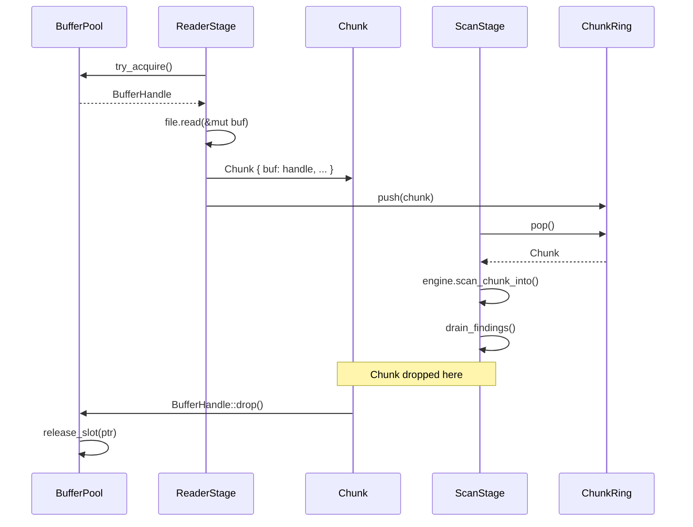

# Pipeline Flow

The scanner-rs pipeline is a 4-stage cooperative pipeline using ring buffers for inter-stage communication.

```mermaid
flowchart LR
    subgraph Input
        Path["Path"]
    end

    subgraph Walker["Walker Stage"]
        WP["Walker::pump()"]
        FS["fs::read_dir()"]
        FT["FileTable"]
    end

    subgraph FileRing["file_ring<br/>capacity: 1024"]
        FR[("FileId Queue<br/>SpscRing")]
    end

    subgraph Reader["Reader Stage"]
        RP["ReaderStage::pump()"]
        FO["File::open()"]
        RC["read_next_chunk()"]
    end

    subgraph ChunkRing["chunk_ring<br/>capacity: 128"]
        CR[("ScanItem Queue<br/>Chunk or FileDone")]
    end

    subgraph Scanner["Scan Stage"]
        SP["ScanStage::pump()"]
        ENG["Engine::scan_chunk_into()"]
        SS["ScanScratch"]
    end

    subgraph OutRing["out_ring<br/>capacity: 8192"]
        OR[("FindingRec Queue<br/>SpscRing")]
    end

    subgraph Output["Output Stage"]
        OP["OutputStage::pump()"]
        SW["BufWriter<Stdout>"]
    end

    subgraph Pool["BufferPool<br/>capacity: 136"]
        BP[("2MB Aligned Buffers<br/>NodePoolType")]
    end

    Path --> WP
    WP --> FS
    FS --> FT
    WP --> FR

    FR --> RP
    RP --> FO
    FO --> RC
    RC --> CR

    BP -.->|"acquire()"| RC
    RC -.->|"BufferHandle"| CR

    CR --> SP
    SP --> ENG
    ENG --> SS
    SP --> OR

    CR -.->|"drop(Chunk)"| BP

    OR --> OP
    OP --> SW

    style Input fill:#e3f2fd
    style Walker fill:#fff3e0
    style FileRing fill:#e8eaf6
    style Reader fill:#e8f5e9
    style ChunkRing fill:#e8eaf6
    style Scanner fill:#ffebee
    style OutRing fill:#e8eaf6
    style Output fill:#f3e5f5
    style Pool fill:#fce4ec
```



## Stage Details

### Walker Stage
- **Input**: Root path
- **Output**: `file_ring` (FileId queue, cap=1024)
- **State**: `stack: Vec<WalkEntry>`, `done: bool`
- **Behavior**: DFS traversal, skips symlinks, respects `max_files` limit

`PipelineStats` now includes `archive: ArchiveStats` for archive outcome
aggregation when archive scanning is enabled.

### Reader Stage
- **Input**: `file_ring` (FileId queue)
- **Output**: `chunk_ring` (ScanItem queue, cap=128)
- **State**: `active: Option<FileReader>`, `pending_done: Option<FileId>`, `overlap`, `chunk_size`
- **Behavior**:
  - Opens files via FileTable path lookup
  - Reads 1MB chunks with configurable overlap
  - Preserves overlap for cross-boundary pattern matching
  - Enqueues `FileDone` after EOF so the scan stage can finalize lexical filtering
  - Archive handling is gated by `PipelineConfig.archive` (enabled by default)
  - When enabled, ReaderStage detects archives by extension and header sniff
  - Archive budgets and path canonicalization are defined in `src/archive/`

### Scan Stage
- **Input**: `chunk_ring` (ScanItem queue)
- **Output**: `out_ring` (FindingRec queue, cap=8192)
- **State**: `scratch: ScanScratch`, `pending_emit: Vec<FindingRec>`
- **Behavior**:
  - Invokes `Engine::scan_chunk_into()` on each chunk
  - Drains findings to pending buffer when `context_mode = Off`
  - Buffers findings per file when `context_mode != Off`
  - Applies lexical filtering on `FileDone` before emitting

### Output Stage
- **Input**: `out_ring` (FindingRec queue)
- **Output**: stdout via BufWriter
- **State**: `out: BufWriter<Stdout>`
- **Behavior**: Formats `path:start-end rule_name` and writes

## Buffer Lifecycle



## Ring Buffer Capacities

| Ring | Capacity | Type | Purpose |
|------|----------|------|---------|
| `file_ring` | 1024 | `SpscRing<FileId>` | File discovery queue |
| `chunk_ring` | 128 | `SpscRing<ScanItem>` | Read chunk queue + `FileDone` markers |
| `out_ring` | 8192 | `SpscRing<FindingRec>` | Finding output queue |

## Pool Sizing

```
PIPE_POOL_CAP = PIPE_CHUNK_RING_CAP + 8
             = 128 + 8
             = 136 buffers
             = 136 * 2MB = 272MB max
```

The pool is sized to allow the chunk ring to be full plus a small headroom for in-flight reads.

## Design Rationale

The pipeline is intentionally staged and bounded, even though it runs in a
single thread:

- **Explicit backpressure**: fixed-capacity rings make it obvious when a stage
  is producing faster than the next stage can consume.
- **Deterministic memory**: the ring sizes and buffer pool define a hard ceiling
  on in-flight data. This makes memory usage predictable for large repos.
- **Clear ownership**: chunks own their buffers via `BufferHandle`, and drop
  returns them to the pool. This keeps lifetimes and reuse unambiguous.

These choices trade some peak throughput for debuggability and predictable
resource usage, which matters for a scanner that may run on arbitrary inputs.

## Git Scan Concurrency & Backpressure

The Git scanning pipeline is **single-threaded** today: each stage executes
serially inside the runner with no internal queues or cross-thread handoff.
Backpressure is enforced through explicit limits rather than runtime channels.

Key bounded points:

- **Spill + dedupe**: `SpillLimits` cap candidate count, spill bytes, and run counts.
- **Mapping bridge**: `MappingBridgeConfig.max_{packed,loose}_candidates` and
  `path_arena_capacity` cap in-memory candidate sets and path bytes.
- **Pack planning**: `PackPlanConfig.max_worklist_entries` and
  `max_delta_depth` bound delta closure expansion.
- **Pack execution**: `PackMmapLimits` cap open packs + total mmap bytes;
  `PackDecodeLimits` cap header bytes, delta bytes, and object bytes.

If any limit is exceeded, the scan fails explicitly and produces no watermark
advance. This makes the single-threaded execution deterministic and resource
bounded, and it provides clear queue/budget boundaries to carry forward if
parallelization is added later.
