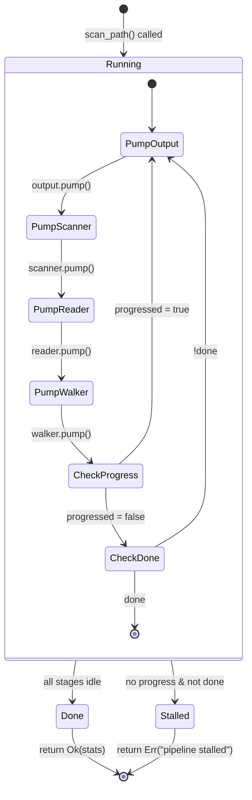
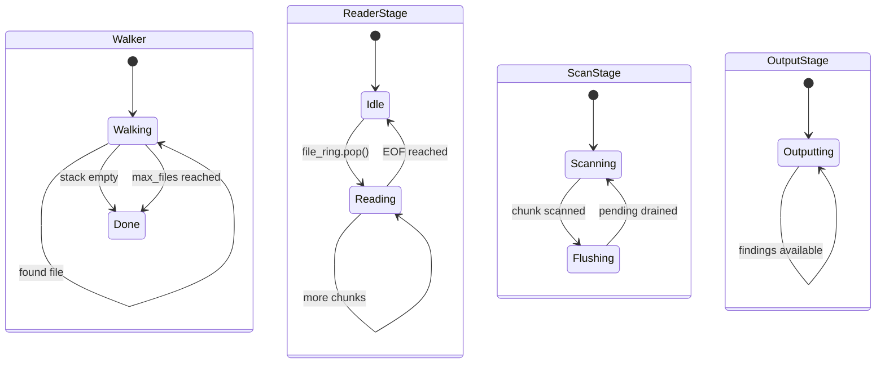
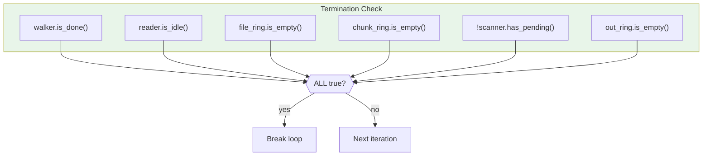
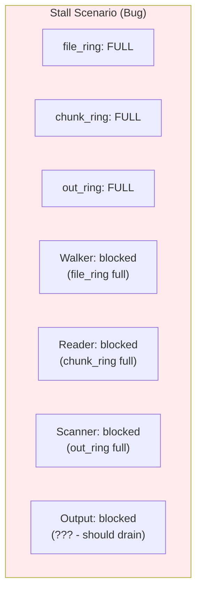
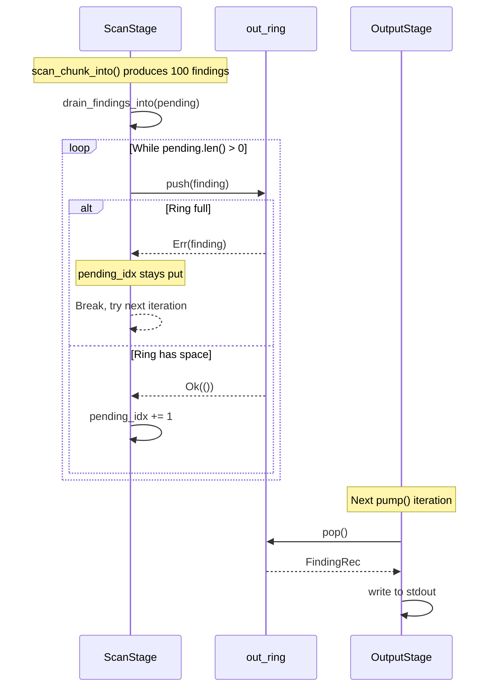
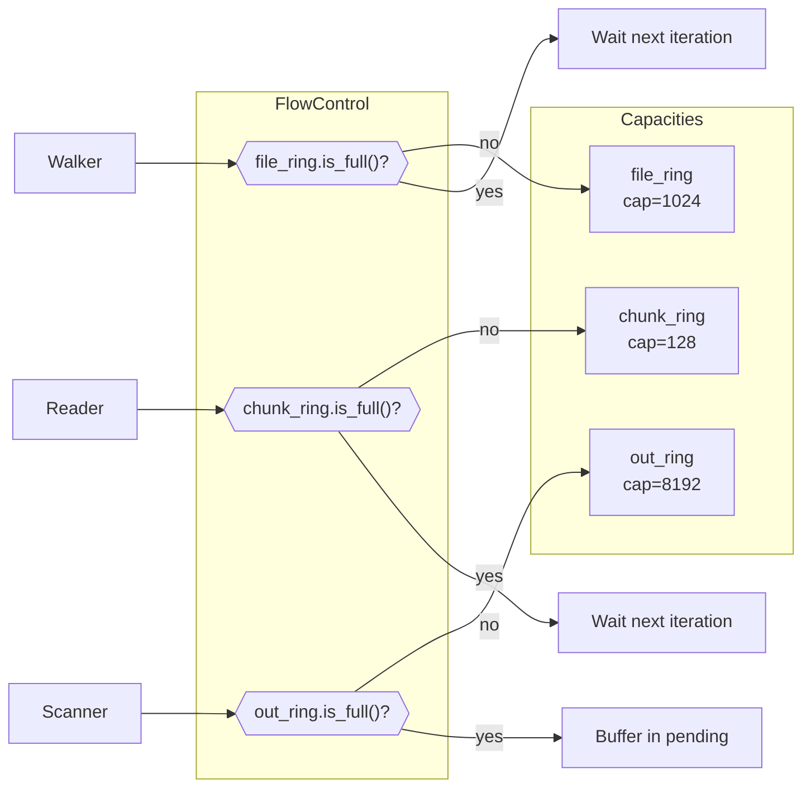

# Pipeline State Machine

Cooperative scheduling loop and state transitions in the scanner-rs pipeline.



## Pump Order

The pipeline processes stages in **reverse order** (output to input) to maximize throughput:

```mermaid
sequenceDiagram
    participant Loop as Main Loop
    participant Output as OutputStage
    participant Scanner as ScanStage
    participant Reader as ReaderStage
    participant Walker as Walker

    loop Every iteration
        Loop->>Output: pump() - drain findings
        Output-->>Loop: progressed?

        Loop->>Scanner: pump() - scan chunks
        Scanner-->>Loop: progressed?

        Loop->>Reader: pump() - read files
        Reader-->>Loop: progressed?

        Loop->>Walker: pump() - discover files
        Walker-->>Loop: progressed?

        Loop->>Loop: Check termination
    end
```

**Why reverse order?**
1. Output first creates space in `out_ring`
2. Scanner can then emit new findings
3. Reader can push chunks when `chunk_ring` has space
4. Walker fills `file_ring` with more work

This prevents deadlocks where upstream stages block on full queues.

## Stage States



## Termination Conditions

```rust
let done = walker.is_done()           // No more files to discover
    && reader.is_idle()               // No active file being read
    && file_ring.is_empty()           // No pending file IDs
    && chunk_ring.is_empty()          // No pending chunks
    && !scanner.has_pending()         // No buffered findings
    && out_ring.is_empty();           // All findings written
```



## Progress Tracking

Each `pump()` returns a boolean indicating whether progress was made:

```rust
loop {
    let mut progressed = false;

    progressed |= output.pump(&engine, &files, &mut out_ring, &mut stats)?;
    progressed |= scanner.pump(&engine, &mut chunk_ring, &mut out_ring);
    progressed |= reader.pump(&mut file_ring, &mut chunk_ring, &pool, &files, &mut stats)?;
    progressed |= walker.pump(&mut files, &mut file_ring, &mut stats)?;

    // ... termination check ...

    if !progressed {
        return Err(io::Error::new(io::ErrorKind::Other, "pipeline stalled"));
    }
}
```

This check prevents a silent busy loop when rings are full/empty in a way that
should not be possible. It surfaces deadlocks early during development.

## Stall Detection

A stall occurs when:
- No stage made progress (`progressed = false`)
- Termination conditions not met

This indicates a logic error (e.g., deadlock) rather than empty input:



In practice, stalls shouldn't occur because:
- Ring buffer sizes are chosen to prevent blocking
- Output stage always drains when data is available
- Pool size exceeds chunk ring capacity

## Backpressure Handling



The `ScanStage` buffers findings in `pending` when `out_ring` is full, ensuring no findings are dropped.

## Ring Buffer Flow Control



## Statistics Collection

```rust
pub struct PipelineStats {
    pub files: u64,     // Files discovered by Walker
    pub chunks: u64,    // Chunks read by Reader
    pub findings: u64,  // Findings written by Output
    pub errors: u64,    // File open/read errors
}
```

Stats are updated atomically at each stage:
- `Walker::pump()`: `stats.files += 1` per file
- `Reader::pump()`: `stats.chunks += 1` per chunk, `stats.errors += 1` on open failure
- `Output::pump()`: `stats.findings += 1` per finding written
