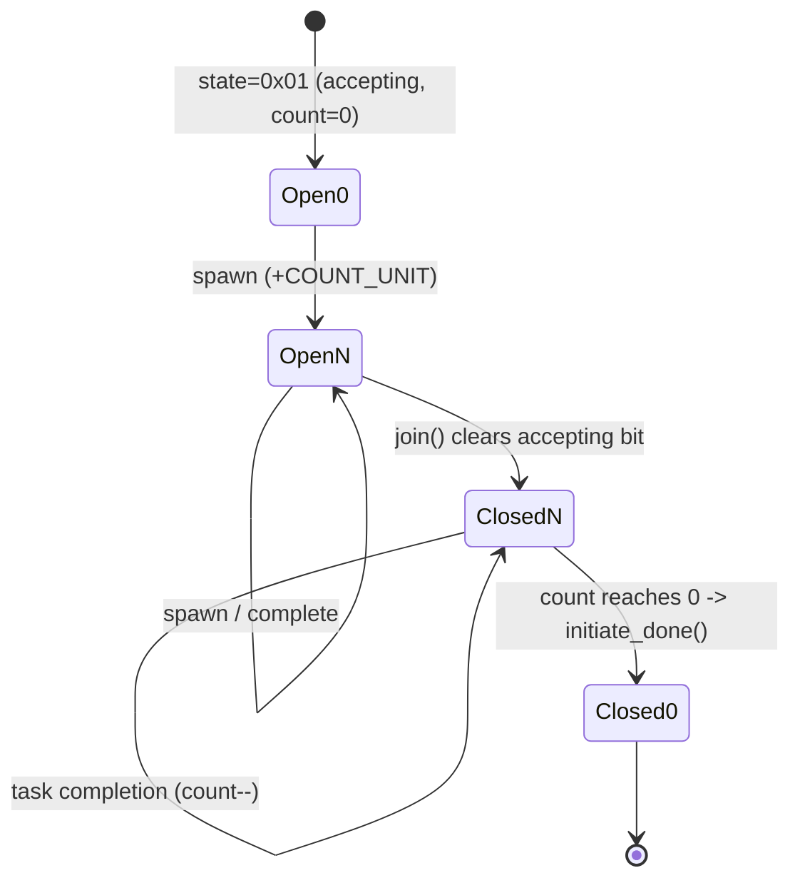

# Pipeline State Machine

Current filesystem scanning uses the scheduler path:

`unified::orchestrator::run` -> `parallel_scan_dir` -> `scan_local` -> `Executor<FileTask>`.

The older single-thread `pump()` ring model (`file_ring`, `chunk_ring`,
`out_ring`) is not present in current `src/` code.

## Top-Level Dispatch

```mermaid
stateDiagram-v2
    [*] --> OrchestratorRun: run(config)
    OrchestratorRun --> FsPath: SourceConfig::Fs
    OrchestratorRun --> GitPath: SourceConfig::Git

    FsPath --> BuildEngine: run_fs()
    BuildEngine --> BuildSink
    BuildSink --> ParallelScanDir: parallel_scan_dir(...)

    ParallelScanDir --> RootError: !root.exists() or read_dir() fails
    ParallelScanDir --> SingleFile: root.is_file()
    ParallelScanDir --> DirWalker: root.is_dir()

    SingleFile --> ScanLocal: scan_single_file() -> SingleFileSource
    DirWalker --> ScanLocal: IterWalker::next_file()

    ScanLocal --> EmitSummary: report -> SummaryEvent
    EmitSummary --> [*]

    RootError --> [*]
    GitPath --> [*]: run_git_scan(...)
```

## scan_local Main-Thread States

```mermaid
stateDiagram-v2
    [*] --> Init: validate + pool + budget + executor
    Init --> Discovery

    Discovery --> Abort: abort_run == true
    Discovery --> DoneDiscovery: source.next_file() == None
    Discovery --> AcquirePermit: next_file() -> LocalFile

    AcquirePermit --> QueueTask: CountBudget::acquire(1)
    QueueTask --> FlushBatch: batch.len() >= batch_cap
    QueueTask --> Discovery: batch.len() < batch_cap
    FlushBatch --> Discovery: spawn_external_batch(...)

    DoneDiscovery --> Join
    Abort --> Join
    Join --> [*]: ex.join() + aggregate metrics
```

`batch_cap` is `cfg.max_in_flight_objects.clamp(1, 64)`.

## Worker Task States (`process_file`)

```mermaid
stateDiagram-v2
    [*] --> CheckAbort
    CheckAbort --> [*]: abort_run == true
    CheckAbort --> DetectByPath

    DetectByPath --> ArchiveDispatch: detect_kind_from_path(...) == Some
    DetectByPath --> OpenFile: no extension match

    OpenFile --> [*]: open/metadata error (io_errors += 1)
    OpenFile --> SkipFile: empty or size > max_file_size
    OpenFile --> DetectByHeader: archive.enabled
    OpenFile --> BinaryProbe: !archive.enabled and skip_binary
    OpenFile --> ChunkLoop: otherwise

    DetectByHeader --> ArchiveDispatch: sniff_kind_from_header(...) == Some
    DetectByHeader --> BinaryProbe: no archive match
    BinaryProbe --> SkipFile: Binary / unsupported extraction
    BinaryProbe --> ChunkLoop: Text

    ArchiveDispatch --> [*]: ArchiveEnd::Scanned/Skipped/Partial
    ChunkLoop --> [*]: EOF or read error
    SkipFile --> [*]
```

Notes:
- Archive scan dispatch is `dispatch_archive_scan(...)` and records
  `ArchiveEnd::{Scanned, Skipped, Partial}`.
- Regular file scanning uses overlap-carry chunks and `engine.scan_chunk_into(...)`.
- `drop_prefix_findings(new_bytes_start)` keeps overlap dedupe deterministic.

## Executor Termination States

The executor uses a combined atomic state `(in_flight << 1) | accepting`.

Constants:
- `ACCEPTING_BIT = 1`
- `COUNT_UNIT = 2`

```mermaid
stateDiagram-v2
    [*] --> Open0: state=0x01 (accepting, count=0)
    Open0 --> OpenN: spawn (+COUNT_UNIT)
    OpenN --> OpenN: spawn / complete
    OpenN --> ClosedN: join() clears accepting bit
    ClosedN --> ClosedN: task completion (count--)
    ClosedN --> Closed0: count reaches 0 -> initiate_done()
    Closed0 --> [*]
```

There is no explicit "pipeline stalled" error state in this path. Completion is
driven by source exhaustion + `join()` + executor in-flight drain.

## Current Names and Constants

| Symbol / Type | Value / Meaning | Location |
| --- | --- | --- |
| `ParallelScanConfig::default().chunk_size` | `256 * 1024` bytes | `src/scheduler/parallel_scan.rs` |
| `ParallelScanConfig::default().pool_buffers` | `workers * 4` | `src/scheduler/parallel_scan.rs` |
| `ParallelScanConfig::default().max_in_flight_objects` | `1024` | `src/scheduler/parallel_scan.rs` |
| `LocalConfig::default().chunk_size` | `64 * 1024` bytes | `src/scheduler/local_fs_owner.rs` |
| `LocalConfig::default().max_in_flight_objects` | `256` | `src/scheduler/local_fs_owner.rs` |
| `ARCHIVE_STREAM_READ_MAX` | `256 * 1024` bytes | `src/scheduler/local_fs_owner.rs` |
| `ACCEPTING_BIT` / `COUNT_UNIT` | `1` / `2` | `src/scheduler/executor_core.rs` |

## Metrics and Summary Wiring

- `scan_local(...)` returns `LocalReport { stats: LocalStats, metrics: MetricsSnapshot }`.
- `stats.io_errors` is set from `metrics.io_errors` at the end of `scan_local`.
- `run_fs(...)` emits `SummaryEvent` using:
  - `report.metrics.bytes_scanned`
  - `report.metrics.findings_emitted`
  - `report.stats.io_errors`
  - elapsed wall-clock timing

## Source of Truth (Paths)

- `src/unified/orchestrator.rs`
- `src/scheduler/parallel_scan.rs`
- `src/scheduler/local_fs_owner.rs`
- `src/scheduler/executor.rs`
- `src/scheduler/executor_core.rs`
- `src/scheduler/metrics.rs`
