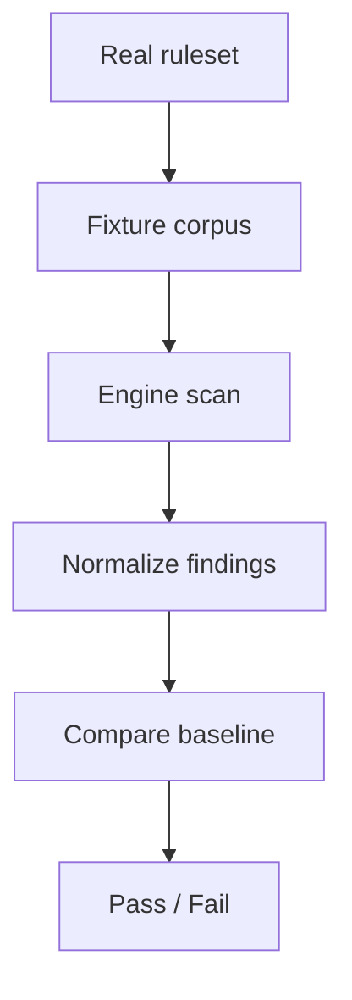

# Real Ruleset Harness Plan (Mode 2)

## Purpose

Define a separate harness mode that runs the production ruleset
(`src/gitleaks_rules.rs`) against a curated fixture corpus. This mode is
explicitly **not** a replacement for the synthetic engine stress harness.

Cross-references:
- `scanner_harness_modes.md`
- `scanner_test_harness_guide.md`
- `detection-rules.md`

## Problem Statement

We want a test mode that provides **ruleset-specific regression signal**
without conflating it with engine correctness. That requires:
- Real ruleset execution
- Deterministic, reviewable expected results
- A fixture corpus with safe, non-sensitive samples

## References (Design Inspiration)

- Semgrep tests rules using in-file annotations (`ruleid`/`ok`) in fixtures.
- detect-secrets uses a baseline file to snapshot expected findings.
- Gitleaks keeps a `testdata/` directory and ships examples around fixtures.

These references suggest two common patterns:
1) Annotated fixtures (explicit expectations in the test files)
2) Baseline snapshots (golden expected findings file)

## Options Considered

### Option A: Annotated Fixtures (Semgrep-style)

**Pros**
- Explicit expectations embedded with the fixture
- Easy to understand per sample

**Cons**
- Requires fixtures to carry annotations (not always possible with binary data)
- Annotation parsing adds complexity

### Option B: Baseline Snapshot (detect-secrets-style)

**Pros**
- Scales to large rulesets
- Works for binary-ish fixtures
- Simple to update with a controlled command

**Cons**
- Baseline churn when rules change
- Requires careful normalization to avoid non-determinism

### Option C: Golden CLI Output

**Pros**
- Leverages existing CLI formats
- Minimal harness code

**Cons**
- Output formats change more often
- Harder to normalize and review

## Decision

Adopt **Option B: Baseline Snapshot** with a curated fixture corpus.

Rationale:
- The ruleset is large and evolving; a baseline scales better.
- Fixtures can include binary/encoded cases without annotations.
- Baseline diffs are reviewable and can be gated.

We can optionally add a small number of annotated fixtures later for
high-risk rules where explicit expectations are valuable.

## Scope and Invariants

**In-scope**
- Real ruleset scan on curated fixtures
- Stable normalization for deterministic comparisons
- Baseline update flow for rule changes

**Out-of-scope**
- Replacing synthetic engine stress testing
- Scanning live repos or real secrets

**Invariants**
- Fixtures contain **no real secrets**
- Baseline updates are explicit and reviewable
- Results are deterministic across runs

## Proposed Data Layout

| Component | Location | Purpose |
|---|---|---|
| Fixtures | `tests/corpus/real_rules/fixtures/` | Curated sample files |
| Expected baseline | `tests/corpus/real_rules/expected/findings.json` | Normalized findings |
| Readme | `tests/corpus/real_rules/README.md` | Corpus rationale and contents |
| Harness test | `tests/simulation/scanner_real_rules.rs` | Baseline comparison |

## Normalization Strategy (Expected Findings)

Normalize each finding to a stable tuple:
- `path` (byte-accurate or lossless encoding)
- `rule_id` / `rule_name`
- `span_start`, `span_end` (byte offsets)
- Optional: `root_hint_start`, `root_hint_end` for encoded matches

Sort deterministically (path, rule_id, span_start).

## Harness Design Sketch

## Step-by-Step Plan

1) **Expose the real ruleset for tests**
   - Add a feature flag (e.g., `real-rules-harness`) that exports
     `gitleaks_rules()` for integration tests.
   - Keep this separate from `bench` to avoid enabling in production builds.

2) **Create fixture corpus layout**
   - Add `tests/corpus/real_rules/fixtures/` and README.
   - Seed with a minimal, safe fixture set (small but representative).

3) **Define baseline schema**
   - JSON array of normalized findings.
   - Include a schema version and optional metadata.

4) **Implement the harness test**
   - Build engine from real rules.
   - Scan fixtures through the existing engine pipeline.
   - Normalize and compare to baseline.

5) **Add a baseline update command**
   - A dedicated script or test flag to rewrite the baseline.
   - Require explicit commit of the updated baseline.

6) **Integrate with CI (optional)**
   - Run in a separate job from synthetic stress tests.
   - Consider nightly by default to reduce churn noise.

7) **Document usage**
   - Update `scanner_test_harness_guide.md` with commands and workflow.
   - Link to `scanner_harness_modes.md` for rationale.

## Risks and Mitigations

- **Ruleset churn** → Baseline updates gated by explicit command.
- **Fixture drift** → Keep corpus small and purpose-driven.
- **False sense of coverage** → Call out limitations in README.

