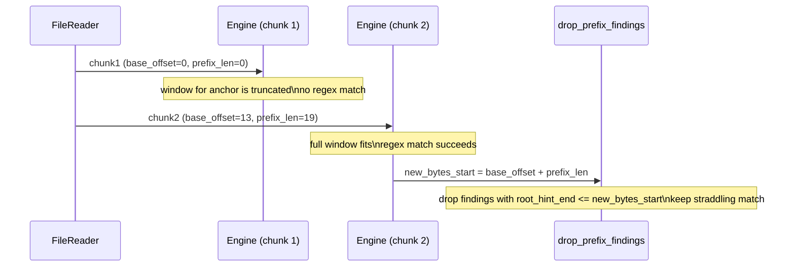

# Scan Trace Examples

Concrete, end-to-end traces of `Engine::scan_chunk_into()` for two scenarios:
1) A secret fully contained in one chunk.
2) A secret that straddles a chunk boundary.

This is not a spec; it is a worked example to make the scan flow tangible.
The goal is to explain the *why* behind each phase so a new reader can follow
the mechanics and the design intent.

## Example setup (shared)

Rules (simplified):

Each rule defines:
- anchors: short byte strings used to cheaply locate candidate windows
- radius: how far to expand around an anchor hit to form a window
- optional two-phase config: a small seed window confirm step before expanding
- regex: the final validator run inside each window

```
rule0 (aws_access_key)
  anchors: ["AKIA"]
  radius: 8
  two_phase: None
  must_contain: None
  regex: AKIA[0-9A-Z]{16}

rule1 (pem_private_key)
  anchors: ["PRIVATE KEY"]
  radius: 32
  two_phase: Some {
      seed_radius: 16,
      full_radius: 64,
      confirm_any: ["BEGIN", "END"]
  }
  must_contain: None
  regex: -----BEGIN [A-Z ]+PRIVATE KEY-----
```

Transforms (simplified):

Transforms are optional decode stages (URL percent, Base64) that produce
derived buffers for scanning.

```
TransformId::UrlPercent (mode: Always)
TransformId::Base64    (mode: Always, gate: AnchorsInDecoded)
```

Tuning (simplified):

Tuning values are caps and limits that bound work and memory.

```
merge_gap = 64
max_windows_per_rule_variant = 16
pressure_gap_start = 128
max_anchor_hits_per_rule_variant = 2048
max_work_items = 256
max_transform_depth = 3
max_total_decode_output_bytes = 4 * 1024 * 1024
```

### Anchor fanout map (how rules/anchors become targets)

Anchors are compiled into three variants: Raw, UTF-16LE, UTF-16BE.
A variant is just a different byte representation of the same anchor so we can
find UTF-16 anchors without decoding the full buffer.

Example anchor fanout (showing just rule0 + rule1):

```
// Key: pattern bytes; Value: list of (rule_id, variant)
"AKIA"                -> [(0, Raw)]
"A\0K\0I\0A\0"         -> [(0, Utf16Le)]
"\0A\0K\0I\0A"         -> [(0, Utf16Be)]

"PRIVATE KEY"         -> [(1, Raw)]
"P\0R\0I\0V\0A\0T\0E\0 \0K\0E\0Y\0" -> [(1, Utf16Le)]
"\0P\0R\0I\0V\0A\0T\0E\0 \0K\0E\0Y" -> [(1, Utf16Be)]
```

Those lists are flattened into:

```
pat_targets = [Target(...), Target(...), ...]
pat_offsets = [0, end_of_pattern0, end_of_pattern1, ...]
```

During scanning:

```
targets = pat_targets[pat_offsets[pid] .. pat_offsets[pid + 1]]
```

where `pid` is the Aho-Corasick pattern id and each `Target` is a packed
`(rule_id, variant)` entry for fast fanout.

Selection note:

- The engine keeps two anchor automatons: raw-only and combined (raw + UTF-16).
- If the scanned slice has no NUL bytes, UTF-16 variants cannot match, so the
  raw-only automaton is used. Otherwise the combined automaton is used to keep
  a single pass on NUL-heavy buffers.

## Mermaid diagrams

### Flow (single chunk, contained secret)

This diagram shows the major phases. The text below explains what each phase
does and why it exists.

```mermaid
flowchart TB
    Start["Chunk data (root buffer)"] --> Scan["scan_rules_on_buffer()"]
    Scan --> AC["Aho-Corasick anchor scan"]
    AC --> Fanout["pat_offsets/pat_targets fanout"]
    Fanout --> Acc["HitAccumulator per (rule, variant)"]
    Acc --> Touched["touched bitset -> touched_pairs list"]
    Touched --> Merge["merge_ranges_with_gap_sorted()"]
    Merge --> Coalesce["coalesce_under_pressure_sorted()"]
    Coalesce --> TwoPhase{ "two_phase?" }

    TwoPhase -- "no" --> Validate["run_rule_on_window()"]
    TwoPhase -- "yes" --> Seed["seed window confirm_any (PackedPatterns)"]
    Seed -- "confirmed" --> Expand["expand to full radius"]
    Expand --> Validate

    Validate --> Finding["FindingRec (span + root_hint)"]
    Finding --> Output["materialize (optional) + output"]

    Validate --> Transforms["transform loop (optional)"]
    Transforms --> Spans["find_spans_into()"]
    Spans --> Gate{ "gate == AnchorsInDecoded?" }
    B64Note["Base64 adds an encoded-space pre-gate before decoded gating"]
    B64Note -.-> Gate
    Gate -- "yes" --> GateScan["gate_stream_contains_anchor()"]
    GateScan -- "no" --> Transforms
    GateScan -- "yes" --> Decode
    Gate -- "no" --> Decode
    Decode["stream_decode -> DecodeSlab"] --> Dedupe["hash128 + FixedSet128"]
    Dedupe -- "new" --> Work["enqueue WorkItem (BufRef::Slab)"]
    Dedupe -- "dup" --> Transforms
    Work --> Scan
```

### Flow (boundary case, straddling secret)

This diagram highlights how overlap ensures a straddling match is still
detected, and how prefix filtering avoids duplicate findings.



## Walk the code (tutorial)

This section is a guided tour of the actual scan loop. It is written as a
step-by-step tutorial so you can connect the flow diagram to the code and
data structures.

### 1) Engine::scan_chunk_into (entry point)

What it does:

- Resets scratch state (no per-scan allocations, all buffers reused).
- Seeds a work queue with the root buffer.
- Runs a loop until all work items are processed or global decode budgets
  are exhausted.

Why:

- The work queue unifies root scanning and decoded-buffer scanning.
- A single loop avoids recursion and makes bounded work explicit.

Key structures:

- `WorkItem`: buffer + provenance (`step_id`) + `root_hint` + depth. `root_hint`
  is a span in the original root buffer used for reporting decoded matches,
  and depth enforces the transform recursion limit.
- `BufRef`: `Root` or `Slab(range)` into `DecodeSlab`, so derived buffers are
  represented by ranges instead of allocations.
- `ScanScratch`: owns all reusable hot-path buffers for a scan.
- `DecodeSlab`: a single pre-allocated buffer that holds all decoded outputs.

### 2) scan_rules_on_buffer (anchor-first core)

What it does:

- Runs Aho-Corasick over the buffer to find anchor hits.
- For each anchor hit, looks up the fanout targets and pushes a window into
  the corresponding `HitAccumulator`.
- Tracks which (rule, variant) pairs were touched.
- For each touched pair, merges/coalesces windows and runs validation.
- If a rule is two-phase, confirms in seed windows before expanding to full
  radius.

Why:

- Anchors are cheap and sharply reduce the regex search space.
- Accumulators allow bounded window counts and control worst-case behavior.
- Touched tracking avoids processing rules with no anchors in the buffer.

Key structures:

- `AhoCorasick`: fast multi-pattern matcher used for anchor scanning.
- `pat_targets` + `pat_offsets`: flat fanout table. `pat_offsets` is a
  prefix-sum array so each pattern id maps to a slice of `pat_targets`.
- `Target`: packed `(rule_id, variant)` to keep fanout cache-friendly.
- `HitAccumulator`: collects windows for one (rule, variant) and switches to a
  single coalesced window when the hit cap is exceeded.
- `SpanU32`: packed `u32` start/end offsets to keep window lists compact.
- `ScratchVec<T>`: fixed-capacity vector that never reallocates (panics on
  overflow to make caps explicit).
- `DynamicBitSet`: records touched (rule, variant) pairs with O(1) reset.
- `PackedPatterns`: contiguous confirm-any patterns for two-phase rules, used
  in memmem checks without `Vec<Vec<u8>>` overhead.

### 3) run_rule_on_window (validation)

What it does:

- For Raw: optionally checks `must_contain`, then runs regex on the window.
- For UTF-16: decodes the window to UTF-8, then runs the same checks.
- Emits `FindingRec` with span, root_hint, and provenance step id.

Why:

- Regex is expensive; we run it only on windows.
- UTF-16 decoding is scoped to the window, not the whole buffer.
- Findings are stored in a compact format first, then materialized later.

Key structures:

- `FindingRec`: compact output record stored on the hot path.
- `root_hint`: span in the root buffer used for reporting decoded matches.
- `StepArena` + `StepId`: parent-linked decode provenance (transform steps and
  UTF-16 windows) without cloning vectors.

### 4) transform loop (decoded buffers)

What it does:

- For each transform (URL percent, Base64), scans for candidate spans.
- Applies an optional gate to avoid decoding when decoded output is unlikely
  to contain anchors.
- Streams decode into `DecodeSlab`, respecting per-transform and global limits.
- Dedupes decoded buffers with a 128-bit hash.
- Enqueues derived buffers as new work items.

Why:

- Secrets often appear encoded. We decode *only* candidate spans.
- Streaming decode avoids large temporary allocations.
- Dedupe prevents quadratic work when the same decoded content appears
  multiple times.

Key structures:

- `ScratchVec<SpanU32>`: fixed-capacity span list for candidate encoded regions.
- `GateScratch`: keeps a small tail buffer for streaming gate checks across
  decode chunk boundaries. Anchor selection for the gate is based on the
  tail+chunk window so UTF-16 matches that straddle boundaries are not missed.
- `DecodeSlab`: pre-allocated contiguous buffer for decoded output slices.
- `FixedSet128`: generation-based hash set for deduping decoded buffers.
- `hash128`: 128-bit AEGIS tag used to avoid adversarial collisions.

### 5) materialize findings (optional)

What it does:

- Turns `FindingRec` into `Finding` by materializing decode steps.
- Uses `StepArena` to reconstruct a `Vec<DecodeStep>` without allocations
  during scanning.

Why:

- Keeps the hot path compact while still enabling rich provenance later.

### Provenance chain (StepArena + DecodeStep)

What it is:

- `DecodeStep` is an enum describing *how* a derived buffer was produced
  (transform decode or UTF-16 window decode). Each step also stores the
  parent span in the source buffer.
- `StepArena` is a Vec of `StepNode { parent: StepId, step: DecodeStep }`.
- `StepId` is just an index into that Vec.

How it works:

1) When a transform decode happens, we push a `DecodeStep::Transform` node
   whose parent is the current work item's `step_id`.
2) When a UTF-16 window is decoded, we push a `DecodeStep::Utf16Window` node
   whose parent is the current `step_id`.
3) A `FindingRec` stores the resulting `StepId`.
4) To materialize a full chain, we walk parent links back to `STEP_ROOT`,
   collect steps, then reverse.

Simplified shape (conceptual):

```rust
struct StepNode {
    parent: StepId,
    step: DecodeStep,
}

fn materialize(mut id: StepId, out: &mut Vec<DecodeStep>) {
    out.clear();
    while id != STEP_ROOT {
        let node = &self.nodes[id.0 as usize];
        out.push(node.step.clone());
        id = node.parent;
    }
    out.reverse();
}
```

Why this design:

- Keeps `FindingRec` small and cheap to push on the hot path.
- Avoids allocating a `Vec<DecodeStep>` per finding during scanning.
- Makes provenance reconstruction deterministic and bounded.

Lifetime note:

- `StepId` values are valid only while the owning `ScanScratch.step_arena`
  is alive and not reset. Materialize findings before reusing scratch.

## Tuning knobs (what to adjust and why)

These values trade off performance, memory, and false negatives under attack:

- `merge_gap`:
  Merge windows if they are within this many bytes. Larger values reduce regex
  calls but may expand scan regions.

- `max_windows_per_rule_variant`:
  Hard cap on window count per (rule, variant). Exceeding this triggers pressure
  coalescing to bound work.

- `pressure_gap_start`:
  Initial merge gap used during pressure coalescing. Doubles until the window
  list fits the cap.

- `max_anchor_hits_per_rule_variant`:
  Cap on raw anchor hits stored before merging. Exceeding it collapses to a
  single coalesced window.

- `max_utf16_decoded_bytes_per_window`:
  Limits UTF-16 decode output per window to control worst-case memory and time.

- `max_total_decode_output_bytes`:
  Global cap across all decode output (transform + UTF-16). Prevents runaway
  decode amplification.

- `max_transform_depth`:
  Maximum depth of recursive decode. Higher values allow nested encodings but
  can blow up work.

- `max_work_items`:
  Hard cap on queued decoded buffers. Prevents unbounded work queue growth.

- `max_findings_per_chunk`:
  Cap on findings emitted per scan. Drops excess findings and increments a
  counter (useful for DoS control).

## Pipeline context (why chunks and overlap exist)

The engine scans chunks, not entire files. The pipeline provides:

- `ReaderStage`: reads chunks with an overlap prefix from the previous chunk.
- `Chunk`: carries `base_offset`, `prefix_len`, and the buffer data.
- `drop_prefix_findings`: removes findings fully inside the overlap prefix to
  avoid duplicates.
- `RingBuffer<T, N>`: fixed-capacity SPSC queues between stages to make
  backpressure explicit without allocations.

This is how we detect secrets that straddle a boundary without double-reporting.

## Example 1: Secret fully contained in one chunk (raw bytes)

Chunk:

```
base_offset = 0
len = 128
data contains: "... AKIA1234567890ABCD ..."
```

Positions:

```
match "AKIA" at m.start = 40, m.end = 44
```

### Step-by-step trace

1) Work queue setup

What happens:

```
work_q = [ WorkItem { buf=Root, step_id=STEP_ROOT, root_hint=None, depth=0 } ]
```

Why:

The engine treats the root buffer and any decoded buffers the same way. A
work queue lets us scan the root, then optionally scan derived buffers
without recursion or allocations in the hot path.

2) Anchor scan (Aho-Corasick)

What happens:

```
pid = pattern id for "AKIA"
targets = pat_targets[pat_offsets[pid] .. pat_offsets[pid + 1]]
targets = [(rule0, Raw)]
```

Why:

Aho-Corasick is a fast multi-pattern matcher that finds anchors in one pass.
We only pay the cost of regex matching inside windows around anchor hits.
The fanout table tells us which rules/variants care about a matched anchor.

3) HitAccumulator push + touched tracking

What happens:

```
seed_radius = 8 (rule0.radius)
scale = 1 (Raw)
window = (m.start - 8) .. (m.end + 8) = 32..52

accs[rule0][Raw].push(32, 52)
touched bitset marks (rule0, Raw)
```

Why:

We compute a window around each anchor hit so regex runs on a much smaller
slice than the full buffer. The "touched" bitset records which (rule, variant)
pairs had at least one anchor hit so we can skip all other rules.

4) Only touched pairs are processed

What happens:

```
touched_pairs = [ rule0/raw ]
```

Why:

Processing only touched pairs avoids O(rules * variants) work when most rules
do not trigger on a given buffer (critical for hundreds of rules).

5) Window merge/coalesce

What happens:

```
windows = [32..52]
merge_ranges_with_gap_sorted -> unchanged
coalesce_under_pressure_sorted -> unchanged
```

Why:

Anchor hits can be close together, so multiple windows can overlap.
`merge_ranges_with_gap_sorted` merges nearby windows to reduce regex calls.
If there are too many windows, pressure coalescing increases the merge gap
until the list fits the configured cap.

6) Regex validation (rule0, Raw)

What happens:

```
window bytes = buf[32..52]
regex matches "AKIA1234567890ABCD" at rm.start=8, rm.end=28
span_in_buf = (32+8) .. (32+28) = 40..60
root_span_hint = span_in_buf (root_hint was None)

FindingRec pushed:
  span_start=40, span_end=60
  root_hint_start=40, root_hint_end=60
  step_id=STEP_ROOT
```

Why:

The regex is the expensive validation step. It only runs inside windows.
Findings are stored as compact `FindingRec` entries with spans in the current
buffer and a `root_hint` that points to where to report the finding.

7) Transform chain (optional)

What happens:

After scanning the current buffer, transforms are evaluated:

```
for each transform:
  quick_trigger
  find_spans_into -> spans: ScratchVec<SpanU32>
  gate (if AnchorsInDecoded)
  append_stream_decode -> DecodeSlab range
  hash128 + FixedSet128 dedupe
  push WorkItem { buf=Slab, step_id, root_hint, depth+1 }
```

If a Base64 span decodes into bytes that include "AKIA...":

- The derived buffer is scanned with the same anchor/regex logic.
- `root_hint` points to the encoded span in the root buffer, so the finding
  carries the original location even though the regex matched decoded bytes.

Why:

Secrets often appear encoded (URL percent, Base64). The transform chain lets
us decode candidate spans and run the same detection logic on the decoded
buffer. The gate for Base64 avoids decoding when there are no anchors after
decoding. The hash+dedupe prevents re-scanning identical decoded content.

8) UTF-16 variants (optional)

What happens:

If the anchor hit was for a UTF-16 pattern instead of Raw:

- `variant = Utf16Le` or `Utf16Be`
- The window is decoded with `decode_utf16*_to_buf`.
- `rule.re` is run on the decoded UTF-8 bytes.
- The finding gets a `DecodeStep::Utf16Window` and root_hint is the window in
  the original buffer.

Why:

Some secrets appear in UTF-16 text. Anchors are compiled into UTF-16LE/BE
variants so we can find them without decoding the entire buffer. When an
UTF-16 anchor hits, we decode just the window and run the regex on UTF-8.

## Example 2: Secret straddles a chunk boundary

Chunking:

```
chunk_size = 32
required_overlap = 19  // 2*radius + anchor_len - 1 = 16 + 4 - 1
```

File offsets:

```
Chunk 1:
  base_offset = 0
  prefix_len = 0
  payload covers [0..31]

Chunk 2:
  base_offset = 32 - 19 = 13
  prefix_len = 19
  data covers [13..63]
  new payload starts at offset 32
```

Secret placement:

```
"AKIA1234567890ABCD" starts at offset 28 and ends at 48
anchor "AKIA" at 28..32
window = (28 - 8) .. (32 + 8) = 20..40
```

What happens:

- Chunk 1 contains offsets 0..31, so the window 20..40 is truncated (missing 32..40).
  Regex validation cannot succeed because the full window is not present.

- Chunk 2 contains offsets 13..63, so it includes 20..40 in full:

```
chunk2 buffer indices for window:
  file offset 20 -> index 7  (20 - base_offset 13)
  file offset 40 -> index 27 (40 - base_offset 13)
```

Therefore chunk 2 can build the full window and the regex match succeeds.

### Duplicate suppression

After scanning chunk 2, the pipeline filters prefix-only findings:

```
new_bytes_start = base_offset + prefix_len = 13 + 19 = 32
drop if root_hint_end <= 32
```

The straddling secret has `root_hint_end = 48`, so it is kept.
If a finding were fully inside the overlap prefix (end <= 32), it would be dropped.

Why:

Scanning `chunk.data()` includes the overlap prefix, which is required for
correctness. But that means the overlap region would be scanned twice (once
as payload in chunk 1, once as prefix in chunk 2). The prefix filter removes
findings that are fully within old bytes while keeping any finding that spans
the boundary.

### Why overlap is required

The overlap size is computed as:

```
required_overlap = max_window_diameter_bytes + max_anchor_pat_len - 1
```

This guarantees that any anchor window (including UTF-16 scaled windows and
two-phase full-radius expansions) fits in at least one chunk, even when the
anchor is near a chunk boundary.

## Summary (what each component is for)

- Aho-Corasick anchors: cheap multi-pattern search to avoid full regex scans.
- HitAccumulator + merge/coalesce: bound window count and avoid excessive regex calls.
- Two-phase rules: confirm noisy anchors cheaply before expanding to large windows.
- Transform chain: scan decoded representations without decoding the entire file.
- Work queue + DecodeSlab: bounded, reusable buffers for derived scans.
- hash128 + FixedSet128: avoid rescanning duplicate decoded content.
- Overlap + prefix filtering: preserve correctness across chunk boundaries without duplicates.
