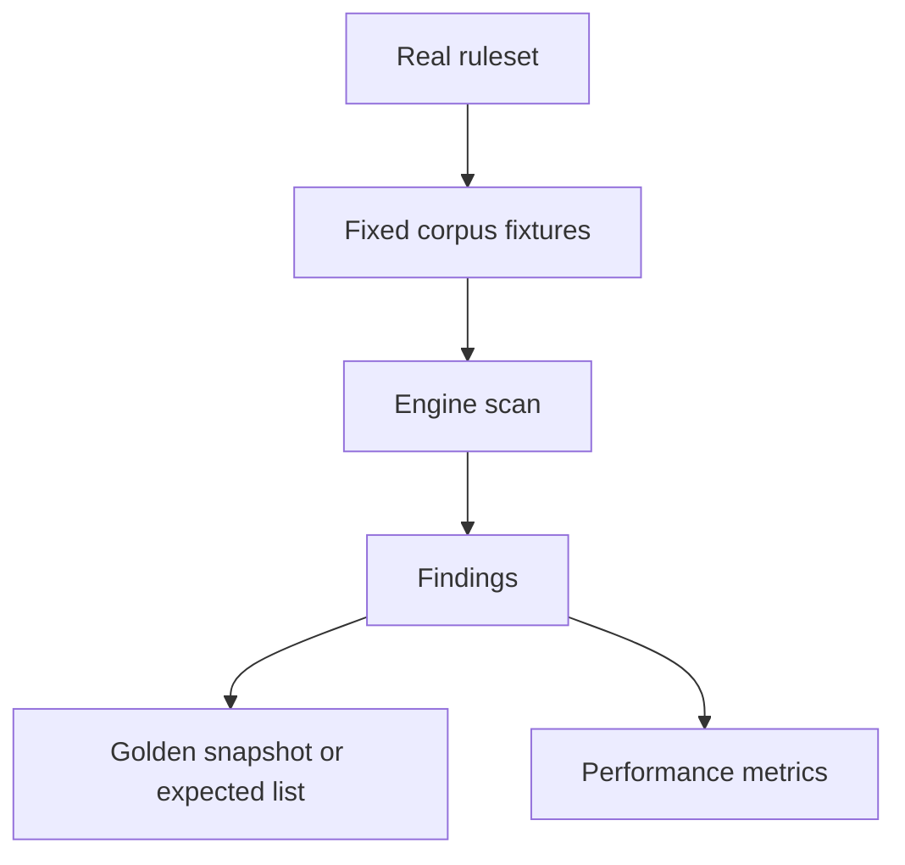

# Scanner Harness Modes (Synthetic vs Real Ruleset)

## Purpose

This document records two complementary testing approaches for the scanner:

1. Synthetic engine stress testing (current default)
2. Real ruleset testing (proposed, separate concern)

The goal is to keep engine correctness and ruleset quality concerns separated
while making the trade-offs explicit. See `scanner_test_harness_guide.md` for
execution details. See `detection-rules.md` for the real ruleset context.

## Component Map

| Component | Location | Purpose |
|---|---|---|
| Synthetic scenario generator | `src/sim_scanner/generator.rs` | Build deterministic in-memory files, rules, and expected spans from a seed |
| Random sim harness | `tests/simulation/scanner_random.rs` | Seeded stress testing of engine invariants under faults and chunking |
| Corpus replay harness | `tests/simulation/scanner_corpus.rs` | Replays minimized regression artifacts |
| Real ruleset | `src/gitleaks_rules.rs` | Production detection rules (not used by sim harness today) |
| Harness guide | `docs/scanner_test_harness_guide.md` | How to run and debug the harness |

## Mode 1: Synthetic Engine Stress (Current)

### What it tests

The synthetic harness validates the engine invariants regardless of which rules
are in use. It stresses:
- Chunking and overlap handling
- Transform decoding (base64, URL percent, UTF-16, nested)
- Deduplication and drop-prefix logic
- Fault handling (partial reads, EINTR, corruption)
- Determinism and stability across schedules

### What the synthetic data is

Each seed deterministically builds:
- A fake in-memory filesystem with N files and byte contents
- A synthetic ruleset (rules like `SIM7_[A-Z0-9]{N}`)
- Embedded synthetic secrets that are guaranteed to match those rules
- Ground-truth spans for every inserted secret

No real repo files or production rules are involved. The simulator does not
test the correctness of `src/gitleaks_rules.rs`; it tests the engine behavior.

### Oracles and invariants

The harness enforces:
- Ground truth: expected secrets are found (when files are fully observed)
- Differential: chunked scan matches a single-chunk reference scan
- Stability: results are identical across schedule seeds
- Internal invariants: no duplicate emission, no prefix overlap leakage, no hangs

### When to use it

Use this mode for engine correctness, boundary conditions, and transform logic.

## Mode 2: Real Ruleset Harness (Proposed)

### Why keep it separate

The real ruleset introduces different risks:
- Regex complexity and performance shifts
- Rule-specific false positives/false negatives
- Rule evolution that should not be conflated with engine correctness

This mode should measure ruleset behavior, not core engine invariants.

### Proposed value

A real-rules harness can provide:
- Performance regression signal for production rules
- Detection regression signal against curated fixtures
- Stability signal when run under different schedules or chunking configs

### Proposed scope

Use the production ruleset from `src/gitleaks_rules.rs` and run one or more
of the following scenario types:

1. Curated fixture corpus (preferred)
   - Small, versioned set of synthetic or redacted files
   - Known expected findings per file
   - Focused on high-risk rule patterns and edge cases

2. Realistic synthetic corpus
   - Generator emits payloads shaped like real credentials
   - Expected findings are known, but contents are not sensitive

3. Snapshot-based regression check
   - Use a fixed corpus and snapshot the normalized findings
   - Changes are reviewed explicitly (like a golden file)

### Non-goals

- Do not replace synthetic engine stress tests
- Do not use production repos with live secrets in tests
- Do not conflate rule changes with engine regressions

### Harness design sketch

### Open questions

- Where to store fixture corpus and expected findings
- How to update golden snapshots safely
- How to balance strictness vs expected churn from ruleset changes

## Recommendation

Keep synthetic engine stress testing as the primary correctness gate, and add
a separate real-rules harness as a regression and performance signal. The two
paths should not share oracles or failure criteria.

