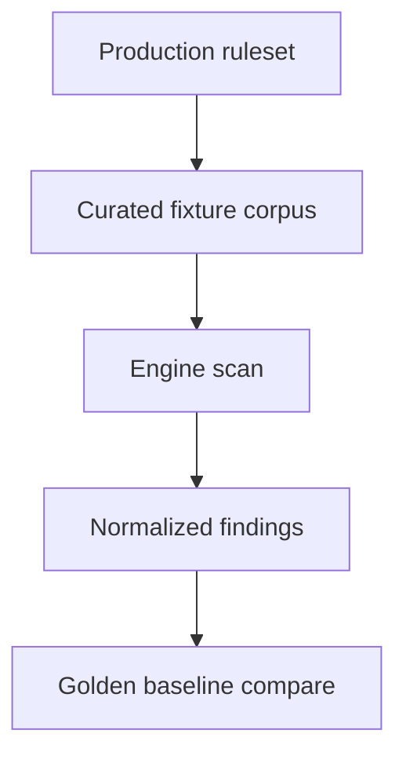

# Scanner Harness Modes (Synthetic vs Real Ruleset)

## Purpose

This document records two complementary scanner test modes:

1. Synthetic engine stress testing (`sim-harness`)
2. Real ruleset baseline snapshot testing (`real-rules-harness`)

The goal is to keep engine correctness and ruleset quality concerns separated
while making the trade-offs explicit. See `scanner_test_harness_guide.md` for
synthetic harness usage. See `detection-rules.md` and
`tests/corpus/real_rules/README.md` for real-rules context.

## Component Map

| Component | Location | Purpose |
|---|---|---|
| Synthetic scenario generator | `src/sim_scanner/generator.rs` | Build deterministic in-memory files, rules, and expected spans from a seed |
| Random sim harness | `tests/simulation/scanner_random.rs` | Seeded stress testing of engine invariants under faults and chunking |
| Corpus replay harness | `tests/simulation/scanner_corpus.rs` | Replay minimized regression artifacts |
| Additional synthetic coverage | `tests/simulation/scanner_archive_*.rs`, `tests/simulation/scanner_discovery.rs`, `tests/simulation/scanner_max_file_size.rs`, `tests/simulation/scanner_budget_invariance.rs` | Archive, discovery fallback, and size or budget invariants |
| Real rules harness | `tests/simulation/scanner_real_rules.rs` | Scan curated fixtures with production rules and compare normalized findings to a golden baseline |
| Real rules fixtures | `tests/corpus/real_rules/fixtures/` | Curated synthetic, non-sensitive fixture corpus |
| Real rules baseline | `tests/corpus/real_rules/expected/findings.json` | Golden findings snapshot for mode-2 regression |
| Real ruleset source | `default_rules.yaml` (embedded via `src/rules/mod.rs`) | Production detection rules used by `demo_rules()` |
| Harness guide | `docs/scanner_test_harness_guide.md` | How to run and debug synthetic scanner simulations |

## Mode 1: Synthetic Engine Stress (Current)

### What it tests

The synthetic harness validates engine invariants regardless of production
rule quality. It stresses:
- Chunking and overlap handling
- Transform decoding (base64, URL percent, UTF-16, nested)
- Deduplication and drop-prefix logic
- Fault handling (partial reads, EINTR, corruption)
- Determinism and stability across schedules

### What the synthetic data is

Each seed deterministically builds:
- An in-memory filesystem with files and byte contents
- A synthetic ruleset (`SIM{rule_id}_[A-Z0-9]{N}`)
- Embedded synthetic secrets guaranteed to match those rules
- Ground-truth spans for every inserted secret

No real repo files or production rules are involved. This mode is for engine
behavior, not `default_rules.yaml` correctness.

### Oracles and invariants

The harness enforces:
- Ground truth: expected secrets are found (when files are fully observed)
- Differential: chunked scan matches a single-chunk reference scan
- Stability: results are identical across schedule seeds
- Internal invariants: no duplicate emission, no prefix overlap leakage, no hangs

### Commands

```bash
# Corpus replay
cargo test --features sim-harness --test simulation scanner_corpus

# Random stress (DEFAULT_SEED_COUNT=25)
cargo test --features sim-harness --test simulation scanner_random

# Optional scale and depth knobs
SIM_SCANNER_SEED_COUNT=100 cargo test --features sim-harness --test simulation scanner_random
SIM_SCANNER_DEEP=1 cargo test --features sim-harness --test simulation scanner_random
```

### When to use it

Use this mode for engine correctness, boundary conditions, transform behavior,
and deterministic fault and schedule coverage.

## Mode 2: Real Ruleset Baseline Snapshot (Implemented)

### What it tests

Mode 2 validates detection regressions for the production ruleset using a fixed
fixture corpus and golden snapshot comparison:
- Ruleset loaded through `demo_rules()` (built from `default_rules.yaml`)
- Corpus scanned with production transforms and tuning
- Findings normalized to `(path, rule, start, end)` and compared to baseline

### Verified constants and baseline paths

Current implementation in `tests/simulation/scanner_real_rules.rs` uses:
- `CORPUS_DIR = "tests/corpus/real_rules/fixtures"`
- `BASELINE_PATH = "tests/corpus/real_rules/expected/findings.json"`
- `LocalConfig { workers: 2, chunk_size: 64 * 1024, pool_buffers: 8, .. }`

### Commands

```bash
# Baseline comparison test
cargo test --features real-rules-harness --test simulation -- scanner_real_rules

# Baseline regeneration (ignored test)
cargo test --features real-rules-harness --test simulation -- \
    scanner_real_rules::update_baseline --ignored --nocapture
```

### Non-goals

- Do not replace synthetic engine stress tests
- Do not use production repos with live secrets in tests
- Do not conflate rule changes with engine regressions

### Harness design sketch


```mermaid
flowchart TD
    A[Production ruleset] --> B[Curated fixture corpus]
    B --> C[Engine scan]
    C --> D[Normalized findings]
    D --> E[Golden baseline compare]
```

## Recommendation

Keep synthetic stress testing as the primary engine-correctness gate, and use
the real-rules harness as a separate ruleset regression gate. The two modes
should not share oracles or failure criteria.
