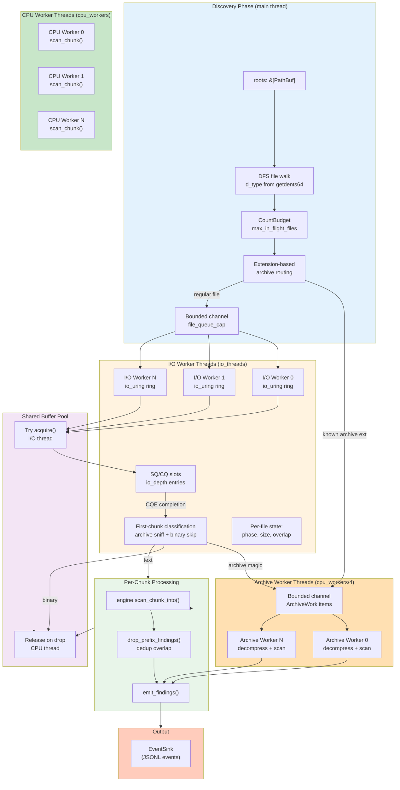

# Local Filesystem Scanner with io_uring

The io_uring backend provides Linux-native asynchronous I/O for high-concurrency file scanning. Unlike blocking reads, io_uring enables dozens of concurrent read operations per I/O thread with minimal kernel overhead, making it ideal for cold-storage workloads (NVMe, network mounts, or high-latency devices).

## Module Purpose

`src/scheduler/local_fs_uring.rs` implements Linux io_uring-based file scanning with work-stealing CPU executors. The module separates I/O, CPU, and archive work across dedicated thread pools:

- **I/O threads** use io_uring to manage asynchronous reads with batched syscalls
- **CPU threads** run the work-stealing executor to scan chunks and emit findings
- **Archive worker threads** handle blocking decompression (gzip, tar, zip) off the I/O loop
- **Buffer pool** transfers ownership: I/O threads acquire, CPU threads release

The architecture emphasizes:
- **High concurrency**: Hundreds of in-flight operations via efficient batch submission
- **Work conservation**: Never drops discovered files; uses backpressure instead
- **Correctness guarantees**: Chunk overlap, deduplication, exactly-once scanning semantics
- **Minimal syscalls**: First-chunk classification folds archive/binary probing into the initial read
- **Platform parity**: Single unified interface with blocking `local_fs_owner.rs` backend (`scan_local`)

## Why io_uring?

### Traditional Read Syscall Limitations

Blocking `read()` and `pread()` provide one I/O operation per syscall. For N concurrent files:
- **High syscall overhead**: Each thread must block until its single operation completes
- **Low utilization**: CPU and I/O threads must scale linearly with concurrency
- **Latency bound**: Long-latency storage (network mounts) stalls the thread

### io_uring Advantages

io_uring provides **kernel-level completion queue semantics** borrowed from hardware queues (NVMe, networking):

```
Traditional Blocking Reads:       io_uring Approach:
┌──────────────────────────┐     ┌──────────────────────────┐
│  read(fd, buf, 8KB)      │     │  Submit 128 reads at once│
│    [BLOCK on kernel]     │     │     (SQ entries)         │
│  (single op in flight)   │     │   [RETURN IMMEDIATELY]   │
└──────────────────────────┘     │ in_flight_ops = 128      │
                                 │                          │
   [Latency bound]               │  [Loop checks]           │
                                 │  - Submit more SQEs      │
                                 │  - Reap CQEs in batches  │
                                 │  - Spawn CPU tasks       │
                                 └──────────────────────────┘

                                 [Throughput bound]
```

**Benefits**:
- **Batched syscalls**: 1–2 syscalls per epoch regardless of concurrency (default: ~128 ops/batch)
- **CPU concurrency**: I/O threads stay active; CPU threads never block on I/O
- **High device utilization**: Hardware can parallelize; kernel queues disambiguate ordering
- **Tunable depth**: `io_depth` parameter controls latency/throughput tradeoff

### When to Use Each Backend

| Scenario | Backend | Reason |
|----------|---------|--------|
| Everything in page cache | `local_fs_owner.rs` (`scan_local`) | Syscall overhead dominates; kernel optimizations (hugepages, prefetch) shine |
| Tiny files | `local_fs_owner.rs` (`scan_local`) | Context-switch overhead > I/O latency |
| Cold storage (NVMe, network) | `io_uring` | Kernel can parallelize; reduces thread count & context switches |
| High concurrency (many files) | `io_uring` | I/O rings can sustain high fan-out without matching blocking thread counts |
| Latency-sensitive | `io_uring` | Bounded by device, not thread scheduling |

**Guidance**: Profile both backends on your actual workload. io_uring wins most on cold storage at high concurrency; blocking is simpler and sometimes faster on hot data.

## Architecture Overview


```mermaid
flowchart TB
    subgraph Discovery["Discovery Phase (main thread)"]
        Source["roots: &[PathBuf]"]
        Walk["DFS file walk<br/>d_type from getdents64"]
        Budget["CountBudget<br/>max_in_flight_files"]
        Queue["Bounded channel<br/>file_queue_cap"]
        ExtRoute["Extension-based<br/>archive routing"]
    end

    subgraph IoPool["I/O Worker Threads (io_threads)"]
        IOW1["I/O Worker 0<br/>io_uring ring"]
        IOW2["I/O Worker 1<br/>io_uring ring"]
        IOwN["I/O Worker N<br/>io_uring ring"]
        Classify["First-chunk classification<br/>archive sniff + binary skip"]
        FileState["Per-file state:<br/>phase, size, overlap"]
        OpSlots["SQ/CQ slots<br/>io_depth entries"]
    end

    subgraph ArchivePool["Archive Worker Threads (cpu_workers/4)"]
        AW1["Archive Worker 0<br/>decompress + scan"]
        AWN["Archive Worker N<br/>decompress + scan"]
        ArchiveChan["Bounded channel<br/>ArchiveWork items"]
    end

    subgraph BufferPool["Shared Buffer Pool<br/>(FixedBufferPool)"]
        BufAcq["Try acquire()<br/>I/O thread"]
        BufRel["Release on drop<br/>CPU thread"]
    end

    subgraph CpuPool["CPU Worker Threads (cpu_workers)"]
        CPUW1["CPU Worker 0<br/>scan_chunk()"]
        CPUW2["CPU Worker 1<br/>scan_chunk()"]
        CpuWN["CPU Worker N<br/>scan_chunk()"]
    end

    subgraph Processing["Per-Chunk Processing"]
        Scan["engine.scan_chunk_into()"]
        DropPrefix["drop_prefix_findings()<br/>dedup overlap"]
        Emit["emit_findings()"]
    end

    subgraph Output["Output"]
        Sink["EventSink<br/>(JSONL events)"]
    end

    Source --> Walk
    Walk --> Budget
    Budget --> ExtRoute
    ExtRoute -->|"known archive ext"| ArchiveChan
    ExtRoute -->|"regular file"| Queue
    Queue --> IOW1 & IOW2 & IOwN

    IOW1 & IOW2 & IOwN --> BufAcq
    BufAcq --> OpSlots
    OpSlots -->|"CQE completion"| Classify
    Classify -->|"archive magic"| ArchiveChan
    Classify -->|"binary"| BufRel
    Classify -->|"text"| Processing

    ArchiveChan --> AW1 & AWN
    AW1 & AWN --> Emit

    Processing --> Scan
    Scan --> DropPrefix
    DropPrefix --> Emit
    Emit --> Output

    Processing --> BufRel
    BufRel --> BufferPool

    style Discovery fill:#e3f2fd
    style IoPool fill:#fff3e0
    style ArchivePool fill:#ffe0b2
    style BufferPool fill:#f3e5f5
    style CpuPool fill:#c8e6c9
    style Processing fill:#e8f5e9
    style Output fill:#ffccbc
```

## Queue Management: SQE and CQE Semantics

io_uring uses two ring buffers (user-space to kernel communication):

### Submission Queue (SQ)

The **submission queue** holds read requests pending kernel processing:

```rust
// Build a read request
let entry = opcode::Read::new(types::Fd(fd), ptr, len)
    .offset(base_offset)
    .build()
    .user_data(op_slot as u64);  // Correlation ID

// Push into SQ (user-space)
ring.submission().push(&entry)?;

// Flush to kernel (syscall only if needed)
ring.submit()?;
```

**Key properties**:
- **User-space**: No syscall to add entries (until flush)
- **Per-I/O-thread ring**: SQ memory updates happen in user-space; syscall occurs at `submit()`
- **Correlation**: `user_data` field lets us match CQEs back to ops
- **Batching**: Fill multiple SQEs before calling `submit()` (amortizes syscall)

### Completion Queue (CQ)

The **completion queue** reports finished operations:

```rust
// Reap all completed operations
for cqe in ring.completion() {
    let op_slot = cqe.user_data() as usize;  // Recover op_slot
    let result = cqe.result();                // Read syscall result or error

    if result < 0 {
        // Syscall error
        stats.read_errors += 1;
    } else {
        let bytes_read = result as usize;
        // Process buffer (bytes_read of data now available)
    }
}
```

**Key properties**:
- **User-space readable**: No syscall to read CQEs
- **Unordered completions**: CQEs may arrive out of submission order; `user_data` maps each CQE to its op slot
- **Reusable**: After processing a CQE, the entry is freed for next operation
- **Batched**: Loop reaps all pending CQEs; use `submit_and_wait(1)` if none available

### I/O Depth and Ring Sizing

```
┌──────────────────────────────────────────────────┐
│           io_uring Ring (cfg.ring_entries)       │
│                                                  │
│  ┌─────────────────────────┐                     │
│  │  Submission Queue (SQ)  │  <-- Add entries    │
│  │  - Up to io_depth       │                     │
│  │  - Batched push()       │                     │
│  └─────────────────────────┘                     │
│                                                  │
│  ┌─────────────────────────┐                     │
│  │  Completion Queue (CQ)  │  <-- Reap CQEs     │
│  │  - Completion order     │                     │
│  │  - user_data matching   │                     │
│  └─────────────────────────┘                     │
└──────────────────────────────────────────────────┘

Default sizing: ring_entries=256, io_depth=128
Invariant: io_depth <= ring_entries - 1
```

| Parameter | Meaning | Tuning |
|-----------|---------|--------|
| `ring_entries` | Total SQ+CQ capacity | Larger = more concurrent ops, more kernel memory |
| `io_depth` | Max simultaneous reads per I/O thread | Tradeoff: higher = more parallelism, but diminishing returns |
| In-flight ops | Dynamically tracked; capped at `io_depth` | Prevents SQ overflow and kernel saturation |

## Integration with Scheduler

### Discovery Integration

Unlike `scan_local` in `local_fs_owner.rs`, this backend does not take a `FileSource`.
`scan_local_fs_uring()` takes `roots: &[PathBuf]` and discovers files via
`walk_and_send_files()`.

**Discovery flow**:
1. Main thread DFS-walks each root using `fs::read_dir` + `DirEntry::file_type()`. On Linux (ext4/xfs/btrfs), `file_type()` uses the `d_type` field from `getdents64` — **no per-file `statx` syscall** during discovery. This eliminated ~98K redundant `statx` calls observed in profiling.
2. Files with known archive extensions (`.tar`, `.gz`, `.tar.gz`, `.zip`) are routed directly to archive workers via the archive channel, bypassing I/O threads entirely.
3. Remaining regular files: acquire a `CountBudget` permit (blocks when `max_in_flight_files` is reached), wrap path + permit in `FileToken`, send `FileWork` over bounded channel.
4. I/O workers keep the token alive until all chunk tasks for that file finish.
5. Size filtering is deferred to the I/O thread's `statx` (which runs async via io_uring), avoiding TOCTOU races between discovery and scanning.

This still enforces work conservation: discovery blocks under backpressure instead of dropping files.

### CPU Task Spawning

When a read completes, the I/O worker spawns a CPU task:

```rust
let total_len = op.prefix_len.saturating_add(n);

let task = CpuTask::ScanChunk {
    token: Arc::clone(&st.token),      // Keeps file permit alive
    base_offset: op.base_offset,       // Overlap bytes
    prefix_len: op.prefix_len as u32,  // Bytes to drop in findings
    len: total_len as u32,             // prefix + payload bytes
    buf: op.buf,                       // Buffer handle (RAII)
};

if cpu.spawn(task).is_err() {
    // CPU executor shut down; mark file as failed
    stopping = true;
    st.failed = true;
    st.done = true;
} else {
    // Spawned successfully; re-queue file for next chunk if needed
    if !st.done && !st.failed && rs.next_offset < rs.size {
        read_ready.push_back(op.file_slot);
    }
}
```

### Overlap Carry and Chunk Stitching

Like blocking I/O, io_uring carries overlap bytes forward:

```
I/O Worker:                          CPU Worker:
┌──────────────────────┐            ┌──────────────────────┐
│ Read [base..base+len)│            │ scan_chunk_into()    │
│ into buffer          │            │                      │
└──────────────────────┘            └──────────────────────┘
        │                                     │
        └─────────────────────────────────────┘
                     Task spawn
                     (CpuTask::ScanChunk)

CPU:
- prefix_len bytes overlap
- Drop findings in [0..prefix_len)
- Emit findings in [prefix_len..len)
- Buffer released (RAII) when task completes
```

### FindingRecord Deduplication

Findings are deduplicated within each chunk by `(rule_id, root_hint, span)`:

```rust
fn dedupe_pending_in_place(p: &mut Vec<FindingRec>) {
    p.sort_unstable_by(|a, b| {
        (a.rule_id, a.root_hint_start, a.root_hint_end, a.span_start, a.span_end)
            .cmp(&(...))
    });
    p.dedup_by(|a, b| {
        a.rule_id == b.rule_id
            && a.root_hint_start == b.root_hint_start
            && a.root_hint_end == b.root_hint_end
            && a.span_start == b.span_start
            && a.span_end == b.span_end
    });
}
```

**Purpose**: Overlap regions can generate duplicate findings across chunks. Sorting + dedup ensures each finding is reported once per chunk.

## First-Chunk Classification

When the first CQE completes for a file (`base_offset == 0`, `prefix_len == 0`), the I/O thread classifies the file content before spawning a CPU task. This folds what was previously a separate probe read + seek into the initial read that was going to happen anyway — eliminating 2 syscalls per file.

### Classification Steps

```
First CQE (base_offset=0, prefix_len=0):
┌─────────────────────────────────────────────┐
│  1. Archive magic sniff (first 512 bytes)   │
│     └─ match → route ArchiveWork to channel │
│                 mark file done, continue     │
│                                              │
│  2. Binary classification (first CHECK_LEN) │
│     └─ NUL bytes → increment binary_skipped │
│                     mark file done, continue │
│                                              │
│  3. Text → fall through to scan_chunk spawn  │
└─────────────────────────────────────────────┘
```

**Archive sniffing**: Uses `sniff_kind_from_header()` to detect gzip, tar, and zip magic bytes regardless of file extension. If detected, the I/O thread constructs an `ArchiveWork` item and sends it to the archive channel. The buffer is dropped immediately (archive workers re-open the file) and the file is marked done — no further reads are submitted.

**Binary detection**: When `skip_binary` is enabled, checks the first `CHECK_LEN` bytes for NUL bytes. Binary files are skipped entirely, saving all subsequent read + scan work.

**Why this is done in the I/O thread**: The first CQE is the earliest point where file content is available. Classifying here avoids spawning CPU tasks for files that will be skipped or rerouted, and avoids a separate probe read + seek that would waste 2 syscalls per file.

### Comparison with Blocking Path

The blocking path (`local_fs_owner.rs`) applies the same optimization: the first `read()` doubles as both archive/binary probe and the first scan chunk. The old code performed a separate 512-byte probe read into a dedicated buffer, then `seek(0)` to rewind before the real read. The new code acquires the pool buffer up-front, reads directly into it, classifies from those bytes, and reuses the buffer for scanning on the first loop iteration (tracked via `preloaded: usize`).

Both paths now have the same per-file syscall profile:

```
open → fstat → read (first chunk, doubles as probe) → [more reads...] → close
```

## Archive Worker Architecture

Archive decompression (gzip inflate, tar entry parsing, zip extraction) is blocking synchronous I/O. The io_uring I/O threads cannot perform this work inline because doing so would stall the entire io_uring completion loop, starving all other in-flight file reads.

### Why Separate Threads?

```
io_uring I/O thread event loop (MUST NOT BLOCK):
┌──────────────────────────────────────────┐
│  submit SQEs → flush → reap CQEs → loop │
│  (drives 128+ concurrent reads)          │
└──────────────────────────────────────────┘
         │
         │ [archive detected]
         ▼
  ArchiveWork ──channel──▶ Archive Worker Thread
                           (blocking decompress is fine here)
```

If an I/O thread blocked on `gzip::read()`, all other in-flight reads on that ring would stall until decompression finished. With 128 concurrent ops per thread, one slow archive could stall 127 other file reads.

### Contrast with Blocking Path

The blocking path (`local_fs_owner.rs`) handles archives **inline on the same worker thread** via `dispatch_archive_scan()`. This is safe because blocking-path workers already call `read()` synchronously — there is no completion loop to protect. Each worker processes one file at a time, so blocking on decompression only delays that worker's next file.

```
Blocking path:                     io_uring path:
┌──────────────────┐              ┌──────────────────┐
│ Worker thread    │              │ I/O thread       │
│  open → read →   │              │  submit → reap → │
│  [archive?]      │              │  [archive?]      │
│   └─ decompress  │              │   └─ send to     │
│      inline      │              │      archive     │
│  scan → close    │              │      channel     │
└──────────────────┘              └──────────────────┘
                                         │
                                         ▼
                                  ┌──────────────────┐
                                  │ Archive worker   │
                                  │  open → decomp → │
                                  │  scan → close    │
                                  └──────────────────┘
```

The key invariant: **never block a thread that drives an async I/O completion loop**. The blocking path doesn't have one, so the distinction doesn't apply there.

### Thread Pool Sizing

Archive worker count defaults to `max(cpu_workers / 4, 1)` when archives are enabled. This is a fraction of the CPU pool because:
- Archive decompression is CPU-bound (inflate) mixed with blocking I/O (re-read from disk).
- Most files in a typical scan are not archives; a small pool avoids idle threads.
- The bounded channel (`file_queue_cap`) provides backpressure if archives arrive faster than workers can process.

### Archive Routing

Archives are detected at two points:

1. **Discovery time** (extension-based): Files with known extensions (`.tar`, `.gz`, `.tar.gz`, `.zip`) are routed directly to archive workers during directory traversal via `detect_kind_from_path()`, bypassing I/O threads entirely.

2. **First-chunk classification** (content-based): Files without archive extensions but with archive magic bytes in their content are detected by I/O threads after the first read completes and routed to archive workers via `ArchiveWork`.

### Archive Scan Flow

Each archive worker runs `archive_worker_loop`, which:
1. Receives `ArchiveWork` from the bounded channel.
2. Re-opens the file (the I/O thread dropped its fd after routing).
3. Dispatches to the appropriate scanner: `scan_gzip_stream`, `scan_tar_stream`, `scan_targz_stream`, or `scan_zip_source`.
4. Uses `UringArchiveSink` to forward decompressed entry chunks to the scan engine, following the same `scan_chunk_into → drop_prefix_findings → drain → dedupe → emit` pattern as regular CPU tasks.
5. Drops the `FileToken` when done, releasing the `CountPermit` and unblocking discovery.

Archive worker stats (bytes, chunks, findings, archives processed) are merged into the `MetricsSnapshot` after all workers finish, giving the orchestrator a unified view.

## Setup and Configuration

### LocalFsUringConfig Structure

```rust
pub struct LocalFsUringConfig {
    // Concurrency
    pub cpu_workers: usize,              // CPU worker threads for scanning
    pub io_threads: usize,               // I/O threads running io_uring

    // I/O tuning
    pub ring_entries: u32,               // SQ/CQ size (e.g., 256)
    pub io_depth: usize,                 // Max concurrent ops per thread (reads + open/stat)

    // Memory and chunking
    pub chunk_size: usize,               // Payload bytes per chunk (e.g., 256 KB)
    pub max_in_flight_files: usize,      // Hard cap on discovered-but-not-done files
    pub file_queue_cap: usize,           // Bounded channel size: discovery → I/O
    pub pool_buffers: usize,             // Total buffers in global pool
    pub use_registered_buffers: bool,    // Use READ_FIXED (registered buffers)
    pub open_stat_mode: OpenStatMode,    // io_uring open/stat vs blocking
    pub resolve_policy: ResolvePolicy,   // openat2 resolve policy (Linux)

    // Safety options
    pub follow_symlinks: bool,           // O_NOFOLLOW if false
    pub max_file_size: Option<u64>,      // Skip files larger than N bytes
    pub seed: u64,                       // Executor determinism

    // Deduplication
    pub dedupe_within_chunk: bool,       // Dedupe findings per chunk

    // Thread affinity
    pub pin_threads: bool,               // Pin worker/IO threads to CPU cores

    // Content classification
    pub skip_binary: bool,               // Skip files with NUL bytes in first CHECK_LEN
    pub archive: ArchiveConfig,          // Archive scanning (gzip, tar, zip expansion)
}
```

Open/stat controls:
- `open_stat_mode`: `UringPreferred` (default), `BlockingOnly`, or `UringRequired`.
- `resolve_policy`: Only applies when `OPENAT2` is used. If `OPENAT2` is unavailable, the worker submits `OPENAT` (without resolve bits). Blocking open/stat is used only when open/stat ops are unavailable or a fallback error (`EINVAL`/`EOPNOTSUPP`) is hit in non-`UringRequired` modes.

### Default Configuration

```rust
pub fn default() -> Self {
    Self {
        cpu_workers: 8,                  // 8 CPU threads for scanning
        io_threads: 4,                   // 4 I/O threads with io_uring
        ring_entries: 256,               // SQ+CQ capacity
        io_depth: 128,                   // Up to 128 concurrent ops per I/O thread
        chunk_size: 256 * 1024,          // 256 KB chunks
        max_in_flight_files: 512,        // Cap on in-flight objects
        file_queue_cap: 256,             // Bounded discovery → I/O queue
        pool_buffers: 256,               // 256 buffers (>= io_threads * io_depth)
        use_registered_buffers: false,   // Off by default
        open_stat_mode: OpenStatMode::UringPreferred, // io_uring open/stat
        resolve_policy: ResolvePolicy::Default,       // No extra resolution constraints
        follow_symlinks: false,          // Safe default: O_NOFOLLOW
        max_file_size: None,             // No size filter
        seed: 1,                         // Deterministic executor
        dedupe_within_chunk: true,       // Dedupe by default
        pin_threads: default_pin_threads(), // CPU affinity (Linux)
        skip_binary: true,               // Skip binary files by default
        archive: ArchiveConfig::default(), // Archive expansion enabled
    }
}
```

### Configuration Validation

The `validate()` method enforces invariants:

```rust
pub fn validate<E: ScanEngine>(&self, engine: &E) {
    // Basic sizes
    assert!(self.cpu_workers > 0);
    assert!(self.io_threads > 0);
    assert!(self.ring_entries >= 8);

    // Buffer sizing
    let overlap = engine.required_overlap();
    let buf_len = overlap.saturating_add(self.chunk_size);
    assert!(buf_len <= BUFFER_LEN_MAX);  // 4 MiB limit

    // io_depth must fit in ring
    let max_depth = (self.ring_entries as usize).saturating_sub(1);
    assert!(self.io_depth <= max_depth);

    // Pool must handle I/O saturation
    let min_pool = self.io_threads.saturating_mul(self.io_depth);
    assert!(
        self.pool_buffers >= min_pool,
        "pool_buffers >= io_threads * io_depth"
    );

    if self.use_registered_buffers {
        assert!(self.pool_buffers <= u16::MAX as usize);
    }
}
```

### Sizing Guidelines

| Parameter | Guidance | Example |
|-----------|----------|---------|
| `cpu_workers` | Match CPU cores for CPU-bound scanning; increase if I/O ops block on CPU | 8–16 |
| `io_threads` | 1–4 per NUMA node; io_uring thread scales well | 4 |
| `ring_entries` | 256–1024; larger allows more concurrent ops but uses more kernel memory | 256 |
| `io_depth` | 64–256; tradeoff between parallelism and latency | 128 |
| `chunk_size` | 64–256 KiB; larger reduces syscalls but increases memory per file | 256 KiB |
| `max_in_flight_files` | 100–1000; bounds discovery depth and memory | 512 |
| `file_queue_cap` | 64–256; bounded channel size to avoid unbounded discovery | 256 |
| `pool_buffers` | Must be >= `io_threads * io_depth`; recommend 2x for CPU pipeline headroom | 256–512 |

### Buffer Pool Configuration

The buffer pool is configured as a fixed global pool:

```rust
let pool = FixedBufferPool::new(
    buf_len,            // overlap + chunk_size
    cfg.pool_buffers,   // global total
);
```

**Why fixed global-only?**
- I/O threads and CPU threads share a single buffer table
- Global acquisition/release simplifies handoff
- Required for optional `READ_FIXED` (registered buffers)

**Memory bound**: Peak memory is bounded by `pool_buffers * (overlap + chunk_size)`.

**Registered buffers**: When `use_registered_buffers` is true, `pool_buffers` must be <= `u16::MAX` (io_uring buffer table limit).

## Submission and Completion Flow

### Per-I/O-Thread Event Loop

Each I/O worker thread runs an event loop:

```
┌─────────────────────────────────────────────────────┐
│            I/O Worker Event Loop                    │
├─────────────────────────────────────────────────────┤
│                                                     │
│  1. Check stop flag (signal for clean shutdown)    │
│                                                     │
│  2. Pull new files from bounded channel (batch)    │
│     - Create FileState in PendingOpen (io_uring)   │
│       or Ready (blocking fallback)                 │
│     - Enqueue into open_ready/read_ready           │
│                                                     │
│  3. Fill SQ up to io_depth:                        │
│     - Prefer read_ready, then stat_ready, open     │
│     - Open: submit OPENAT/OPENAT2                  │
│     - Stat: submit STATX (AT_EMPTY_PATH)           │
│     - Read: acquire buffer, copy overlap, submit   │
│     - Push to SQ (lockfree)                        │
│     - Store Op metadata in ops[]                  │
│     - Increment in_flight_ops                     │
│                                                     │
│  4. Flush SQ to kernel (syscall)                   │
│     - ring.submit()                                │
│                                                     │
│  5. Drain CQ; wait only if empty:                  │
│     - ring.completion().is_empty()                 │
│     - ring.submit_and_wait(1) if empty             │
│     - Or yield if buffers exhausted                │
│                                                     │
│  6. Reap all completed ops:                        │
│     - For each CQE:                               │
│       - Match to Op via user_data                 │
│       - Open success → queue Stat                 │
│       - Stat success → queue Read                 │
│       - Read success (first chunk):               │
│         a. Sniff archive magic → route to         │
│            archive workers, mark done             │
│         b. Check binary → skip, mark done         │
│         c. Text → spawn ScanChunk                 │
│       - Read success (subsequent) → ScanChunk     │
│       - Errors/short reads → mark file done       │
│       - Release buffer to pool (RAII)             │
│                                                     │
│  7. Decide next step:                              │
│     - If stop && in_flight == 0: exit loop       │
│     - If channel closed && no queued files: exit  │
│     - Else: continue (go to step 1)              │
│                                                     │
│  8. Drain any remaining in-flight ops             │
│     - block.submit_and_wait(N) until all done     │
│     - Safety: ensures kernel finishes before drop │
│                                                     │
└─────────────────────────────────────────────────────┘
```

### File State Tracking

Each file has a `FileState` entry tracking its progress:

```rust
struct FileState {
    phase: FilePhase,            // PendingOpen → PendingStat → Ready
    in_flight: u32,              // 0 or 1 (exactly one op in-flight)
    done: bool,                  // Monotonic: finished or skipped
    failed: bool,                // Monotonic: open/stat/read failure
    token: Arc<FileToken>,       // Keeps permit alive
}

enum FilePhase {
    PendingOpen { path: PathBuf },
    PendingStat { file: Option<File> },
    Ready(ReadState),
}

struct ReadState {
    file: File,                  // Open file descriptor
    size: u64,                   // Size captured at open (snapshot)
    next_offset: u64,            // Offset for next chunk (monotonic)
    overlap_buf: Box<[u8]>,      // Tail overlap bytes
    overlap_len: usize,          // Valid bytes in overlap_buf
}

// Invariants (enforced by loop):
// - in_flight is always 0 or 1 (single op in-flight per file)
// - done and failed are monotonic (once true, never reset)
// - phase only advances (no backward transitions)
// - next_offset only advances (never seeks backward)
```

### Operation Tracking

Each in-flight operation has an `Op` entry:

```rust
enum Op {
    Open(OpenOp),
    Stat(StatOp),
    Read(ReadOp),
}

struct OpenOp {
    file_slot: usize,             // FileState index (for completion lookup)
    path: CString,                // NUL-terminated path (lifetime to CQE)
    open_how: Option<Box<types::OpenHow>>,
}

struct StatOp {
    file_slot: usize,             // FileState index
    statx_buf: Box<libc::statx>,  // Buffer (lifetime to CQE)
}

struct ReadOp {
    file_slot: usize,             // FileState index (for completion lookup)
    base_offset: u64,             // Offset of buffer[0] in file
    prefix_len: usize,            // Overlap bytes (dropped in findings)
    payload_len: usize,           // Bytes read from kernel
    buf: FixedBufferHandle,       // Buffer (lifetime to CQE)
}

// Invariant: ops[user_data] is Some() while in-flight, None after completion
// Lifetime coupling: path/open_how/statx/buffer stay valid via ops[] until CQE
```

### SQE Submission Example

```rust
// Calculate read region (payload-only; overlap already copied)
let offset = rs.next_offset;                           // Current file offset
let prefix_len = rs.overlap_len;                       // Bytes to skip in findings
let payload_len = (rs.size - offset).min(chunk_size as u64) as usize;

// Build and push SQE (Read or ReadFixed)
let entry = opcode::Read::new(types::Fd(fd), ptr, payload_len as u32)
    .offset(offset)
    .build()
    .user_data(op_slot as u64);  // Correlation ID

ring.submission().push(&entry)?;  // Lockfree push
ops[op_slot] = Some(Op { ... });  // Record metadata
in_flight_ops += 1;
```

### CQE Completion Handling

```rust
// Reap completed reads
for cqe in ring.completion() {
    let op_slot = cqe.user_data() as usize;
    let result = cqe.result();  // Bytes read (or negative error)

    let op = ops[op_slot].take().unwrap();  // Remove from ops[]

    if result < 0 {
        // Syscall error (-ENOENT, -EIO, etc.)
        stats.read_errors += 1;
        st.failed = true;
        st.done = true;
    } else if result == 0 {
        // Unexpected EOF (file shrank)
        stats.read_errors += 1;
        st.failed = true;
        st.done = true;
    } else {
        let n = result as usize;
        if n < op.payload_len {
            // Short read (file truncated between reads)
            stats.short_reads += 1;
            st.done = true;  // Don't trust offset for next chunk
        }

        // Spawn CPU task to scan this chunk
        let total_len = op.prefix_len.saturating_add(n);
        let task = CpuTask::ScanChunk {
            token: Arc::clone(&st.token),
            base_offset: op.base_offset,
            prefix_len: op.prefix_len as u32,
            len: total_len as u32,
            buf: op.buf,  // Ownership transfer to CPU task
        };

        if cpu.spawn(task).is_ok() {
            // Task spawned; re-queue file if more chunks to read
            if !st.done && !st.failed && rs.next_offset < rs.size {
                read_ready.push_back(op.file_slot);
            } else {
                st.done = true;
            }
        }
    }

    free_ops.push(op_slot);
    in_flight_ops -= 1;
}
```

## Error Handling and Resilience

### Open/Stat Failures

Files that cannot be opened or stat'ed are tracked but not scanned. In blocking mode
or per-file fallback, `open_file_safe()` failures increment `files_open_failed`. In
io_uring mode, open/stat CQEs increment `open_failures`/`stat_failures`, and may fall
back on `-EINVAL`/`-EOPNOTSUPP` when `open_stat_mode != UringRequired`.

**Metrics**: `files_open_failed`, `open_failures`, `stat_failures`, and
`open_stat_fallbacks` capture these outcomes without blocking discovery.

### Read Errors

Transient read errors (EIO, EAGAIN) mark the file as failed:

```rust
if result < 0 {
    // Syscall failed
    stats.read_errors += 1;
    st.failed = true;    // Don't retry or seek forward
    st.done = true;      // Clean up file on next iteration
}
```

**No retry logic**: Each I/O error is treated as fatal for that file (partial scans are unreliable). Discovery continues.

### Short Reads

If fewer bytes arrive than requested, the file is marked done:

```rust
if n < op.payload_len {
    // File shrank between size check and read
    stats.short_reads += 1;
    st.done = true;  // Don't trust next_offset
}
```

**Rationale**: Trusting `next_offset` after a short read could skip data or read past new EOF. Safer to abort and report what we got.

### Buffer Pool Starvation

If buffer pool is exhausted, I/O workers yield:

```rust
let Some(buf) = pool.try_acquire() else {
    // No buffers available; yield to CPU workers
    std::thread::yield_now();
    continue;  // Retry next loop iteration
};
```

**Invariant**: `pool_buffers >= io_threads * io_depth` ensures this isn't a deadlock (CPU workers eventually complete tasks and release buffers).

### Channel Closure

If the file queue channel closes, I/O workers drain in-flight operations:

```rust
match rx.try_recv() {
    Ok(w) => add_file(...),
    Err(chan::TryRecvError::Disconnected) => {
        channel_closed = true;
        // Continue processing queued files and draining in-flight
    }
}

// Later: if no queued files, exit loop (clean shutdown)
```

### Drain Before Exit

Before any I/O worker returns, all in-flight operations **must** complete:

```rust
// SAFETY: Drain any remaining in-flight ops before returning.
// This ensures the kernel finishes writing before we drop buffers.
if in_flight_ops > 0 {
    drain_in_flight(&mut ring, &mut ops, &mut in_flight_ops, &mut stats)?;
}

fn drain_in_flight(
    ring: &mut IoUring,
    ops: &mut [Option<Op>],
    in_flight_ops: &mut usize,
    stats: &mut UringIoStats,
) -> io::Result<()> {
    while *in_flight_ops > 0 {
        ring.submit_and_wait(1)?;
        for cqe in ring.completion() {
            let op_slot = cqe.user_data() as usize;
            if let Some(op) = ops.get_mut(op_slot).and_then(|o| o.take()) {
                *in_flight_ops = in_flight_ops.saturating_sub(1);
                match op {
                    Op::Read(op) => drop(op.buf), // Buffer returns to pool
                    Op::Open(_) | Op::Stat(_) => {}
                }
            }
        }
    }
    Ok(())
}
```

**Why essential**: The kernel writes into buffers until CQEs are reaped. If we drop buffers before collecting CQEs, the kernel may write into freed memory (use-after-free).

## Platform Requirements

### Runtime Compatibility

This module does not hardcode a kernel version check. Runtime behavior is:

- Ring creation must succeed: `IoUring::new(cfg.ring_entries)?`
- Open/stat capability is probed per ring (`OPENAT`/`OPENAT2`/`STATX`)
- `open_stat_mode` controls fallback vs hard failure when capabilities are missing

### Compilation

The module compiles **unconditionally on Linux** (no feature gate):

```rust
#![cfg(target_os = "linux")]
```

**Effect**: On Linux, both io_uring and blocking backends are always available. On other platforms, only the blocking `scan_local` in `local_fs_owner.rs` is compiled. The previous `io-uring` feature gate was removed to simplify build configuration.

### Kernel Capabilities

io_uring operations require **no special capabilities** (CAP_SYS_ADMIN). Regular unprivileged processes can use io_uring for file I/O.

However, some workloads may be restricted by:
- **AppArmor/SELinux**: File access policies still enforced
- **seccomp**: `io_uring` syscall may be blocked if not whitelisted
- **Namespace restrictions**: File visibility determined by mount namespace

### Fallback on Unavailable Kernels

If io_uring initialization fails (for example unsupported kernel or blocked syscall), the error propagates:

```rust
let mut ring = IoUring::new(cfg.ring_entries)?;
// Returns io::Error if kernel doesn't support io_uring
```

**Recommendation**: Use blocking `scan_local` (`local_fs_owner.rs`) as fallback when `io_uring` is unavailable or disallowed by policy.

## Key Types and Functions

### Configuration

```rust
pub struct LocalFsUringConfig {
    pub cpu_workers: usize,
    pub io_threads: usize,
    pub ring_entries: u32,
    pub io_depth: usize,
    pub chunk_size: usize,
    pub max_in_flight_files: usize,
    pub file_queue_cap: usize,
    pub pool_buffers: usize,
    pub use_registered_buffers: bool,
    pub open_stat_mode: OpenStatMode,
    pub resolve_policy: ResolvePolicy,
    pub follow_symlinks: bool,
    pub max_file_size: Option<u64>,
    pub seed: u64,
    pub dedupe_within_chunk: bool,
}

impl LocalFsUringConfig {
    pub fn validate<E: ScanEngine>(&self, engine: &E);  // Panics on invalid config
}
```

### Statistics

```rust
pub struct LocalFsSummary {
    pub files_seen: u64,           // Total files discovered
    pub files_enqueued: u64,       // Files sent to I/O threads
    pub walk_errors: u64,          // Directory walk errors
    pub open_errors: u64,          // Files that couldn't be opened
    pub read_errors: u64,          // Read syscall errors
    pub files_skipped_size: u64,   // Files exceeding max_file_size
    pub archives_routed: u64,      // Files routed to archive workers
    pub binary_skipped: u64,       // Files skipped as binary
}

pub struct UringIoStats {
    pub files_started: u64,        // Files opened by I/O threads
    pub files_open_failed: u64,    // Open failures
    pub open_ops_submitted: u64,   // OPENAT/OPENAT2 SQEs submitted
    pub open_ops_completed: u64,   // OPENAT/OPENAT2 CQEs reaped
    pub stat_ops_submitted: u64,   // STATX SQEs submitted
    pub stat_ops_completed: u64,   // STATX CQEs reaped
    pub open_failures: u64,        // OPENAT/OPENAT2 errors
    pub stat_failures: u64,        // STATX errors
    pub open_stat_fallbacks: u64,  // Fallbacks to blocking open/stat
    pub reads_submitted: u64,      // SQEs submitted to kernel
    pub reads_completed: u64,      // CQEs reaped
    pub read_errors: u64,          // Syscall errors or short reads
    pub short_reads: u64,          // File truncation between reads
    pub binary_skipped: u64,       // Files skipped as binary (first-chunk)
    pub archives_sniffed: u64,     // Files routed to archive workers (content-based)
}
```

### Entry Point

```rust
pub fn scan_local_fs_uring<E: ScanEngine>(
    engine: Arc<E>,
    roots: &[PathBuf],
    cfg: LocalFsUringConfig,
    event_sink: Arc<dyn EventSink>,
) -> io::Result<(LocalFsSummary, UringIoStats, MetricsSnapshot)>;
```

**Returns**: Tuple of discovery summary, I/O thread stats, and CPU executor metrics (chunks scanned, bytes scanned, wall-clock time).

**Errors**: Returns `io::Error` if:
- io_uring ring setup/submit/wait fails
- `open_stat_mode = UringRequired` and open/stat opcodes are unsupported
- An I/O thread returns an error or panics
- Discovery cannot send to I/O workers (broken channel)

### Internal Types

```rust
struct FileToken {
    _permit: CountPermit,           // Holds budget permit alive
    file_id: FileId,                // Unique file ID for output
    display: Arc<[u8]>,             // File path bytes (cheap clone)
}

struct FileWork {
    path: PathBuf,                  // Path to open
    token: Arc<FileToken>,          // Permit + ID
}

struct FileState {
    phase: FilePhase,               // PendingOpen → PendingStat → Ready
    in_flight: u32,                 // 0 or 1 (single op in-flight per file)
    done: bool,                     // Monotonic: reached EOF or skipped
    failed: bool,                   // Monotonic: open/stat/read error
    token: Arc<FileToken>,
}

enum FilePhase {
    PendingOpen { path: PathBuf },
    PendingStat { file: Option<File> },
    Ready(ReadState),
}

struct ReadState {
    file: File,                     // Opened file descriptor
    size: u64,                      // Actual file size (from statx/fstat)
    next_offset: u64,               // Next chunk offset
    overlap_buf: Box<[u8]>,         // Tail overlap bytes
    overlap_len: usize,             // Valid bytes in overlap_buf
}

enum Op {
    Open(OpenOp),
    Stat(StatOp),
    Read(ReadOp),
}

struct OpenOp {
    file_slot: usize,               // FileState index
    path: CString,                  // NUL-terminated path
    open_how: Option<Box<types::OpenHow>>,
}

struct StatOp {
    file_slot: usize,               // FileState index
    statx_buf: Box<libc::statx>,
}

struct ReadOp {
    file_slot: usize,               // FileState index
    base_offset: u64,               // Offset of buffer[0] in file
    prefix_len: usize,              // Overlap bytes prepended
    payload_len: usize,             // Bytes read from disk
    buf: FixedBufferHandle,         // Buffer (lifetime to CQE)
}

enum CpuTask {
    ScanChunk {
        token: Arc<FileToken>,
        base_offset: u64,
        prefix_len: u32,
        len: u32,
        buf: FixedBufferHandle,
    },
}

// Archive worker types
struct ArchiveWork {
    path: PathBuf,                  // Path to archive file
    kind: ArchiveKind,              // Detected archive format
    token: Arc<FileToken>,          // Keeps permit alive during decompression
}

struct UringArchiveSink<'a, E: ScanEngine> {
    engine: &'a E,
    scratch: &'a mut E::Scratch,
    pending: &'a mut Vec<Finding>,
    event_sink: &'a dyn EventSink,
    display: Vec<u8>,               // Current entry display path
    file_id: FileId,                // Deterministic per-entry ID
    dedupe: bool,
    bytes_scanned: u64,
    chunks_scanned: u64,
    findings_emitted: u64,
}
```

### Core Functions

```rust
// Main loop for I/O worker thread
fn io_worker_loop<E: ScanEngine>(
    _wid: usize,
    rx: chan::Receiver<FileWork>,      // File queue
    pool: Arc<FixedBufferPool>,         // Shared buffer pool
    cpu: ExecutorHandle<CpuTask>,       // CPU executor handle
    engine: Arc<E>,
    cfg: LocalFsUringConfig,
    stop: Arc<AtomicBool>,              // Graceful shutdown flag
    archive_tx: Option<chan::Sender<ArchiveWork>>, // Archive routing channel
) -> io::Result<UringIoStats>;

// Archive worker loop (blocking decompression + scan)
fn archive_worker_loop<E: ScanEngine>(
    rx: chan::Receiver<ArchiveWork>,
    engine: Arc<E>,
    event_sink: Arc<dyn EventSink>,
    cfg: ArchiveConfig,
    dedupe: bool,
) -> ArchiveWorkerStats;

// Discovery DFS walk
fn walk_and_send_files(
    root: &Path,
    cfg: &LocalFsUringConfig,
    budget: &Arc<CountBudget>,         // In-flight file limit
    tx: &chan::Sender<FileWork>,
    archive_tx: &Option<chan::Sender<ArchiveWork>>, // Direct archive routing
    next_file_id: &mut u32,
    summary: &mut LocalFsSummary,
) -> io::Result<()>;

// Safe file open with O_NOFOLLOW option
fn open_file_safe(path: &Path, follow_symlinks: bool) -> io::Result<File>;

// Drain pending in-flight operations (called at shutdown)
fn drain_in_flight(
    ring: &mut IoUring,
    ops: &mut [Option<Op>],
    in_flight_ops: &mut usize,
    stats: &mut UringIoStats,
) -> io::Result<()>;

// CPU worker task runner
fn cpu_runner<E: ScanEngine>(task: CpuTask, ctx: &mut WorkerCtx<CpuTask, CpuScratch<E>>);

// Deduplication helper
fn dedupe_pending_in_place<F: FindingRecord>(p: &mut Vec<F>);

// Emit findings as structured events
fn emit_findings<E: ScanEngine, F: FindingRecord>(
    engine: &E,
    event_sink: &dyn EventSink,
    display: &[u8],
    recs: &[F],
);
```

## Usage Example

```rust
use std::path::PathBuf;
use std::sync::Arc;

use crate::unified::events::VecEventSink;

// Setup
let engine = Arc::new(MockEngine::default());
let roots = vec![PathBuf::from("/data")];
let cfg = LocalFsUringConfig {
    cpu_workers: 8,
    io_threads: 4,
    ring_entries: 256,
    io_depth: 128,
    chunk_size: 256 * 1024,
    max_in_flight_files: 512,
    file_queue_cap: 256,
    pool_buffers: 256,
    use_registered_buffers: false,
    open_stat_mode: OpenStatMode::UringPreferred,
    resolve_policy: ResolvePolicy::Default,
    follow_symlinks: false,
    max_file_size: Some(100 * 1024 * 1024),  // 100 MB max
    seed: 1,
    dedupe_within_chunk: true,
};
let sink = Arc::new(VecEventSink::new());

// Validate
cfg.validate(&engine);

// Scan
let (summary, io_stats, cpu_metrics) =
    scan_local_fs_uring(engine, &roots, cfg, sink.clone())?;

// Results
println!("Files seen: {}", summary.files_seen);
println!("Files enqueued: {}", summary.files_enqueued);
println!("Open ops submitted: {}", io_stats.open_ops_submitted);
println!("Stat ops submitted: {}", io_stats.stat_ops_submitted);
println!("Open/stat fallbacks: {}", io_stats.open_stat_fallbacks);
println!("Reads completed: {}", io_stats.reads_completed);
println!("Chunks scanned: {}", cpu_metrics.chunks_scanned);

let jsonl = String::from_utf8_lossy(&sink.take());
println!("Findings/events bytes: {}", jsonl.len());
```

## Correctness and Invariants

### Single-Op-In-Flight Per File

**Invariant**: At most 1 operation (open/stat/read) in-flight per file at any time.

**Why**: Keeps per-file state transitions deterministic and preserves prefix-drop semantics for reads.

**Enforcement**:
```rust
// Files in ready queues (open/stat/read) always have in_flight == 0
debug_assert_eq!(st.in_flight, 0);

// After push to SQ:
st.in_flight = 1;

// After CQE reaped:
st.in_flight = 0;
```

### Monotonic State Transitions

**Invariant**: `done`, `failed`, and `phase` are monotonic (once advanced, never reset or move backward).

**Why**: Simplifies state machine; once a file is finalized, it stays finalized.

**Enforcement**:
```rust
// Only set to true, never reset:
st.failed = true;
st.done = true;

// Check prevents double-processing:
if st.done || st.failed { continue; }
```

### Buffer Lifetime Coupling

**Invariant**: Buffer referenced by kernel must remain valid until CQE is reaped.

**Why**: io_uring kernel code writes to buffer asynchronously; freeing the buffer while write is in-flight causes use-after-free.

**Enforcement**:
```rust
// Buffer stored in ops[] until completion:
ops[op_slot] = Some(Op { buf, ... });

// On CQE:
let op = ops[op_slot].take();  // Remove from ops[]
drop(op.buf);                   // Now safe to free
```

### Drain Before Return

**Invariant**: All in-flight operations must complete before I/O worker returns.

**Why**: Ensures kernel finishes writing before buffers are freed (via pool cleanup).

**Enforcement**:
```rust
// At end of io_worker_loop:
if in_flight_ops > 0 {
    drain_in_flight(&mut ring, &mut ops, &mut in_flight_ops, &mut stats)?;
}
assert_eq!(in_flight_ops, 0);
```

### Budget Permit Lifetime

**Invariant**: FileToken (holding budget permit) stays alive as long as any chunk is queued or in-flight.

**Why**: Ensures `max_in_flight_files` backpressure remains in effect; prevents discovery from unbounded racing ahead.

**Enforcement**:
```rust
// Token created at discovery time:
let token = Arc::new(FileToken { _permit: permit, ... });

// Spawned CPU task holds Arc clone:
CpuTask::ScanChunk { token: Arc::clone(&token), ... }

// Permit released when last Arc is dropped (after scan completes)
```

## Testing

The module includes integration tests for correctness:

```rust
#[test]
fn uring_finds_boundary_spanning_match() {
    // Verify findings spanning chunk boundaries are detected
    // Pattern "SECRET" placed at offset 4 in 16-byte file
    // With chunk_size=8, pattern spans chunks [0..8) and [8..16)
    // Overlap carry ensures both pieces are scanned together
}

#[test]
fn global_only_pool_works() {
    // Verify minimal pool (single worker, minimal local queue) works
    // and correctly acquires/releases buffers
}

#[test]
fn uring_binary_skipped_counted() {
    // File with NUL bytes triggers binary skip
    // Verifies both io_stats.binary_skipped and cpu_metrics.binary_skipped
    // are incremented, and no findings are emitted for the binary file
}

#[test]
fn uring_archive_sniffed_counted() {
    // File with gzip magic bytes (0x1f 0x8b) but no archive extension
    // Verifies io_stats.archives_sniffed is incremented (content-based routing)
}
```

## Performance Characteristics

### Throughput

io_uring often improves throughput on cold cache and high-concurrency workloads.
On hot cache or tiny files, the blocking backend can be comparable or faster.

### Latency

io_uring provides **latency isolation**:
- Individual file scans are not delayed by slow peers (no thread starvation)
- CPU workers are never blocked on I/O
- Bounded queue depths prevent runaway memory

### Memory

- **Peak memory**: `pool_buffers * (overlap + chunk_size)` (exact value depends on engine overlap and config)
- Additional memory comes from per-thread ring state and file/op tracking tables.

### Scalability

| Workload | Bottleneck | Optimization |
|----------|-----------|--------------|
| CPU-bound (large files) | CPU time | Increase `cpu_workers` |
| I/O-bound (many small files) | I/O throughput | Increase `io_depth` or `io_threads` |
| Memory-constrained | Buffer pool | Reduce `pool_buffers` or `chunk_size` |
| Discovery-constrained | File enumeration | Increase discovery thread priority or parallelize walk |

## Future Improvements

- **Conditional ring polling**: Use poll-based completion for ultra-low latency
- **Per-NUMA ring allocation**: Pin rings to NUMA nodes for better locality
- **Retry on transient errors**: Distinguish permanent vs. transient read errors
- **Adaptive io_depth**: Adjust based on real-time latency/throughput metrics
