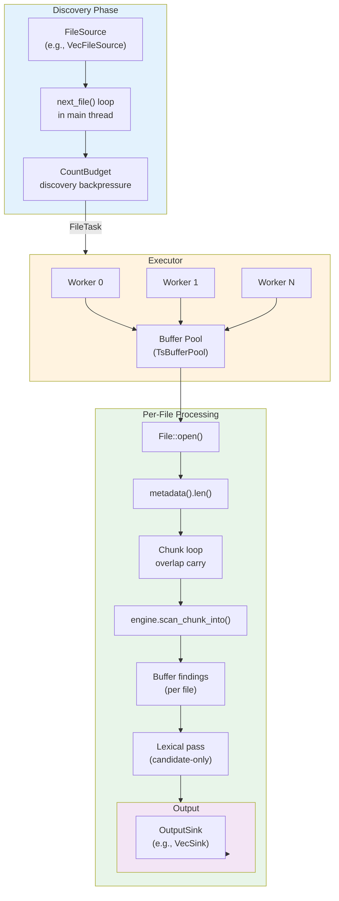

# Local Filesystem Scanner

The local scheduler module implements blocking-read file scanning with overlap-carry for efficient chunk processing. It serves as the low-level foundation for multithreaded file scanning with configurable worker threads, buffer pools, and memory budgets.

## Module Purpose

`src/scheduler/local.rs` provides the core scanning logic for local filesystem traversal. Each worker thread opens files, reads them sequentially, chunks the data with overlap preservation, and buffers findings per file. When lexical context is enabled, a candidate-only second pass re-opens the file to tokenize and filter findings before emission. The module emphasizes correctness through work-conserving semantics and point-in-time snapshot safety, using blocking I/O as a strong baseline before adding complexity like `io_uring`.

## Architecture Overview



## Key Concepts

### Blocking Reads

The module uses synchronous file I/O (no `async`, no `io_uring`). This provides:

- **Strong baseline**: Kernel page cache is highly optimized; frequently hits memory
- **Minimal complexity**: No async runtime overhead or completion queue management
- **Measurability**: Establish baseline performance before adding I/O complexity
- **Work conservation**: Workers stay busy until the pool is truly exhausted

### Overlap Carry Pattern

Instead of seeking back to re-read overlap bytes, the module carries overlap bytes forward via `copy_within`:

```
Iteration 1:                    Iteration 2:
┌─────────────────────────┐     ┌─────────────────────────┐
│      payload bytes      │     │overlap│  new payload    │
│      (from read)        │     │(copy) │  (from read)    │
└─────────────────────────┘     └─────────────────────────┘
                           │            ▲
                           └────────────┘
                         copy_within(tail → head)
```

This eliminates:
- Kernel seeks between reads
- Re-reading overlap bytes from the filesystem
- Per-chunk buffer pool churn

### Point-in-Time Snapshot Semantics

File size is captured at `open()` time via `metadata().len()`. This means:
- **Truncated files**: Scanning stops at actual EOF
- **Growing files**: Scanning stops at size-at-open (consistent snapshot)
- **TOCTOU safety**: No time-of-check-time-of-use race on file size
- **Size cap enforcement**: `max_file_size` is checked against the open-time size

### Archive Detection

When archive scanning is enabled, each file is classified by extension and
optional header sniffing. Archive candidates are routed to archive handling
paths (and otherwise scanned as regular files).
See `src/archive/` for the archive path semantics and hardening expectations.

### Work-Conserving Semantics

Every discovered file is enqueued with a `CountBudget` permit. Workers block on buffer acquisition, never skip files due to backpressure. This ensures:
- All files discovered are eventually scanned
- Memory bounds are maintained via pool size and in-flight object limits
- Graceful degradation under high discovery rate

## Configuration

```rust
pub struct LocalConfig {
    pub workers: usize,              // CPU worker threads
    pub chunk_size: usize,           // Payload bytes per chunk
    pub pool_buffers: usize,         // Total buffers in pool
    pub local_queue_cap: usize,      // Per-worker buffer queue
    pub max_in_flight_objects: usize,// In-flight file limit
    pub max_file_size: u64,          // Max bytes to scan (open-time enforced)
    pub seed: u64,                   // Deterministic executor seed
    pub dedupe_within_chunk: bool,   // Deduplicate findings per chunk
    pub context_mode: ContextMode,   // Candidate-only lexical filtering mode
    pub archive: ArchiveConfig,      // Archive scanning policy + limits
}
```

### Sizing Guidelines

| Parameter | Guidance |
|-----------|----------|
| `chunk_size` | 64–256 KiB typical. Larger = fewer syscalls, more memory per file. |
| `pool_buffers` | Should be >= `workers` to avoid starvation. Bounds peak memory = `pool_buffers * (chunk_size + overlap)`. |
| `max_in_flight_objects` | Bounds discovery depth and path metadata in memory. Typically 100–1000. |
| `local_queue_cap` | Per-worker local queue for buffers. Typically 2–8 to amortize pool contention. |
| `workers` | Match CPU cores for I/O-light workloads; may be higher for highly parallelizable CPU work. |
| `max_file_size` | Size cap in bytes. Enforced at open time using `metadata().len()`. |

## Candidate-Only Lexical Context

When `context_mode` is enabled, the scheduler buffers findings per file and
re-opens candidate files for a second pass. The file is tokenized into
code/comment/string/config runs based on a language-family mapping derived from
the path extension. Findings are filtered only when lexical context is
definitive; unknown context, run-cap overflow, or I/O errors fail open (findings
are emitted unfiltered).

### Configuration Validation

The `validate()` method checks:
- All sizes are positive
- `chunk_size + overlap <= BUFFER_LEN_MAX` (2 MiB)
- Warns if `pool_buffers < workers` (potential contention)
- Archive config invariants via `ArchiveConfig::validate()`

Archive entry paths (when enabled) are canonicalized and bounded; arena/path
budget overruns are handled as partial outcomes instead of panics.

## File Sources and Discovery

### FileSource Trait

The `FileSource` trait is the abstraction for file discovery:

```rust
pub trait FileSource: Send + 'static {
    fn next_file(&mut self) -> Option<LocalFile>;
}
```

**Why it exists**: Decouples discovery logic (directory walking, filtering, gitignore) from scanning logic. Users can implement custom sources for:
- Directory traversal with symlink handling
- Extension-based filtering
- `.gitignore` respect
- Remote file sources (S3, etc.)
- Deterministic test sequences

### LocalFile

```rust
pub struct LocalFile {
    pub path: PathBuf,
    pub size: u64,  // Discovery hint (may be 0 if metadata was skipped)
}
```

The `size` is a discovery hint for memory budgeting and stats. The actual file size is re-read at open time for snapshot semantics and size-cap enforcement.

### VecFileSource

A simple in-memory file list:

```rust
let source = VecFileSource::new(vec![
    LocalFile { path: "file1.txt".into(), size: 1024 },
    LocalFile { path: "file2.txt".into(), size: 2048 },
]);
```

## Main Types and Functions

### LocalStats

Aggregated discovery statistics:
- `files_enqueued`: Count of files discovered and enqueued
- `bytes_enqueued`: Total bytes across all enqueued files
- `io_errors`: Count of I/O failures (open, metadata, read)

### LocalReport

Complete scan result:
```rust
pub struct LocalReport {
    pub stats: LocalStats,
    pub metrics: MetricsSnapshot,  // chunks_scanned, bytes_scanned, timing
}
```

`MetricsSnapshot` now also aggregates archive outcomes via `ArchiveStats`
(all zeros when archive scanning is disabled).

### process_file()

Core per-file processing loop. **Design highlights**:

1. **Open and snapshot**: Open file, read metadata for snapshot size
2. **Acquire buffer**: Blocking acquire from pool (work-conserving)
3. **Chunk loop**:
   - Copy overlap prefix to buffer head
   - Read next chunk payload
   - Scan the buffer
   - Drop prefix findings (avoid duplicates from overlap region)
   - Emit findings
   - Update metrics
   - Advance offset
4. **Release buffer**: Automatic RAII on `LocalScratch` drop

**Error handling**: I/O errors are logged but do not propagate. Scanning continues with remaining files.

### scan_local() (Entry Point)

High-level entry point:

```rust
pub fn scan_local<E, S>(
    engine: Arc<E>,
    source: S,
    cfg: LocalConfig,
    out: Arc<dyn OutputSink>,
) -> LocalReport
```

**Execution model**:
1. Main thread discovers files via `source.next_file()`
2. Enqueues `FileTask` objects with `CountBudget` permits
3. Executor spins up worker threads
4. Workers pull tasks, process files, emit findings
5. Main thread calls `join()` to wait for all workers to complete

## Walker Behavior and Backpressure

### Discovery Loop

The main thread runs a tight loop:

```rust
while let Some(file) = source.next_file() {
    let permit = budget.acquire(1);  // Blocks if at capacity
    // Enqueue FileTask with permit
}
```

### CountBudget

`CountBudget` enforces `max_in_flight_objects`:
- Each file holds a permit until the `FileTask` drops
- `acquire(1)` blocks if the budget is exhausted
- Guarantees in-flight metadata + path strings stay bounded

### Buffer Pool Backpressure

`TsBufferPool` uses per-worker local queues:
- Workers acquire from their local queue (fast path)
- If local queue empty, acquire from global pool (slower)
- If global pool empty, worker blocks
- Never skips a file; always blocks for a buffer

**Rationale**: Work-conserving semantics ensure all files are scanned. If the pool is undersized, performance degrades gracefully rather than failing silently.

## Overlap and Finding Deduplication

### drop_prefix_findings()

After scanning a chunk, the engine drops findings whose `root_hint_end` is in the overlap prefix region. This avoids duplicate findings when the same pattern is found by adjacent chunks:

```
Chunk 1: [....PATTERN....]  (contains full pattern)
         Overlap region ↓
Chunk 2: [....PATTERN....] (prefix has partial pattern)
         drop_prefix_findings() removes this
```

### dedupe_findings()

Optional within-chunk deduplication (if `dedupe_within_chunk = true`):
1. Sort findings by `(rule_id, root_hint_start, root_hint_end, span_start, span_end)`
2. Remove adjacent duplicates

**When needed**: Engines that emit duplicate findings for overlapping patterns.

## Output Formatting

```rust
fn emit_findings<E, F>(
    engine: &E,
    out: &Arc<dyn OutputSink>,
    out_buf: &mut Vec<u8>,
    path: &[u8],
    findings: &[F],
)
```

**Output format**: `<path>:<start>-<end> <rule_name>\n`

Example:
```
/home/user/.env:42-68 aws-access-key
/home/user/.env:100-120 slack-token
```

The `out_buf` is reused across calls to avoid per-chunk allocation.

## Performance Characteristics

| Workload | Expected Behavior |
|----------|-------------------|
| Hot cache (small files) | CPU-bound, near memory bandwidth (10+ GB/s) |
| Cold cache (SSD) | I/O-bound, ~3–5 GB/s with good SSD |
| Cold cache (HDD) | I/O-bound, ~150–200 MB/s sequential |

### Optimization Opportunities

1. **If workers show idle time waiting on reads**: Profiling (via `perf`, flamegraph) may show contention. Consider `io_uring` for batched I/O.
2. **If page cache thrashing**: Reduce `chunk_size` or `pool_buffers` to fit working set in cache.
3. **If CPU-bound (patterns are expensive)**: Reduce `workers` to avoid oversubscription, or optimize the detection engine.

## Design Rationale

### Why Blocking Reads First?

1. **Kernel page cache is superb**: Highly tuned for sequential access and nearly free for hot data.
2. **Minimal complexity**: No async runtime, no completion queues, no EINTR retry logic beyond `read_some()`.
3. **Measurable baseline**: Establish performance before adding io_uring overhead and scheduling complexity.

### Why Overlap Carry?

- **No seeks**: Direct sequential access pattern, friendly to disk (especially HDD).
- **No re-reading**: Overlap bytes are carried forward, not re-fetched from disk.
- **No per-chunk pool churn**: Single buffer per file, avoiding contention and allocation overhead.

### Why Work-Conserving?

- **Predictability**: All discovered files are guaranteed to scan (no silent drops).
- **Graceful degradation**: If pool is tight, scanning slows but does not fail.
- **Memory safety**: `CountBudget` and pool size together bound in-flight objects and memory.

## Usage Examples

### Basic Scan

```rust
use std::sync::Arc;
use scheduler::engine_stub::MockEngine;
use scheduler::local::{LocalConfig, LocalFile, VecFileSource, scan_local};
use scheduler::output_sink::VecSink;

let engine = Arc::new(MockEngine::new(rules, 16));
let files = vec![LocalFile { path: "test.txt".into(), size: 1024 }];
let source = VecFileSource::new(files);
let sink = Arc::new(VecSink::new());

let report = scan_local(engine, source, LocalConfig::default(), sink.clone());

println!("Files: {}", report.stats.files_enqueued);
println!("Errors: {}", report.stats.io_errors);
println!("Chunks: {}", report.metrics.chunks_scanned);

let output = sink.take();
// Process findings
```

### Custom Configuration

```rust
let cfg = LocalConfig {
    workers: 4,                    // 4 threads
    chunk_size: 128 * 1024,        // 128 KiB chunks
    pool_buffers: 16,              // 16 buffers (~2 MiB per buffer)
    local_queue_cap: 2,
    max_in_flight_objects: 512,
    max_file_size: 100 * 1024 * 1024, // 100 MiB
    seed: 42,
    dedupe_within_chunk: true,
};

cfg.validate(&engine);  // Panics on invalid config

let report = scan_local(engine, source, cfg, sink);
```

### Custom FileSource

```rust
struct MyFileSource {
    pending: Vec<LocalFile>,
}

impl FileSource for MyFileSource {
    fn next_file(&mut self) -> Option<LocalFile> {
        // Custom discovery logic
        self.pending.pop()
    }
}

let source = MyFileSource { pending: vec![...] };
let report = scan_local(engine, source, LocalConfig::default(), sink);
```

## Invariants and Guarantees

### Correctness Invariants

- **Work-conserving**: Every discovered file is scanned (blocking buffer acquire)
- **Chunk overlap**: `engine.required_overlap()` bytes overlap between chunks
- **Budget bounded**: `max_in_flight_objects` limits discovered-but-not-complete files
- **Buffer bounded**: `pool_buffers` limits peak memory
- **Snapshot semantics**: File size taken at open time (consistent point-in-time)
- **Size cap**: Files exceeding `max_file_size` at open time are skipped
- **Finding uniqueness**: Cross-chunk duplicates avoided via `drop_prefix_findings()`

### RAII Semantics

- `FileTask` holds a `CountPermit`; permit is released when task drops
- `LocalScratch.pool` acquires buffer; buffer is released when scratch drops
- No manual cleanup required; all resources are exception-safe

## Related Documentation

| Document | Description |
|----------|-------------|
| [Detection Engine](./detection-engine.md) | Multi-stage pattern matching and finding emission |
| [Memory Management](./memory-management.md) | Buffer pool lifecycle and memory budgets |
| [Architecture](./architecture.md) | High-level system design and module dependencies |
