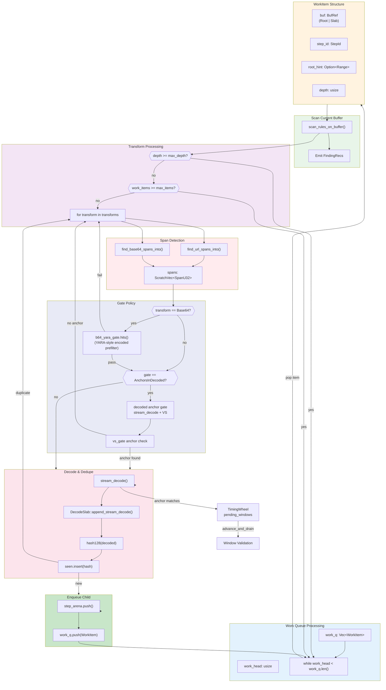
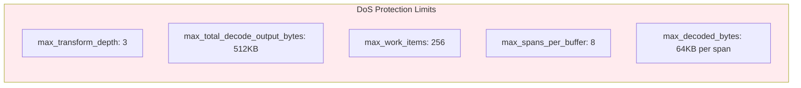
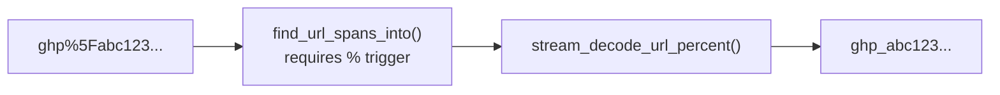
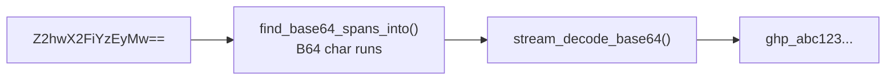
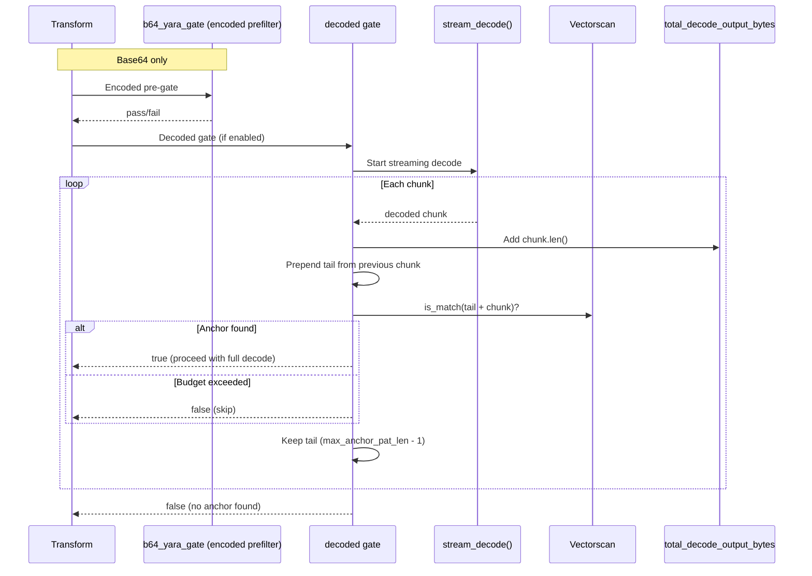
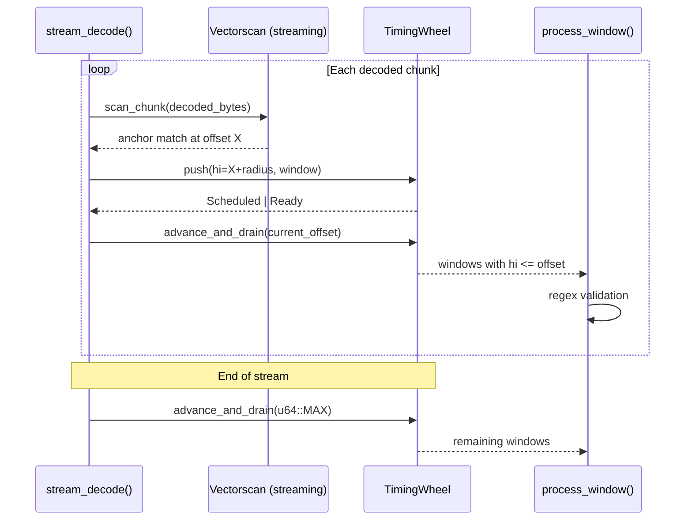
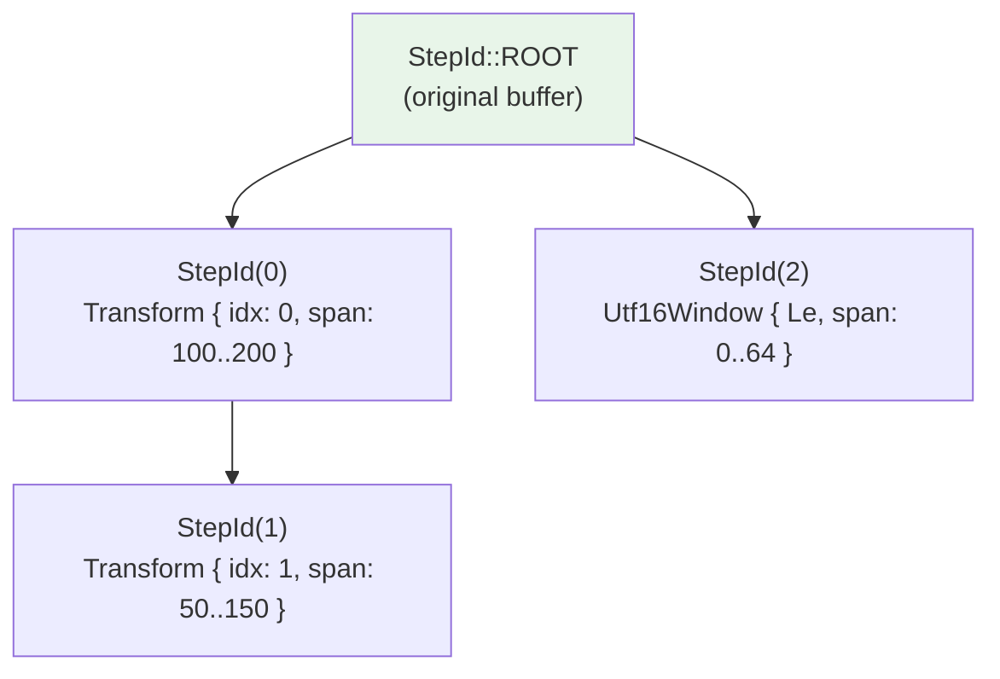

# Transform Chain

Recursive decoding flow for URL percent-encoding and Base64 transforms.



## Budget Limits



## Archive Entry Context

When archive scanning is enabled, entry payload bytes flow through the same
transform chain and decoding budgets as regular files. Archive entry paths are
canonicalized separately in the archive subsystem and do not affect transform
logic or decode limits.
See `src/archive/` for archive-specific invariants and budget guardrails.

## Unified Scanner Output Integration

Transform findings produced by the engine flow through the unified event
contract (`ScanEvent::Finding`) in both filesystem and git scan modes. The
decode/transform decision logic and budgets in this document are unchanged;
only emission/reporting wiring changed.

See [`scanner-unification.md`](scanner-unification.md) for routing/output
details.

| Limit | Default | Purpose |
|-------|---------|---------|
| `max_transform_depth` | 3 | Maximum decode chain length |
| `max_total_decode_output_bytes` | 512KB | Global decode output budget |
| `max_work_items` | 256 | Maximum queued decoded buffers |
| `max_spans_per_buffer` | 8 | Candidate spans per transform per buffer |
| `max_decoded_bytes` | 64KB | Output limit per span decode |

## Transform Types

### URL Percent Decoding



**Span Detection Rules**:
- Requires at least one `%` (or `+` if `plus_to_space` enabled)
- Matches URL-safe character runs: `A-Za-z0-9%+-_.~:/?#[]@!$&'()*,;=`
- Minimum length: 16 characters

### Base64 Decoding



**Span Detection Rules**:
- Matches Base64 alphabet: `A-Za-z0-9+/=-_` plus optional whitespace
- Handles both standard and URL-safe alphabets
- Minimum length: 32 characters

### Base64 Pre-Decode Gate (YARA-style)

Base64 spans can be long, and decoding them just to discover "no anchor present"
is expensive. To avoid that, Base64 transforms add a **pre-gate** that runs on
the *encoded* bytes before any decoding.

**Core idea**: a decoded anchor can appear at any of three byte offsets inside a
base64 quantum. YARA documents this by generating three encoded permutations
and stripping the unstable prefix/suffix characters. We do the same and then
search the encoded stream with Vectorscan.

**Why this is safe**:
- It is **conservative**: if decoded bytes contain an anchor, at least one of
  the derived base64 permutations must appear in the encoded bytes.
- False positives are fine because the decoded gate still confirms anchors
  before accepting the transform.

**Normalization rules**:
- Ignore RFC4648 whitespace (space is only ignored if the span finder allows it).
- Treat URL-safe `-`/`_` as `+`/`/`.
- Stop scanning at `=` padding to avoid cross-span false matches.

## Gate Policy: AnchorsInDecoded

The decoded gate avoids expensive full decodes by streaming and checking for anchors.
For Base64 spans, there is **also** an encoded-space pre-gate that runs first:



## Stream Decode Window Scheduling

During streaming decode, anchor matches are discovered incrementally as chunks
decode. The **TimingWheel** schedules these matches for validation without
waiting for the full buffer:



**Key invariant**: `pending_windows` uses `G=1` (exact scheduling), so windows
fire precisely when `decoded_offset >= hi`. This avoids both early firing
(incomplete window) and excessive latency.

See `docs/detection-engine.md` for TimingWheel data structure details.

## StepArena Provenance



The StepArena enables zero-copy finding records by storing decode provenance as a linked chain:

```rust
struct StepNode {
    parent: StepId,      // Links to parent step (or STEP_ROOT)
    step: DecodeStep,    // Transform or Utf16Window
}

// Materialization walks the chain backwards
fn materialize(&self, mut id: StepId, out: &mut Vec<DecodeStep>) {
    while id != STEP_ROOT {
        let node = &self.nodes[id.0 as usize];
        out.push(node.step.clone());
        id = node.parent;
    }
    out.reverse();
}
```

## Deduplication

The `FixedSet128` provides O(1) hash-based deduplication with generation-based reset:

```rust
struct FixedSet128 {
    keys: Vec<u128>,    // Hash keys
    gen: Vec<u32>,      // Generation counters
    cur: u32,           // Current generation
    mask: usize,        // Capacity mask (power of 2)
}

// Reset is O(1) - just increment generation
fn reset(&mut self) {
    self.cur = self.cur.wrapping_add(1);
    if self.cur == 0 {
        self.gen.fill(0);  // Handle wraparound
        self.cur = 1;
    }
}
```

This prevents re-scanning identical decoded content (e.g., same Base64 blob appearing multiple times).
The engine hashes decoded buffers with a 128-bit AEGIS-128L tag for collision resistance.
