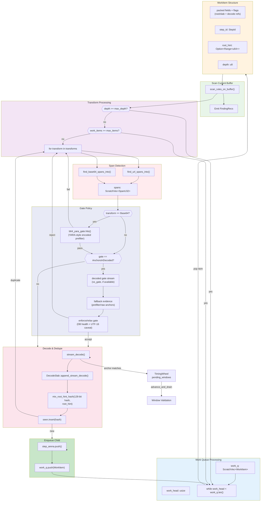
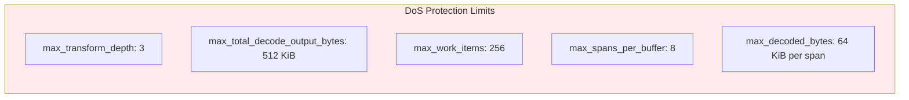
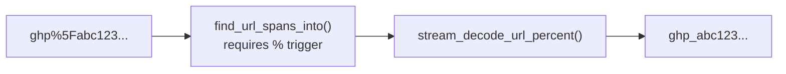
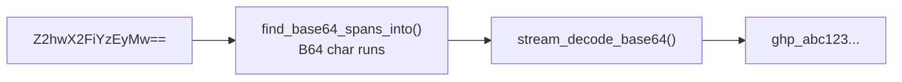
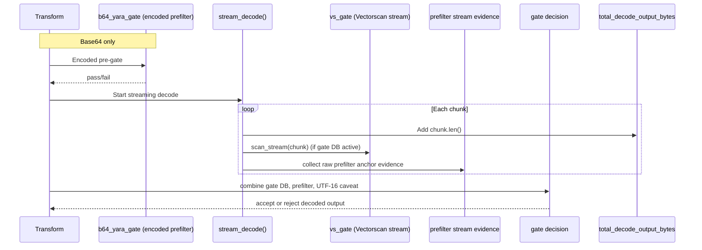
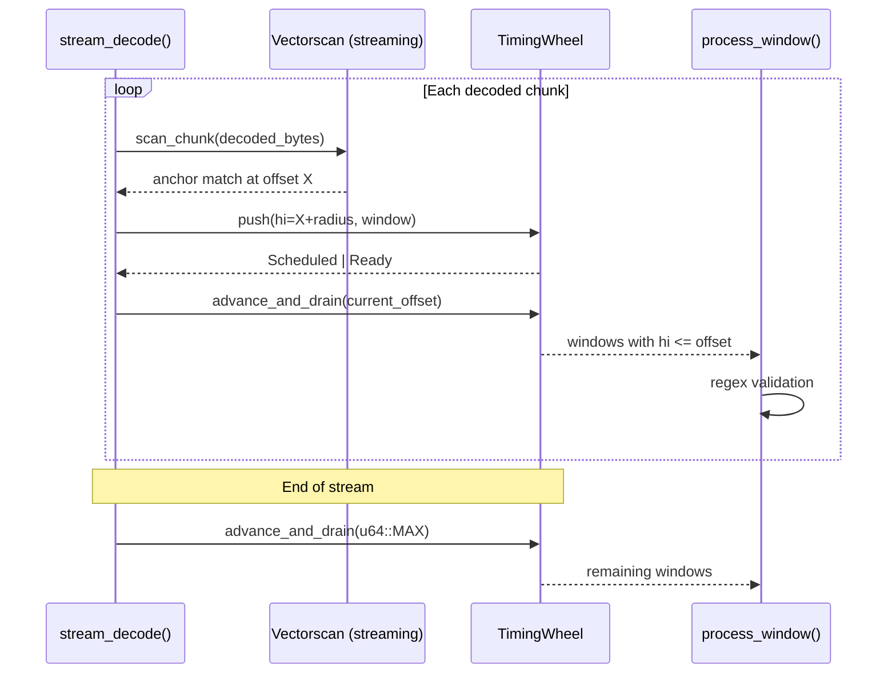
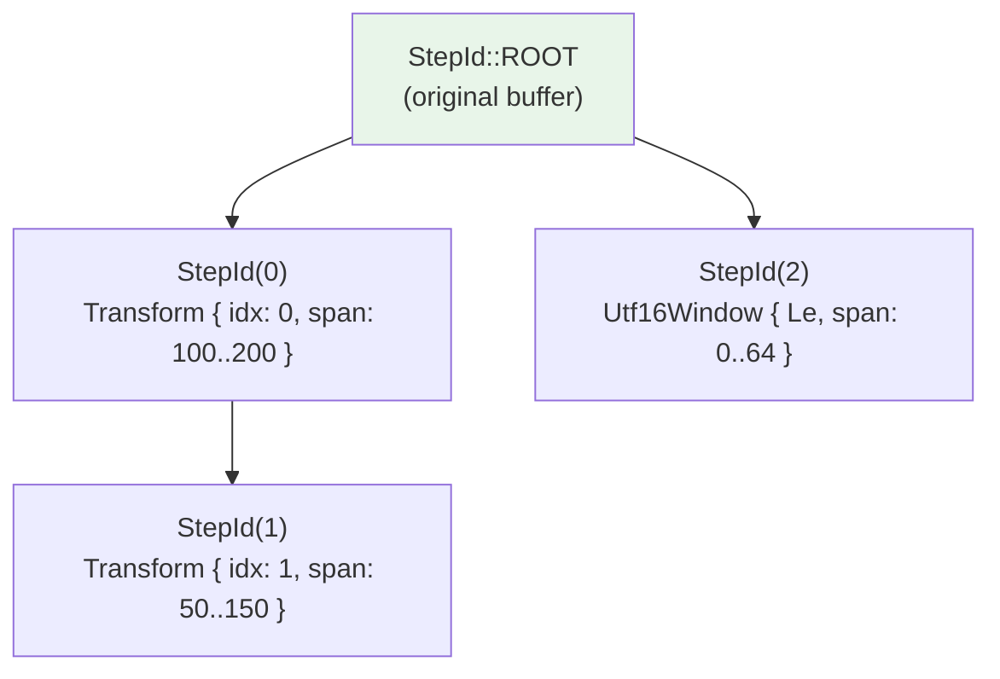

# Transform Chain

Recursive decoding flow for URL percent-encoding and Base64 transforms.

Startup note: the decoded-stream Vectorscan database used by transform gating
can be loaded from the on-disk Vectorscan DB cache (`SCANNER_VS_DB_CACHE*`).
Cache behavior only affects startup time; runtime transform semantics are unchanged.


```mermaid
flowchart TB
    subgraph WorkQueue["Work Queue Processing"]
        WQ["work_q: ScratchVec&lt;WorkItem&gt;"]
        WH["work_head: usize"]
        Loop["while work_head < work_q.len()"]
    end

    subgraph WorkItem["WorkItem Structure"]
        Layout["packed fields + flags<br/>(root/slab + decode refs)"]
        StepId["step_id: StepId"]
        RootHint["root_hint: Option&lt;Range&lt;u64&gt;&gt;"]
        Depth["depth: u8"]
    end

    subgraph Scan["Scan Current Buffer"]
        ScanRules["scan_rules_on_buffer()"]
        Findings["Emit FindingRecs"]
    end

    subgraph TransformLoop["Transform Processing"]
        CheckDepth{{"depth >= max_depth?"}}
        CheckItems{{"work_items >= max_items?"}}
        ForTransform["for transform in transforms"]
    end

    subgraph SpanDetection["Span Detection"]
        URL["find_url_spans_into()"]
        B64["find_base64_spans_into()"]
        Spans["spans: ScratchVec&lt;SpanU32&gt;"]
    end

    subgraph Gating["Gate Policy"]
        CheckB64{{"transform == Base64?"}}
        PreGate["b64_yara_gate.hits()<br/>(YARA-style encoded prefilter)"]
        Gate{{"gate == AnchorsInDecoded?"}}
        StreamGate["decoded gate stream<br/>(vs_gate, if available)"]
        GateFallback["fallback evidence<br/>(prefilter/raw anchors)"]
        GateDecision["enforce/relax gate<br/>(DB health + UTF-16 caveat)"]
    end

    subgraph Decode["Decode & Dedupe"]
        StreamDecode["stream_decode()"]
        Slab["DecodeSlab::append_stream_decode()"]
        Hash["mix_root_hint_hash(128-bit hash,<br/>root_hint)"]
        Seen["seen.insert(hash)"]
    end

    subgraph Enqueue["Enqueue Child"]
        PushStep["step_arena.push()"]
        PushWork["work_q.push(WorkItem)"]
    end

    WQ --> Loop
    Loop --> |"pop item"| WorkItem
    WorkItem --> ScanRules
    ScanRules --> Findings
    ScanRules --> CheckDepth

    CheckDepth --> |"yes"| Loop
    CheckDepth --> |"no"| CheckItems
    CheckItems --> |"yes"| Loop
    CheckItems --> |"no"| ForTransform

    ForTransform --> URL
    ForTransform --> B64
    URL --> Spans
    B64 --> Spans

    Spans --> CheckB64
    CheckB64 --> |"yes"| PreGate
    CheckB64 --> |"no"| Gate
    PreGate --> |"pass"| Gate
    PreGate --> |"fail"| ForTransform
    Gate --> |"yes"| StreamGate
    StreamGate --> GateFallback
    GateFallback --> GateDecision
    GateDecision --> |"reject"| ForTransform
    GateDecision --> |"accept"| Decode
    Gate --> |"no"| Decode

    Decode --> StreamDecode
    StreamDecode --> |"anchor matches"| TimingWheel["TimingWheel<br/>pending_windows"]
    TimingWheel --> |"advance_and_drain"| WindowValidation["Window Validation"]
    StreamDecode --> Slab
    Slab --> Hash
    Hash --> Seen

    Seen --> |"duplicate"| ForTransform
    Seen --> |"new"| Enqueue

    Enqueue --> PushStep
    PushStep --> PushWork
    PushWork --> Loop

    style WorkQueue fill:#e3f2fd
    style WorkItem fill:#fff3e0
    style Scan fill:#e8f5e9
    style TransformLoop fill:#f3e5f5
    style SpanDetection fill:#ffebee
    style Gating fill:#e8eaf6
    style Decode fill:#fce4ec
    style Enqueue fill:#c8e6c9
```

## Budget Limits


```mermaid
graph LR
    subgraph Limits["DoS Protection Limits"]
        MaxDepth["max_transform_depth: 3"]
        MaxOutput["max_total_decode_output_bytes: 512 KiB"]
        MaxItems["max_work_items: 256"]
        MaxSpans["max_spans_per_buffer: 8"]
        MaxDecoded["max_decoded_bytes: 64 KiB per span"]
    end

    style Limits fill:#ffebee
```

## Archive Entry Context

When archive scanning is enabled, entry payload bytes flow through the same
transform chain and decoding budgets as regular files. Archive entry paths are
canonicalized separately in the archive subsystem and do not affect transform
logic or decode limits.
See `src/archive/` for archive-specific invariants and budget guardrails.

## Unified Scanner Output Integration

Transform findings produced by the engine flow through the unified event
contract (`ScanEvent::Finding`) in both filesystem and git scan modes. The
decode/transform decision logic and budgets in this document are unchanged;
only emission/reporting wiring changed.

For filesystem scans, this emission happens from owner-compute workers in
`src/scheduler/local_fs_owner.rs` (each worker performs both I/O and scanning
with worker-local reusable state).

When `--persist-findings` is enabled, the same post-dedupe finding set is also
encoded into `FindingBatch` append-log frames (`src/store/log/format.rs`) and
written by the bounded single-writer runtime (`src/store/log/writer.rs`). This
keeps transform-derived and root findings consistent between stdout events and
persistent log output.

### Identity Canonicalization Link

For persistence IDs (`src/store/identity.rs`), transform-derived findings use:

- Root-hint end normalization tolerant to base64 padding variance (`min..min+3`).
- Span contribution when dedupe includes span (`step_id == STEP_ROOT` or
  `dedupe_with_span`).
- UTF-16 LE/BE variant discriminator carried into `occurrence_id`.

These rules intentionally mirror dedupe semantics in
`ScanScratch::push_finding_with_drop_hint`.

| Limit | Default | Purpose |
|-------|---------|---------|
| `max_transform_depth` | 3 | Maximum decode chain length |
| `max_total_decode_output_bytes` | 512 KiB | Global decode output budget |
| `max_work_items` | 256 | Maximum queued decoded buffers |
| `max_spans_per_buffer` | 8 | Candidate spans per transform per buffer |
| `max_decoded_bytes` | 64 KiB | Output limit per span decode |

## Transform Types

### URL Percent Decoding


```mermaid
graph LR
    Input["ghp%5Fabc123..."]
    Detect["find_url_spans_into()<br/>requires % trigger"]
    Decode["stream_decode_url_percent()"]
    Output["ghp_abc123..."]

    Input --> Detect --> Decode --> Output
```

**Span Detection Rules**:
- Requires at least one `%` (or `+` if `plus_to_space` enabled)
- Matches URL-safe character runs: `A-Za-z0-9%+-_.~:/?#[]@!$&'()*,;=`
- Minimum length: 16 characters

### Base64 Decoding


```mermaid
graph LR
    Input["Z2hwX2FiYzEyMw=="]
    Detect["find_base64_spans_into()<br/>B64 char runs"]
    Decode["stream_decode_base64()"]
    Output["ghp_abc123..."]

    Input --> Detect --> Decode --> Output
```

**Span Detection Rules**:
- Matches Base64 alphabet: `A-Za-z0-9+/=-_` plus optional whitespace
- Handles both standard and URL-safe alphabets
- Minimum length: 32 characters

### Base64 Pre-Decode Gate (YARA-style)

Base64 spans can be long, and decoding them just to discover "no anchor present"
is expensive. To avoid that, Base64 transforms add a **pre-gate** that runs on
the *encoded* bytes before any decoding.

**Core idea**: a decoded anchor can appear at any of three byte offsets inside a
base64 quantum. YARA documents this by generating three encoded permutations
and stripping the unstable prefix/suffix characters. We do the same and then
search the encoded stream with Vectorscan.

**Why this is safe**:
- It is **conservative**: if decoded bytes contain an anchor, at least one of
  the derived base64 permutations must appear in the encoded bytes.
- False positives are fine because the decoded gate still confirms anchors
  before accepting the transform.

**Normalization rules**:
- Ignore RFC4648 whitespace (space is only ignored if the span finder allows it).
- Treat URL-safe `-`/`_` as `+`/`/`.
- Stop scanning at `=` padding to avoid cross-span false matches.

## Gate Policy: AnchorsInDecoded

The decoded gate avoids expensive full decodes by streaming and checking for anchors.
For Base64 spans, there is **also** an encoded-space pre-gate that runs first:


```mermaid
sequenceDiagram
    participant Transform as Transform
    participant Pre as b64_yara_gate (encoded prefilter)
    participant Stream as stream_decode()
    participant VS as vs_gate (Vectorscan stream)
    participant PF as prefilter stream evidence
    participant Decide as gate decision
    participant Budget as total_decode_output_bytes

    Note over Transform,Pre: Base64 only
    Transform->>Pre: Encoded pre-gate
    Pre-->>Transform: pass/fail
    Transform->>Stream: Start streaming decode

    loop Each chunk
        Stream->>Budget: Add chunk.len()
        Stream->>VS: scan_stream(chunk) (if gate DB active)
        Stream->>PF: collect raw prefilter anchor evidence
    end

    Transform->>Decide: combine gate DB, prefilter, UTF-16 caveat
    Decide-->>Transform: accept or reject decoded output
```

## Stream Decode Window Scheduling

During streaming decode, anchor matches are discovered incrementally as chunks
decode. The **TimingWheel** schedules these matches for validation without
waiting for the full buffer:


```mermaid
sequenceDiagram
    participant Stream as stream_decode()
    participant VS as Vectorscan (streaming)
    participant TW as TimingWheel
    participant Val as process_window()

    loop Each decoded chunk
        Stream->>VS: scan_chunk(decoded_bytes)
        VS-->>Stream: anchor match at offset X
        Stream->>TW: push(hi=X+radius, window)
        TW-->>Stream: Scheduled | Ready
        Stream->>TW: advance_and_drain(current_offset)
        TW-->>Val: windows with hi <= offset
        Val->>Val: regex validation
    end

    Note over Stream,TW: End of stream
    Stream->>TW: advance_and_drain(u64::MAX)
    TW-->>Val: remaining windows
```

**Key invariant**: `pending_windows` uses `G=1` (exact scheduling), so windows
fire precisely when `decoded_offset >= hi`. This avoids both early firing
(incomplete window) and excessive latency.

See `docs/detection-engine.md` for TimingWheel data structure details.

## StepArena Provenance


```mermaid
graph TB
    Root["StepId::ROOT<br/>(original buffer)"]

    Step1["StepId(0)<br/>Transform { idx: 0, span: 100..200 }"]
    Step2["StepId(1)<br/>Transform { idx: 1, span: 50..150 }"]
    Step3["StepId(2)<br/>Utf16Window { Le, span: 0..64 }"]

    Root --> Step1
    Step1 --> Step2
    Root --> Step3

    style Root fill:#e8f5e9
```

The StepArena enables zero-copy finding records by storing decode provenance as a linked chain.
Actual storage uses a compact step payload (`CompactDecodeStep`) in
`src/engine/decode_state.rs`; below is the materialization shape:

```rust
struct StepNode {
    parent: StepId,      // Links to parent step (or STEP_ROOT)
    step: CompactDecodeStep, // Compact transform/Utf16Window payload
}

// Materialization walks the chain backwards
fn materialize(&self, mut id: StepId, out: &mut ScratchVec<DecodeStep>) {
    while id != STEP_ROOT {
        let node = &self.nodes[id.0 as usize];
        out.push(node.step.to_decode_step());
        id = node.parent;
    }
    out.reverse();
}
```

## Deduplication

The `FixedSet128` provides O(1) hash-based deduplication with generation-based reset.
Current layout in `src/stdx/fixed_set.rs`:

```rust
struct FixedSet128 {
    slots: Vec<Slot128>, // Interleaved key + generation
    cur: u32,           // Current generation
    mask: usize,        // Capacity mask (power of 2)
}

// Reset is O(1) - just increment generation
fn reset(&mut self) {
    self.cur = self.cur.wrapping_add(1);
    if self.cur == 0 {
        for slot in &mut self.slots {
            slot.gen = 0; // Handle wraparound
        }
        self.cur = 1;
    }
}
```

This prevents re-scanning identical decoded content (e.g., same Base64 blob appearing multiple times).
The engine dedupe key is a 128-bit hash (AEGIS-128L MAC path) mixed with
`root_hint` so identical decoded bytes at different root offsets do not collide.
