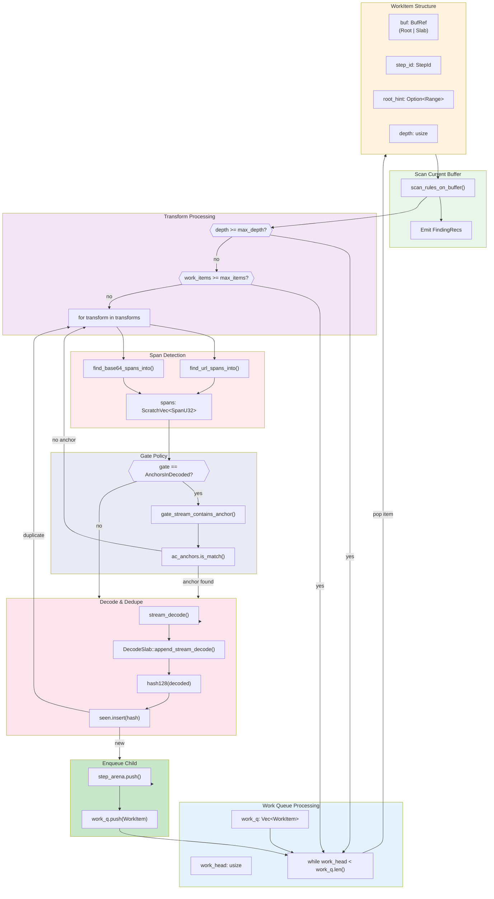
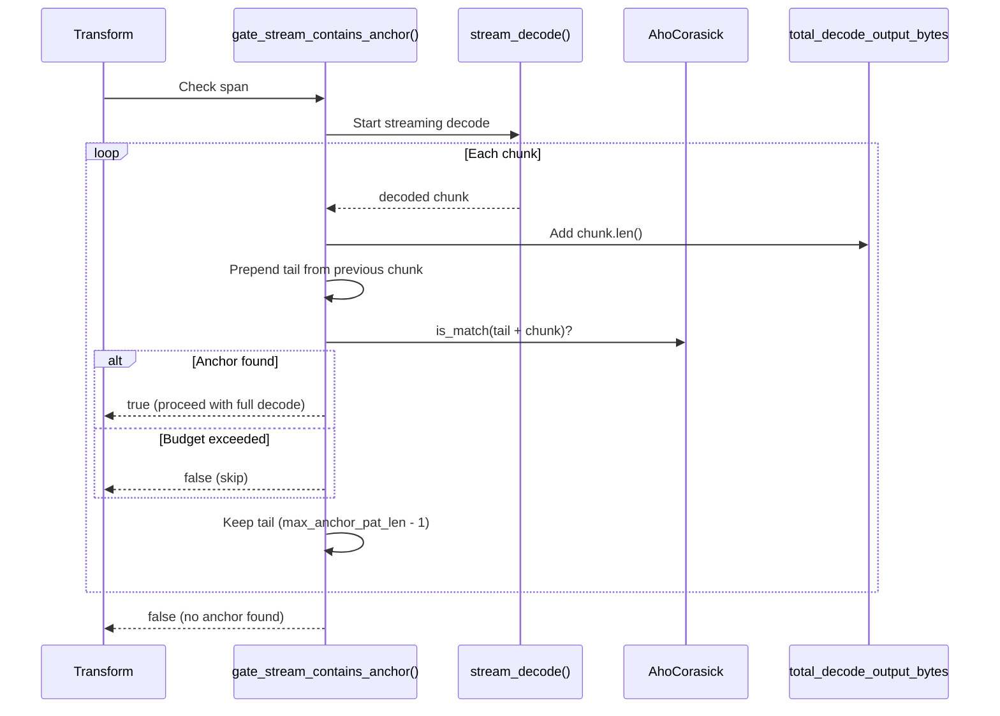

# Transform Chain

Recursive decoding flow for URL percent-encoding and Base64 transforms.



## Budget Limits


| Limit | Default | Purpose |
|-------|---------|---------|
| `max_transform_depth` | 3 | Maximum decode chain length |
| `max_total_decode_output_bytes` | 512KB | Global decode output budget |
| `max_work_items` | 256 | Maximum queued decoded buffers |
| `max_spans_per_buffer` | 8 | Candidate spans per transform per buffer |
| `max_decoded_bytes` | 64KB | Output limit per span decode |

## Transform Types

### URL Percent Decoding


**Span Detection Rules**:
- Requires at least one `%` (or `+` if `plus_to_space` enabled)
- Matches URL-safe character runs: `A-Za-z0-9%+-_.~:/?#[]@!$&'()*,;=`
- Minimum length: 16 characters

### Base64 Decoding


**Span Detection Rules**:
- Matches Base64 alphabet: `A-Za-z0-9+/=-_` plus optional whitespace
- Handles both standard and URL-safe alphabets
- Minimum length: 32 characters

## Gate Policy: AnchorsInDecoded

The gate policy avoids expensive full decodes by streaming and checking for anchors:



## StepArena Provenance


The StepArena enables zero-copy finding records by storing decode provenance as a linked chain:

```rust
struct StepNode {
    parent: StepId,      // Links to parent step (or STEP_ROOT)
    step: DecodeStep,    // Transform or Utf16Window
}

// Materialization walks the chain backwards
fn materialize(&self, mut id: StepId, out: &mut Vec<DecodeStep>) {
    while id != STEP_ROOT {
        let node = &self.nodes[id.0 as usize];
        out.push(node.step.clone());
        id = node.parent;
    }
    out.reverse();
}
```

## Deduplication

The `FixedSet128` provides O(1) hash-based deduplication with generation-based reset:

```rust
struct FixedSet128 {
    keys: Vec<u128>,    // Hash keys
    gen: Vec<u32>,      // Generation counters
    cur: u32,           // Current generation
    mask: usize,        // Capacity mask (power of 2)
}

// Reset is O(1) - just increment generation
fn reset(&mut self) {
    self.cur = self.cur.wrapping_add(1);
    if self.cur == 0 {
        self.gen.fill(0);  // Handle wraparound
        self.cur = 1;
    }
}
```

This prevents re-scanning identical decoded content (e.g., same Base64 blob appearing multiple times).
The engine hashes decoded buffers with a 128-bit AEGIS-128L tag for collision resistance.
